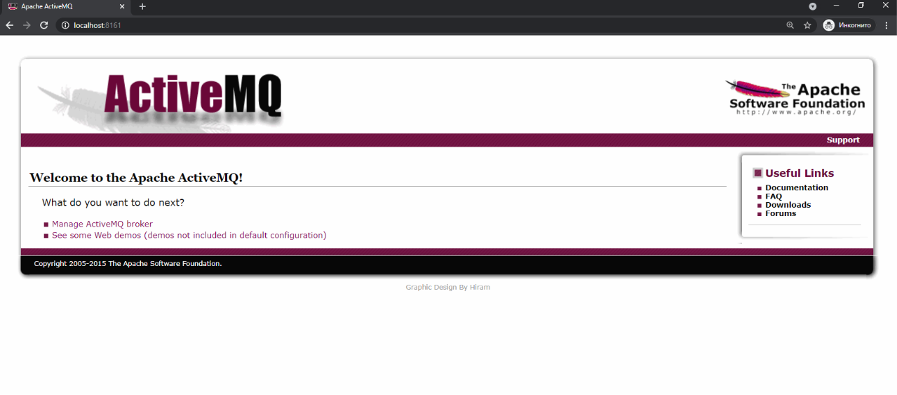
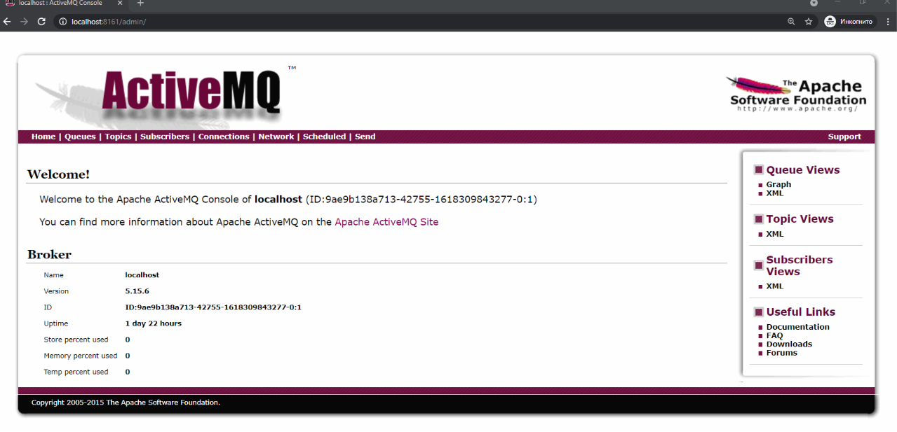
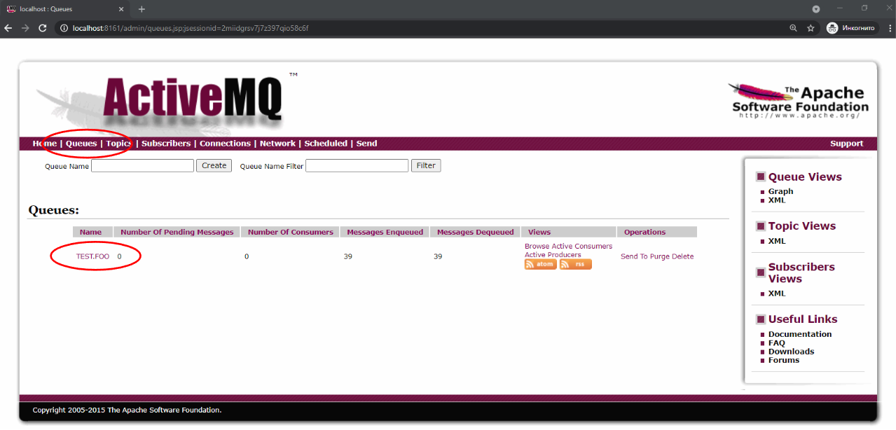
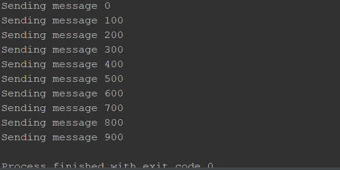
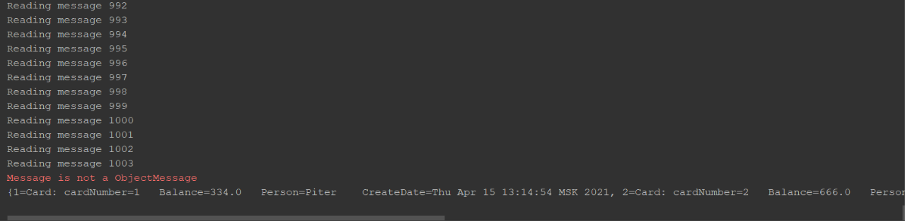

#### Методы и средства построения распределенных программных систем с использованием технологии Java
##### JMS
---
### План занятия
 - Другой подход к построению распределенных приложений: системы построенные на обмене сообщениями
 - Что такое JMS?
     - История
     - Область применимости
     - Элементы архитектуры
 - Пример использования 
---
### Модель, основанная на событиях
 - Объекты реагируют на события (например, вызовом методов) 
 - События могут изменять состояние объектов
 - Множество объектов, расположенных на различных узлах могут извещаться о наступлении событий определенного типа 
 - Используется модель «издатель-подписчик»
     - Объект, генерирующий события, называется издателем (publisher, producer)  - он публикует список типов событий, на которые остальные объекты могут подписаться
     - Объекты, подписывающиеся на события определенного типа называются подписчиками (subscriber, consumer). Они получают уведомление о наступлении события, на которое они подписались 
---
### Модель, основанная на событиях
 - Связь между компонентами – слабая
     - Компонент может получить событие и преобразовать его к нужному виду
 - Не требуется одновременного наличия «на связи» обменивающихся сообщениями компонентов
     - Синхронные и асинхронные механизмы приема и обработки сообщений
     - Сохранение сообщений в буфере, в случае отсутствия получателя
 - Возможность как широковещательной рассылки сообщений, так и избирательной
---
### JMS
 - Стандарт, разработанный для событийной модели в Java
     - JMS 1.0.1  - 1998
     - …
     - JMS 3 (Jakarta Messaging)  - 2020
 - Входит в состав Jakarta EE (ранее - J2EE)
 - Обеспечивает механизм обмена сообщениями:
     - Асинхронный 
     - Надежный
 - Реализуется во многих продуктах сторонних разработчиков
---
### Рекомендуется использовать, если…
- необходимо обеспечить независимость модуля от интерфейса взаимодействия с другим модулем (rpc и rmi требуют знания интерфейса удаленного модуля)
 - компоненты должны работать независимо и могут выполняться в разное (!) время
 - структура приложения такова, что информацию можно передать в другой модуль, не дожидаясь ответа и каких-либо результатов обработки 
---
### Архитектура
 - JMS Provider – система, реализующая интерфейс JMS и предоставляющая средства администрирования
 - JMS Clients – компоненты, посылающие и принимающие сообщения
 - Messages – сообщения (объекты, передающиеся и принимающиеся компонентами)
 - Administrative tools – средства администрирования
 <!-- .element: width="40%"  -->

https://docs.oracle.com/javaee/5/tutorial/doc/figures/jms-architecture.gif<!-- .element: class="copyright-reference"  -->
---
### JMS – два подхода

 - Модель точка-точка для обмена сообщениями между двумя компонентами


 - Модель «издатель-подписчик» для обмена сообщениями между многими компонентами
---
### Модель точка-точка
 - Область применимости:
     - Взаимодействие двух компонентов
 - Элементы модели:
     - Очередь
     - Отправитель
     - Получатель
 - Каждое сообщение обрабатывается только одним клиентом
 - Зависимости по времени между отправителем и получателем нет (в случае, если используется долговременное хранение сообщений)
     - Получатель может запуститься и обработать сообщения, когда отправитель работу уже закончил (или нет)
---
### Модель «издатель - подписчики»
 - Область применимости:
     - Взаимодействие нескольких компонентов
 - Элементы модели:
     - «тема» (topic)
     - Издатель 
     - Подписчик
 - Сообщение может быть получено несколькими подписчиками
 - Подписчик получает только те сообщения, что были отправлены после его подписки на «тему»
---
### Обработка сообщений
 - Синхронная
     - Клиент вызывает блокирующий метод receive
 - Асинхронная
     - Клиент регистрирует «слушателя» (listener), метод которого вызывается при поступлении сообщения
---
### Схема работы с API JMS (Classic API)
<!-- .element: width="60%"  -->

https://docs.oracle.com/javaee/5/tutorial/doc/figures/jms-programmingModel.gif<!-- .element: class="copyright-reference"  -->
---
### Connection Factory
 - Используется для создания соединения с провайдером
 - Как правило связывается с определенным ресурсом посредством механизма аннотаций
```java
@Resource(mappedName="jms/ConnectionFactory")
private static ConnectionFactory connectionFactory;
```
 - Или создается программно, с использованием API JMSProvider (пример для activeMQ)
```java
ConnectionFactory connectionFactory = new ActiveMQConnectionFactory(url);
```
---
### Connection
 - Инкапсулирует соединение с провайдером
 - Используется для создания сессий
```java 
Connection connection = connectionFactory.createConnection();
```
 - После использования соединение должно быть закрыто
```java 
connection.close(); 
```
---
### Hello. Session
 - Сессия представляет собой однопоточный контекст для создания следующих объектов:
    - Отправителей сообщений (Message Producers) 
     - Приемщиков сообщений (Message Consumers)
     - Сообщений (Messages)
     - Просмотрщиков очередей (Queue Browsers)
     - Вспомогательных очередей и тем (Temporary queues and topics)
 - Создание сессии:
```java 
Session session = connection.createSession(false, Session.AUTO_ACKNOWLEDGE);
```
     - Первый аргумент – поддерживаются транзакции или нет
     - Способ оповещения об успешной обработке сообщения
---
### Destination
 - Используется для указания объекта назначения для сообщения
 - Поддерживается два типа:
     - Очередь (Queue)
     - Тема (Topic)
 - Как правило связывается с определенным (заранее созданным) ресурсом через механизм аннотаций

```java 
@Resource(mappedName="jms/Queue")
private static Queue queue;

@Resource(mappedName="jms/Topic")
private static Topic topic; 
```
---
### Destination
 - Или создается программно с использованием методов класса Session:
     - для очереди (queue):
```java 
Destination destination = session.createQueue("TEST.FOO");
```

    - для темы (topic):
    ```java 
    Destination destination = session.createTopic("TEST.FOO");
    ```
---
### Типы сообщений
- TextMessage – текстовое сообщение
 - MapMessage – пары «ключ-значение»
 - BytesMessage – поток байт
 - StreamMessage – поток примитивных типов Java
 - ObjectMessage – сериализуемый объект
 - Message – пустое сообщение
---
### Схема программы – отправителя сообщений
```java 
ConnectionFactory connectionFactory = new ActiveMQConnectionFactory(url);
// Create a Connection
Connection connection = connectionFactory.createConnection();
connection.start();
// Create a Session
Session session = connection.createSession(false, Session.AUTO_ACKNOWLEDGE);
// Create the destination (Topic or Queue)
Destination destination = session.createQueue("TEST.FOO");
// Create a MessageProducer from the Session to the Topic or Queue
MessageProducer producer = session.createProducer(destination);
//producer.setDeliveryMode(DeliveryMode.NON_PERSISTENT);
producer.setDeliveryMode(DeliveryMode.PERSISTENT);
// Create a messages
String text = "Hello world! From: " + Thread.currentThread().getName();
TextMessage message = session.createTextMessage(text);
// Tell the producer to send the message
System.out.println("Sent message: "+ message.hashCode() + " : "
                                     + Thread.currentThread().getName());
producer.send(message);
// Clean up
session.close();
connection.close();

```
---
### Схема программы – читателя сообщений (синхронный прием)
```java 
ConnectionFactory connectionFactory = new ActiveMQConnectionFactory(url);
// Create a Connection
Connection connection = connectionFactory.createConnection();
connection.start();
connection.setExceptionListener(this);
// Create a Session
Session session = connection.createSession(false, Session.AUTO_ACKNOWLEDGE);
// Create the destination (Topic or Queue)
Destination destination = session.createQueue("TEST.FOO");
// Create a MessageConsumer from the Session to the Topic or Queue
MessageConsumer consumer = session.createConsumer(destination);
// Wait for a message
Message message = consumer.receive(10000);
if (message instanceof TextMessage) {
    TextMessage textMessage = (TextMessage) message;
    String text = textMessage.getText();
    System.out.println("Received: " + text);
} else {
    System.out.println("Received: " + message);
}
consumer.close();
session.close();
connection.close();
```
---
### Схема программы – читателя сообщений (асинхронный прием)
```java 
// Create a ConnectionFactory
ConnectionFactory connectionFactory = new ActiveMQConnectionFactory(url);
// Create a Connection
Connection connection = connectionFactory.createConnection();

connection.setExceptionListener(this);
// Create a Session
Session session = connection.createSession(false, Session.AUTO_ACKNOWLEDGE);

// Create the destination (Topic or Queue)
Destination destination = session.createQueue("TEST.FOO");

// Create a MessageConsumer from the Session to the Topic or Queue
MessageConsumer consumer = session.createConsumer(destination);

// Create message listener
HelloListener listener = new HelloListener();

// Register message listener
consumer.setMessageListener(listener);

// Start message processing
connection.start();

```
---
### Схема программы – читателя сообщений. MessageListener
```java 
public class HelloListener implements MessageListener{
    @Override
    public void onMessage(Message message) {
        if (message instanceof TextMessage){
            try {
                String msg = ((TextMessage) message).getText();
                System.out.println("Listener recieved:"+msg);
            } catch (JMSException e) {
                e.printStackTrace();
            }
        }else{
            System.out.println("recieved:"+message);
        }
    }
}
```
 - Реализует интерфейс MessageListener
 - Метод onMessage вызывается при приходе очередного сообщения
 - Проверяется тип сообщения, из него извлекается содержимое и обрабатывается
---
### Компиляция и запуск приложения
 - Для работы приложения необходима реализация JMS (JMSProvider)
 - Список продуктов (неполный), поддерживающих спецификацию JMS: 
     - Amazon SQS's Java Messaging Library
     - Apache ActiveMQ
     - IBM MQ (formerly MQSeries, then WebSphere MQ)
     - IBM WebSphere Application Server's Service Integration Bus (SIBus)
     - JBoss Messaging and HornetQ from JBoss
     - Oracle WebLogic Server and Oracle AQ
     - RabbitMQ from Pivotal Software
     - …
 - В данном курсе в качестве JMS провайдера используется Apache ActiveMQ
---
### Apache ActiveMQ
 - Брокер сообщений с открытым исходным кодом (распространяется под лицензией Apache 2.0)
 - Реализует спецификацию JMS (1.1 для редакции Classic, 2.0 для редакции Artemis)
 - Поддерживает возможность кластеризации, использование для хранения сообщений различные СУБД, кэширование, ведение журналов
 - Первая версия – 2006 г.
 - Текущая версия (5.16.1) – 2021 г.
 - Сайт проекта: https://activemq.apache.org/  
---
### Apache ActiveMQ
 - Для компиляции (и дальнейшей работы) программе на Java необходимы зависимости (библиотеки), содержащие реализацию клиента для ActiveMQ
 - Для системы сборки maven соответствующая зависимость будет следующей:
```xml 
<dependency>
    <groupId>org.apache.activemq</groupId>
    <artifactId>activemq-all</artifactId>
    <version>5.8.0</version>
</dependency>
```
---
### Apache ActiveMQ
 - Для развертывания Apache ActiveMQ будем использовать docker:
```bash 
docker pull rmohr/activemq
docker run -p 61616:61616 -p 8161:8161 rmohr/activemq
```

 - Порт 8161 используется консолью управления (web-client). Доступна по адресу http://localhost:8161/
 - Порт 61616 используется для передачи\приема сообщений брокера
---
### Apache ActiveMQ


---
### Apache ActiveMQ


---
### Просмотр ресурсов в административной консоли


---
### Предварительные итоги
 - JMS – реализация концепции построения приложений, основанных на обмене событиями
 - Существуют различные реализации JMS
 - Поддерживает две концепции обмена:
     - Точка-точка
     - Издатель–подписчик
 - Поддерживает как синхронный, так и асинхронный обмен сообщениями
 - Является удобным механизмом для создания систем, нуждающихся в обмене сообщениями  
---
### Примеры
 - Реализация программы обслуживания сети столовых, с использованием технологии JMS
     - Передаются объекты сложных (пользовательских) типов данных, чтение сообщений сервером осуществляется асинхронно
     - Клиент и сервер не связаны по времени выполнения (должно обеспечиваться долговременное хранение сообщений)
---
### JMS. Пример
 - Сообщения будут передаваться через очередь
 - Клиент (издатель)
     - Создается соединение и сессия
     - Создается MessageProducer 
     - Создаются транспортные объекты (сообщения)
     - Сообщения публикуются
 - Сервер (подписчик)
     - Создается соединение и сессия
     - Создается MessageConsumer
     - Создается листенер
     - Листенер связывается с MessageConsumer и запускается обработка сообщений
---
### Передача сообщений
 - Вводятся транспортные классы (сериализуемые):
     - Card
     - CardOperation
 - Используется тип сообщений ObjectMessage 
 - В ObjectMessage упаковываются (сериализуются) экземпляры транспортных классов
---
### Листенер
 - Используется механизм листенеров (асинхронный механизм обработки сообщений)
     - Регистрация в соответствующем MessageConsumer
     - Старт обработки сообщений
     - При поступлении сообщения у листенера вызывается метод onMessage
---
### BillingService (начало)
```java
package com.asw.jms.ex1;
import org.apache.activemq.ActiveMQConnectionFactory;
import javax.jms.*;
import java.util.concurrent.ConcurrentHashMap;
public class BillingService implements Runnable{
    public static final String url = "tcp://localhost:61616";
    public static final String queueName = "Billing";
    private final ConcurrentHashMap<String, Card> cards;
    public BillingService(){cards = new ConcurrentHashMap<>();}
    @Override
    public void run() {
        try {
            ConnectionFactory connectionFactory = new ActiveMQConnectionFactory(url);
            Connection connection = connectionFactory.createConnection();
            Session session = connection.createSession(false, Session.AUTO_ACKNOWLEDGE);
            Queue queue = session.createQueue(queueName);
            MessageConsumer consumer = session.createConsumer(queue);
            MessageListener listener = new ObjectListener(this);
            consumer.setMessageListener(listener);
            connection.start();
            System.out.println("JMS Billing service started");
        } catch (JMSException e) {e.printStackTrace();}
    }
```
---
### BillingService (окончание)
```java
    public void addNewCard(Card c) {
        cards.putIfAbsent(c.cardNumber, c);
    }
    public void performCardOperation(CardOperation co){
        cards.computeIfPresent(co.card, 
            (key, card)->{card.balance+=co.amount; return card;});
    }
    public void printCards(){
       System.out.println(cards);
    }
    public static void main(String[] args) {
        new Thread(new BillingService()).start();
    }
}
```
---
### ObjectListener
```java []
package com.asw.jms.ex1;
import javax.jms.*;
public class ObjectListener implements MessageListener {
    BillingService bs; private static int count = 0;
    public ObjectListener(BillingService bs) {this.bs = bs;}
    public void onMessage(Message message) {
        count++;
        try {
            if (message instanceof ObjectMessage) {
                ObjectMessage msg = (ObjectMessage) message;
                Object o = msg.getObject();
                System.out.println(String.format("Reading message %d", count));
                if (o instanceof Card) bs.addNewCard((Card) o);
                else if (o instanceof CardOperation) bs.performCardOperation((CardOperation) o);
            } else {System.err.println("Message is not a ObjectMessage"); bs.printCards();}
        } catch (JMSException e) {
            System.err.println("JMSException in onMessage(): " + e.toString());
        } catch (Throwable t) {
            System.err.println("Exception in onMessage():" + t.getMessage());
        }
    }
}
```
---
### Card
```java
package com.asw.jms.ex1;
import java.io.Serializable;
import java.util.*;

public class Card implements Serializable{
   public Card(String person, Date createDate, String cardNumber,double balance){
      this.person = person;
      this.createDate = createDate;
      this.cardNumber = cardNumber;
      this.balance = balance;
   }
   public String person;
   public Date createDate;
   public String cardNumber;
   public double balance;
   public String toString(){
      return "Card: cardNumber="+cardNumber+"\tBalance="
                    +balance+"\tPerson="+person+"\tCreateDate="+createDate+"";
   }
}
```
---
### CardOperation
```java
package com.asw.jms.ex1;

import java.util.*;
import java.io.*;

public class CardOperation implements Serializable {
   public CardOperation(String card,double amount,Date operationDate){
      this.card = card;
      this.amount = amount;
      this.operationDate = operationDate;
   }
   public String card;
   public double amount;
   public Date operationDate;
}
```
---
### BillingClient (начало)
```java []
package com.asw.jms.ex1;
import org.apache.activemq.ActiveMQConnectionFactory;
import javax.jms.*;
import java.io.Serializable;
import java.util.Date;

public class BillingClient implements Runnable {
    @Override
    public void run() {
        try {
            // Create a ConnectionFactory
            ConnectionFactory connectionFactory = new ActiveMQConnectionFactory(BillingService.url);
            // Create a Connection
            Connection connection = connectionFactory.createConnection();
            connection.start();
            Session session = connection.createSession(false, Session.AUTO_ACKNOWLEDGE);
            Queue queue = session.createQueue(BillingService.queueName);
            MessageProducer producer = session.createProducer(queue);
            producer.setDeliveryMode(DeliveryMode.PERSISTENT);

            producer.send(createMessage(new Card("Piter", new Date(), "1", 0.0), session));
            producer.send(createMessage(new Card("Stefan", new Date(), "2", 0.0), session));
            producer.send(createMessage(new Card("Nataly", new Date(), "3", 0.0), session));
```
---
### BillingClient (окончание)
```java []
            int cnt = 1000;
            for (int i = 0; i < cnt; i++) {
                producer.send(createMessage(new CardOperation((i % 3 + 1) + "", i%3 + 1, new Date()), session));
                if (i % 100 == 0) System.out.println(String.format("Sending message %d", i));
            }
            producer.send(session.createMessage());
            producer.close();
            session.close();
            connection.close();
        } catch (JMSException e) {
            e.printStackTrace();
        }
    }
    public ObjectMessage createMessage(Serializable data, Session session) throws JMSException{
        ObjectMessage message = session.createObjectMessage();
        message.setObject(data);
        return message;
    }
    public static void main(String[] args) {
        new Thread(new BillingClient()).start();
    }
}

```
---
### Выполнение
Клиент

<!-- .element: width="40%"  -->

Сервер


---
### Итоги
 - JMS позволяет разрабатывать системы, не связанные по времени выполнения своих компонент (сервис хранит помещенные в него издателем события)
 - Позволяет передавать как простые типы данных, так и сложные (пользовательские)
 - Использование JMS Java-приложениями не сложно, однако требуется реализация JMS (JMS Provider)
