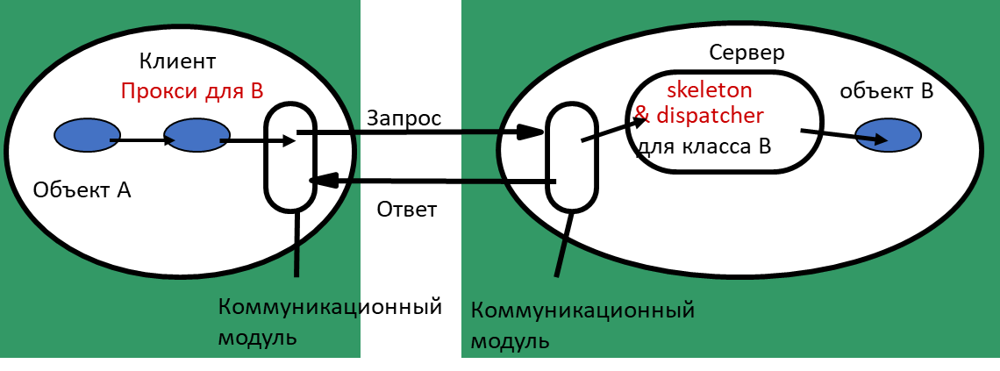
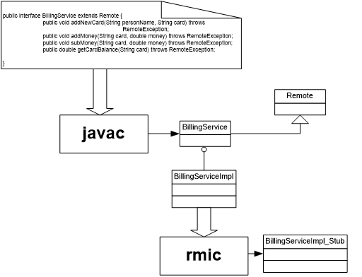
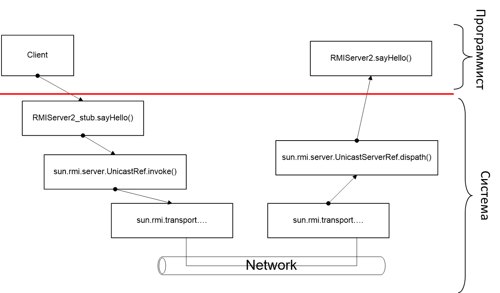
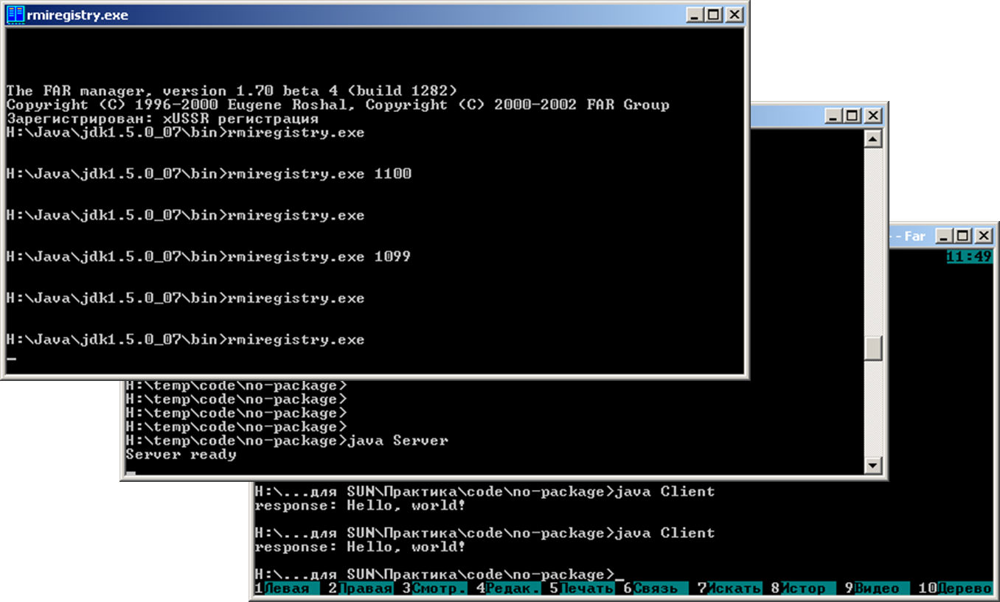

# Java RMI
---
## План занятия 
- Java RMI – одна  из реализаций промежуточного программного обеспечения 
- Входит в состав jdk => не требует инсталляции, настройки, …
---
### Java RMI
- Встроенная реализация механизма вызова удаленных методов
- Пакеты java.rmi.*
- Предназначен для реализации распределенных приложений с использованием ТОЛЬКО Java
    - => экстремально прост в использовании для Java-приложений
---
### Элементы технологии
- Прокси (клиентская заглушка), скелетон и диспетчер генерируются автоматически
- Реализация методов серверных объектов выполняется программистом



---
### Принцип работы
- Сервер публикует объект-обработчик удаленных вызовов
- Клиент производит поиск серверного объекта по его имени и получает proxy-объект, связанный с опубликованным сервером обработчиком
- Клиент вызывает методы proxy-объекта, RMI передает запрос на удаленную JVM и направляет его в реализацию объекта
- Сервер выполняет запрос
- Любые возвращаемые из реализации серверного обработчика значения передаются назад в proxy-объект и затем на клиент
- Для кодирования\декодирования передаваемых данных используется сериализация
---
### Элементы технологии
- Основан на взаимодействии между узлами с использованием сетевого протокола TCP/IP 
- Обеспечивает основные возможности соединения и некоторые стратегии защиты от несанкционированного доступа
- Основной принцип - разделение интерфейса (контракта) и реализации этого интерфейса (поведения)
---
### Процедура поиска
- Клиенты находят удаленные объекты, используя службу имен или каталогов 
- RMI может использовать различные службы, включая Java Naming and Directory Interface (JNDI) 
- RMI включает в себя простую службу – реестр RMI (rmiregistry). Эта утилита доступна в составе JRE. Единственный параметр консольной утилиты – рабочий порт
- RMI Registry работает на каждой машине, содержащей объекты удаленных служб и принимающей запросы на обслуживание (по умолчанию используется порт 1099) 
---
### Передача параметров. Примитивные типы
- Передача в удаленный метод параметров примитивных типов происходит по значению - RMI делает копию значения простого типа и передает ее в удаленный метод 
- Если метод возвращает значение простого типа, также используется передача по значению
- Значения передаются между JVM в стандартном, машинно-независимом формате; это позволяет JVM, работающим на разных платформах, надежно взаимодействовать друг с другом
---
### Передача параметров. Объекты
- Передача в удаленный метод параметров типа «объект» также происходит по значению - RMI делает копию объекта и передает ее в удаленный метод 
- Для создания копии используется механизм сериализации - состояние объекта преобразуется в набор байтов, пересылаемых по сети
- Это означает, что все классы, объекты которых должны передаваться в удаленные методы (или возвращаться из них) должны быть сериализуемыми (реализовывать интерфейс Serializable и содержать только Serializable поля, или поля, объявленные как transient)
---
### Передача параметров. Ссылки на удаленные объекты
- При передаче в качестве параметра или возвращаемого значения ссылки на удаленный прокси-объект сериализация не используется - вместо этого передается удаленная ссылка
- Получатель получает для работы локальную ссылку на прокси-объект удаленного объекта
- С точки зрения кода передача удаленной ссылки абсолютно прозрачна: если объект доступен удаленно, значит он был передан по значению и для него были выполнены условия передачи экземпляра объектного типа
---
### Динамическая загрузка классов

<div style="flex: 1; text-align: center; font-size: 80%;">

- Любой класс, передаваемый на клиент прямо или косвенно (через зависимость) должен быть доступен клиенту, речь идет именно о байт-коде
- Есть два способа обеспечить это
    - Поместить в Classpath клиента все необходимые классы
    - Предоставить возможности загрузки классов
- RMI-клиенты могут сами динамически загружать классы заглушек
- Также могут быть загружены дополнительные классы, необходимые для передачи параметров
- Загрузка произвольных классов потенциально небезопасна и по умолчанию запрещается Security Manager’ом. Это обеспечивается наличием соответствующей проверки в RMI Classloader
- В JDK есть менеджер, который решить эту проблему:
    - System.setSecurityManager(new SecurityManager()); 
- Также можно написать собственную реализацию SecurityManager с необходимым поведением

</div>

---
### Динамическая загрузка классов
- Для подключения динамической загрузки классов можно установить соответствующее JVM property
- -Djava.rmi.server.codebase=http://host:8080/rmi/ 

<svg width="80%" height="auto"  xmlns="http://www.w3.org/2000/svg" viewBox="0 0 850 550" font-family="Segoe UI, Arial, sans-serif" font-size="14px">
  <defs>
    <marker id="arrow" markerWidth="10" markerHeight="10" refX="9" refY="3" orient="auto" markerUnits="strokeWidth">
      <path d="M0,0 L0,6 L9,3 z" fill="#333" />
    </marker>
    <style>
      .box { fill: #f8f9fa; stroke: #495057; stroke-width: 2; }
      .text { fill: #333; font-weight: bold; }
      .msg-line { stroke: #333; stroke-width: 2; fill: none; }
      .note { fill: #fff3cd; stroke: #ffe69c; stroke-width: 1; }
      .note-text { fill: #664d03; }
      .step-text { fill: #333; font-size: 13px; }
      .dashed { stroke: #adb5bd; stroke-dasharray: 6 4; stroke-width: 1.5; fill: none; }
    </style>
  </defs>
  <!-- Узлы -->
  <!-- RMI Client -->
  <rect x="100" y="50" width="200" height="70" rx="5" class="box"/>
  <text x="200" y="90" text-anchor="middle" class="text">RMI client</text>
  <!-- Remote object instance -->
  <rect x="500" y="50" width="250" height="70" rx="5" class="box"/>
  <text x="625" y="90" text-anchor="middle" class="text">Remote object instance</text>
  <!-- URL location -->
  <rect x="500" y="300" width="250" height="70" rx="5" class="box"/>
  <text x="625" y="340" text-anchor="middle" class="text">URL location</text>
  <!-- Шаг 6: Вызов удаленного метода -->
  <line x1="300" y1="85" x2="495" y2="85" class="msg-line" marker-end="url(#arrow)"/>
  <text x="397" y="75" text-anchor="middle" class="step-text">6. Вызов удаленного метода</text>
  <text x="397" y="105" text-anchor="middle" class="step-text" font-size="12px">(передача неизвестного подтипа)</text>
  <!-- Шаг 7: Загрузка определения класса -->
  <line x1="625" y1="120" x2="625" y2="295" class="msg-line" marker-end="url(#arrow)"/>
  <text x="720" y="200" text-anchor="middle" class="step-text">7. Запрос и загрузка</text>
  <text x="720" y="218" text-anchor="middle" class="step-text">определения класса</text>
  <text x="720" y="236" text-anchor="middle" class="step-text">подтипа</text>
  <!-- Заметка с codebase слева -->
  <path d="M 50 300 L 350 300 L 350 370 L 50 370 Z" class="note"/>
  <text x="200" y="325" text-anchor="middle" class="note-text">Свойство клиента:</text>
  <text x="200" y="350" text-anchor="middle" class="note-text" font-family="monospace" font-size="12px">java.rmi.server.codebase=</text>
  <text x="200" y="365" text-anchor="middle" class="note-text" font-family="monospace" font-size="12px">http://wwwServer/mydirectory/</text>
  <!-- Пунктирная связь от заметки к клиенту (указывает, что свойство belongs to client) -->
  <path d="M 200 300 L 200 120" class="dashed"/>
</svg>


---
### Security
- Security manager разрешает Classloader’у загружать классы с удаленной машины по предоставленному codebase
- Тем не менее, скачанным proxy-классам  в большинстве случаев необходимо разрешение на установку socket-соединения и прослушивание портов
- Есть два основных способа обеспечить это требование
    - Создать измененный файл политики безопасности в JRE, security.policy

```json
grant
{  permission java.net.SocketPermission   "*:1024-65535", "connect";
    permission java.net.SocketPermission   "*:80", "connect";
};
```
 и применить его: -Djava.security.policy=security.policy
- Создать собственную реализацию Security Manager
---
### Используемые классы
- Интерфейс java.rmi.Remote – методов не содержит (тэгирующий интерфейс)
    - Служит для указания системе классов, являющихся серверными
- Класс java.rmi.server.UnicastRemoteObject –  используется для экспорта серверных классов и получения клиентских заглушек
- Интерфейс java.rmi.registry.Registry – реализации этого интерфейса содержат методы получения/помещения удаленных объектных ссылок по имени
- Класс java.rmi.registry.LocateRegistry – используется для получения ссылки на Registry
---
### Определение интерфейса
```java
import java.rmi.Remote;
import java.rmi.RemoteException;

public interface Hello extends Remote {
    String sayHello() throws RemoteException;
}
```
- Импорт элементов пакета java.rmi
- Объявление публичного интерфейса
- Интерфейс должен быть унаследован от java.rmi.Remote
- Методы бросают исключения RemoteException
---
### Реализация серверного класса

<div style="display: flex; gap: 20px; align-items: flex-start;">

<!-- Левая колонка: Код -->
<div style="flex: 1; text-align: left;">

```java
public class RMIServer implements Hello {
  public String sayHello() {
      return "Hello, world!";
  }
  public static void main(String args[]) {
    try {
      RMIServer obj = new RMIServer();
      Hellostub=(Hello)UnicastRemoteObject.exportObject(obj, 0);
      //connect to exist registry
      //Registry registry = LocateRegistry.getRegistry();     
      //start registry on this host
      Registry registry = LocateRegistry.createRegistry(8080); 
      registry.bind("Hello", stub);
      System.out.println("RMIServer ready");
    } catch (Exception e) {
 e.printStackTrace();
    }
  }
}
```

</div>

<div style="flex: 1; text-align: left; font-size: 50%;">

Импорт элементов пакета java.rmi <br>
Серверный класс реализует интерфейс (Hello)<br>
Реализуется метод, определенный в удаленном интерфейсе <br>
В методе main
- Создается экземпляр класса
- Вызывается статический метод exportObject класса UnicastRemoteObject – объект экспортируется и становится способным принимать удаленные вызовы
- Полученный интерфейс помещается в сервис имен под именем Hello

Другой способ состоит в наследовании серверного класса от класса UnicastRemoteObject (отпадает необходимость вызова exportObject)

</div>
</div>

---
### Реализация клиента 

<div style="display: flex; gap: 20px; align-items: flex-start;">

<!-- Левая колонка: Код -->
<div style="flex: 1; text-align: left;">

```java
public class RMIClient {
  public static void main(String[] args) {
    String host = (args.length < 1) ? null : args[0];
    int port = 8080;//1099 - default port
      try {
        Registry registry = LocateRegistry.getRegistry(host, port);
        System.out.println("registry :"+host+":"+port);
        Hello stub = (Hello) registry.lookup("Hello");
        System.out.println(stub);
        String response = stub.sayHello();
        System.out.println("response: " + response);
      } catch (Exception e) {
 e.printStackTrace();
      }
  }
}
```

</div>

<div style="flex: 1; text-align: left; font-size: 70%;">

Импорт элементов пакета java.rmi (не показано) <br>
В методе main:
  - С помощью сервиса имен ищется удаленный объект по имени
  - Получается объектная ссылка
  - Осуществляется вызов удаленного метода

</div>
</div>

---
### Автоматическая генерация вспомогательных компонентов  



---
### Автоматическая генерация вспомогательных компонентов
- Определение интерфейса удаленного объекта
- Реализация серверного класса (методов удаленного интерфейса)
- Генерация вспомогательных компонентов (rmic –v1.2 –keep ServerClassImpl)
    - В актуальных версиях jdk генерация прокси-классов выполняется автоматически в момент выполнения программы (без явного использования утилиты rmic)

---
### Вызов удаленных методов в java RMI



---
### Выполнение примера
- rmiregistry
- Java Server
- Java Client
---
##№ Выполнение примера



---
### Серверный класс (наследование от UnicastRemoteObject)

<div style="display: flex; gap: 20px; align-items: flex-start;">

<!-- Левая колонка: Код -->
<div style="flex: 1; text-align: left;">

```java
public class RMIServer2 extends UnicastRemoteObject implements Hello {
    public RMIServer2() throws java.rmi.RemoteException {
        super();
    }
    public String sayHello() {return "Hello, world!";}
    public static void main(String args[]) {
        try {
            RMIServer2 obj = new RMIServer2();
            // Bind the remote object's stub in the registry
            //Registry registry = LocateRegistry.getRegistry(); 
     //connect to exist registry
            Registry registry = LocateRegistry.createRegistry(8080); 
            //start registry on this host
            registry.bind("Hello", obj);
            //Naming.rebind("rmi://localhost/Hello",obj);
            System.out.println("RMIServer ready");
        } catch (Exception e) {
     e.printStackTrace();
        }
    }
}
```

</div>

<div style="flex: 1; text-align: left; font-size: 70%;">

- Класс наследуется от UnicastRemoteObject и объявляется реализующим методы интерфейса Hello
- В конструкторе вызывается конструктор предка (UnicastRemoteObject )
- Запуск – аналогично предыдущему примеру

</div>
</div>

---
### Промежуточные итоги
- Создать распределенное приложение с использованием Java RMI очень просто:
    - Нужно определить интерфейс, наследующий от Remote
    - Определить класс, реализующий этот интерфейс
    - Серверный объект зарегистрировать в сервисе имен под именем…
    - По которому клиент получит на него объектную ссылку

---
### Динамическая загрузка классов
```java
public interface RemoteObject extends Remote {
   Figure createFigure(String figureType) throws RemoteException;
}

public abstract class Figure implements Serializable {
    public abstract void move(int dx, int dy);
}

public class Circle extends Figure {...}

public class Rectangle extends Figure {...}
```
- При старте приложения оно обладает только представлением класса Figure. Остальные классы (наследники) должны быть загружены динамически
---
### Динамическая загрузка классов
```java
public class Server implements RemoteObject{
    public static void main(String[] args) {
        String serverName = "FigureServer";
        final int port = 8080;
        try {
            Server obj = new Server();
            RemoteObject stub = (RemoteObject) UnicastRemoteObject.exportObject(obj, 0);
     Registry registry = LocateRegistry.createRegistry(port); //start registry on this host
            registry.bind(serverName, stub);
            System.out.println("RMIServer ready");
        } catch (Exception e) {
            e.printStackTrace();
        }
    }
    @Override
    public Figure createFigure(String figureType) throws RemoteException {
        switch(figureType.toUpperCase()){
            case "CIRCLE": return new Circle(0,0,10);
            case "RECTANGLE": return new Rectangle(0, 0, 20, 40);
            default: throw new RuntimeException("Unknown figure type:"+figureType);
        }
    }
}
```
---
### Динамическая загрузка классов. Клиент
```java
public class Client {
    public static void main(String[] args) {
        String serverName = "FigureServer";
        String host = (args.length < 1) ? null : args[0];
        int port = 8080;//1099 - default port
        System.setSecurityManager(new SecurityManager());
        try {
            Registry registry = LocateRegistry.getRegistry(host, port);
            System.out.println("registry :" + host + ":" + port);
            RemoteObject stub = (RemoteObject) registry.lookup(serverName);
            System.out.println("response: " + stub.createFigure("CIRCLE"));
            System.out.println("response: " + stub.createFigure("RECTANGLE"));
        } catch (Exception e) {
            System.err.println("RMIClient exception: " + e.toString());
            e.printStackTrace();
        }
    }
}
```
Обратите внимание на установку SecuityManager - без него загрузка классов невозможна

---
### Динамическая загрузка классов. Подготовка к запуску
- Создаем файл с дополнительными привилегиями (нам нужны разрешения на открытие сетевых соединений для динамически-загруженных классов). 
```json
grant {
 permission java.net.SocketPermission  "*:1024-65535", "connect";
 permission java.net.SocketPermission  "*:80", "connect";
};
```
- Обеспечиваем сервис, которые может «отдать» класс по его имени (например, запускаем HTTP сервер и подкладываем ему папку с нашими классами)
---
### Динамическая загрузка классов. Запуск
- Запуск сервере не отличается от ранее рассмотренного
- Запуск клиента
```bash
 java  -Djava.rmi.server.codebase="http://localhost:8000/" -Djava.security.policy=security.policy  net.rmi.loader.client.Client
```
- Где
    - Djava.rmi.server.codebase – URL ресурса из которого могут быть загружены дополнительные классы
    - Djava.security.policy – имя файла с определением дополнительных привелегий
- При вызове метода createFigure и получении любого наследника от класса Figure, определение реального класса будет загружено по сети из http://localhost:8000/
---
### Примеры
- Реализация программы обслуживания сети столовых, с использованием технологии RMI
    - Пример 1: определяется интерфейс, содержащий методы, осуществляющие базовые единичные операции (передача простых типов данных)
    - Пример 2: интерфейс содержит методы, осуществляющие массированные операции (передача пользовательских типов данных с использованием сериализации)
---
### Элементы технологии
- Пакет java.rmi
- Определение удаленного интерфейса
- Генерация вспомогательных классов
- Реализация серверного класса
- Регистрация в сервисе имен
- Реализация клиентского класса
- Разрешение имени с помощью сервиса имен 

---
### Пакет java.rmi
- Интерфейс Remote – тэгирующий интерфейс для интерфейсов удаленных вызовов
- Удаленные методы должны быть определены как кидающие исключение RemoteException 
- Класс UnicastRemoteObject – базовый класс для серверного класса

```java
public interface BillingService extends Remote {
 …
}

public class BillingServiceImpl extends UnicastRemoteObject implements BillingService {
 …
} 
```
---
## Первый пример
Использование простых типов данных в качестве аргументов удаленных методов
---
### Интерфейс BillingService
```java
package com.asw.rmi.ex1;

import java.rmi.*;

public interface BillingService extends Remote {
 void addNewCard(String personName, String card) throws RemoteException;
 void addMoney(String card, double money) throws RemoteException;
 void subMoney(String card, double money) throws RemoteException;
 double getCardBalance(String card) throws RemoteException;
}

```
---
### Класс BillingServiceImpl (начало)
```java
package com.asw.rmi.ex1;

import java.rmi.*;
import java.util.*;
import java.rmi.server.*;

public class BillingServiceImpl extends UnicastRemoteObject implements BillingService {

 private HashMap<String, Double> hash;
 public BillingServiceImpl() throws RemoteException{
  super();
  hash = new HashMap<>();
 }
 public void addNewCard(String personName, String card) throws RemoteException {
  hash.putIfAbsent(card, 0.0);
 }

 public void addMoney(String card, double money) throws RemoteException {
  Double d = hash.get(card);
  if (d!=null) hash.put(card,d.doubleValue()+money);
  else throw new NotExistsCardOperation();
 }

```
---
### Класс BillingServiceImpl (окончание)
```java
        public void subMoney(String card, double money) throws RemoteException {
  Double d = hash.get(card);
  if (d!=null) hash.put(card,d.doubleValue()-money);
  else throw new NotExistsCardOperation();
 }
 
 public double getCardBalance(String card) throws RemoteException{
  Double d = hash.get(card);
  if (d!=null) return d.doubleValue();
  else throw new NotExistsCardOperation();
 };
 
 public static void main (String[] args) throws Exception {
  System.out.println("Initializing BillingService...");
  BillingService service = new BillingServiceImpl();
  String serviceName = "rmi://localhost/BillingService";
  Naming.rebind(serviceName, service);
 }

}
```
---
### Утилита rmic
- rmic -v1.2 -keep com.asw.rmi.ex1.BillingServiceImpl
- Генерируется класс BillingServiceImpl_Stub
- Генерируется автоматически
- Исходный текст уничтожается после компиляции (если не указан параметр -keep)
---
### Класс BillingServiceImpl_Stub
```java
package com.asw.rmi.ex1;
public final class BillingServiceImpl_Stub    extends java.rmi.server.RemoteStub     implements com.asw.rmi.ex1.BillingService, java.rmi.Remote {
    private static final long serialVersionUID = 2;
    private static java.lang.reflect.Method $method_addMoney_0;
    private static java.lang.reflect.Method $method_addNewCard_1;
    private static java.lang.reflect.Method $method_getCardBalance_2;
    private static java.lang.reflect.Method $method_subMoney_3;
     static { try {
     $method_addMoney_0 = com.asw.rmi.ex1.BillingService.class.getMethod("addMoney", new java.lang.Class[] {java.lang.String.class, double.class});
     $method_addNewCard_1 = com.asw.rmi.ex1.BillingService.class.getMethod("addNewCard", new java.lang.Class[] {java.lang.String.class, java.lang.String.class});
     $method_getCardBalance_2 = com.asw.rmi.ex1.BillingService.class.getMethod("getCardBalance", new java.lang.Class[] {java.lang.String.class});
     $method_subMoney_3 = com.asw.rmi.ex1.BillingService.class.getMethod("subMoney", new java.lang.Class[] {java.lang.String.class, double.class});
 } catch (java.lang.NoSuchMethodException e) {     throw new java.lang.NoSuchMethodError("stub class initialization failed");}
    }
     // constructors
    public BillingServiceImpl_Stub(java.rmi.server.RemoteRef ref) {super(ref);   }
     // methods from remote interfaces
    // implementation of addMoney(String, double)
    public void addMoney (java.lang.String $param_String_1, double $param_double_2) throws java.rmi.RemoteException    {
 try {    ref.invoke(this, $method_addMoney_0, new java.lang.Object[] {$param_String_1, new java.lang.Double($param_double_2)}, -378070190076806602L);
 } catch (java.lang.RuntimeException e) {    throw e;} catch (java.rmi.RemoteException e) {    throw e; } catch (java.lang.Exception e) {
     throw new java.rmi.UnexpectedException("undeclared checked exception", e);
 }
    } ……………………….

```
---
### Класс BillingClient
```java
package com.asw.rmi.ex1;

import java.rmi.*;
public class BillingClient {

 public static void main(String[] args) throws Exception{
  String objectName = "rmi://"+args[0]+"/BillingService";
  BillingService bs = (BillingService)Naming.lookup(objectName);
  bs.addNewCard("Piter","1");
  bs.addNewCard("Stefan","2");
  bs.addNewCard("Nataly","3");
  for (int i=0; i<1000;i++){
   bs.addMoney("1", i%10);
   bs.addMoney("2", i%20);
   bs.addMoney("3", i%30);
  }
  
  System.out.println("1:"+bs.getCardBalance("1"));
  System.out.println("2:"+bs.getCardBalance("2"));
  System.out.println("3:"+bs.getCardBalance("3"));
  
 }
}
```
---
### Компиляция и выполнение
- Генерация заглушек (не нужна в актуальных версиях JDK)
    - rmic –v1.2 com.asw.rmi.ex1.BillingServiceImpl
- Запуск сервиса имен
    - rmiregistry
- Запуск сервера
    - java com.asw.rmi.ex1.BillingServiceImpl
- Запуск клиента
    - java com.asw.rmi.ex1.BillingClient 127.0.0.1
---
### Второй пример
- Использование сложных типов данных (пользовательских классов) в качестве аргументов удаленных методов
- Классы должны быть сериализуемы
- При передаче в удаленный метод создается копия класса, а не ссылка!
---
### Интерфейс BillingService 
```java
package com.asw.rmi.ex2;

import java.rmi.*;

public interface BillingService extends Remote {
 void addNewCard(Card card) throws RemoteException;
 void processOperations(CardOperation[] operations) throws RemoteException;
 Card getCard(String card) throws RemoteException;
 
}

```
---
### Класс BillingServiceImpl 
```java
package com.asw.rmi.ex2;

import java.rmi.*;
import java.util.*;
import java.rmi.server.*;

public class BillingServiceImpl extends UnicastRemoteObject implements BillingService {
 private HashMap<String, Card> hash;
 public BillingServiceImpl() throws RemoteException{
  super();
  hash = new HashMap<>();
 }
 public void addNewCard(Card card) throws RemoteException {
  hash.putIfAbsent(card.cardNumber, card);
 }

 public void processOperations(CardOperation[] operations) throws RemoteException {
  for (int i=0;i<operations.length;i++){
   Card c = hash.get(operations[i].card);
   if (c==null) throw new NotExistsCardOperation();
   c.balance+=operations[i].amount;
  }
 } 

```
---
### Класс BillingServiceImpl (окончание)
```java
 public Card getCard(String card) throws RemoteException{
  Card c = hash.get(card);
  return c; 
 };
 public static void main (String[] args) throws Exception {
  System.out.println("Initializing BillingService...");
  BillingService service = new BillingServiceImpl();
  String serviceName = "rmi://localhost/BillingService";
  Naming.rebind(serviceName, service);
 }

}

```
---
### Класс Card
```java
package com.asw.rmi.ex2;

import java.io.Serializable;
import java.util.*;

public class Card implements Serializable{
 public Card(String person, Date createDate, String cardNumber,double balance){
  this.person = person;
  this.createDate = createDate;
  this.cardNumber = cardNumber;
  this.balance = balance;
 }
 public String person;
 public Date createDate;
 public String cardNumber;
 public double balance;
 public String toString(){
  return "Card: cardNumber="+cardNumber+"\tBalance="+balance                 +"\tPerson="+person+"\tCreateDate="+createDate+"";
 }
}

```
---
### Класс CardOperation
```java
package com.asw.rmi.ex2;
import java.util.*;
import java.io.*;

public class CardOperation implements Serializable {
 public CardOperation(String card,double amount,Date operationDate){
  this.card = card;
  this.amount = amount;
  this.operationDate = operationDate;
 }
 public String card;
 public double amount;
 public Date operationDate;
}

```
---
### Класс BillingClient
```java
package com.asw.rmi.ex2;
import java.rmi.*;
import java.util.Date;
public class BillingClient2 {
  public static void main(String[] args) throws Exception{
    String objectName = "rmi://"+args[0]+"/BillingService";
    BillingService bs = (BillingService)Naming.lookup(objectName);
    Card c;
    c = bs.getCard("1");if (c==null) {c = new Card("Piter",new Date(),"1",0.0);bs.addNewCard(c);}
    c = bs.getCard("2");if (c==null) {c = new Card("Stefan",new Date(),"2",0.0);bs.addNewCard(c);}
    c = bs.getCard("3");if (c==null) {c = new Card("Nataly",new Date(),"3",0.0);bs.addNewCard(c);}
    int cnt = 30000;
    CardOperation[] co = new CardOperation[cnt];
      for (int i = 0; i < cnt; i++) {
 switch (i%3){
 case 0: co[i] = new CardOperation("1",1,new Date());break;
 case 1: co[i] = new CardOperation("2",1,new Date());break;
 case 2: co[i] = new CardOperation("3",1,new Date());break;
 }
      }
    bs.processOperations(co);
    System.out.println(bs.getCard("1")); System.out.println(bs.getCard("2"));
    System.out.println(bs.getCard("3"));   
 }
}

```
---
## Итоги
- RMI обеспечивает прозрачную передачу как встроенных типов, так и пользовательских типов (при этом используется сериализация)
- При передаче/возврате параметров осуществляется создание их копий
- Использовать RMI – очень просто!


