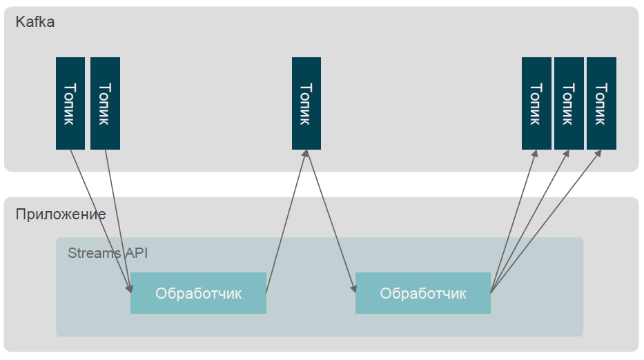
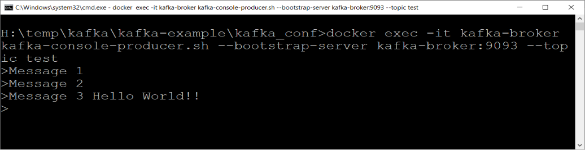
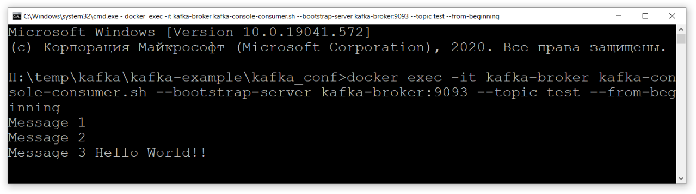
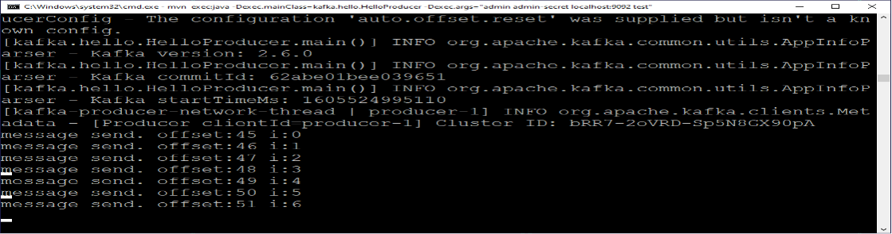
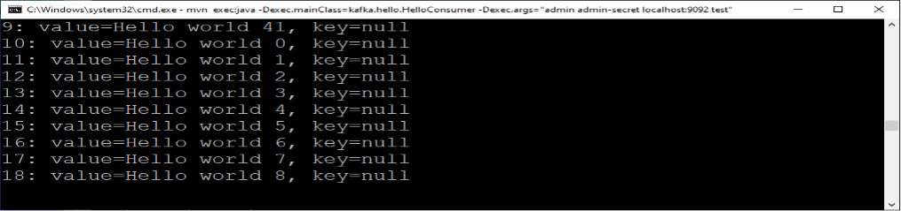

#### Методы и средства построения распределенных программных систем с использованием технологии Java
##### Kafka
---
### Apache Kafka
 - Apache Kafka - это распределенная система, предназначенная для работы с потоками данных. Она построена как горизонтально масштабируемая, отказоустойчивая, с возможностями фиксации в журналах. Позволяет обрабатывать распределенные потоки данных и взаимодействовать с приложениями для обработки потоков.
---
### Apache Kafka
 - Разработан в Linkedin в 2010 году и передан сообществу Apache в 2011 году
 - Предназначен для быстрой и масштабируемой обработки данных
 - Распределенный по своей природе
 - Использует партиционирование данных (шардинг)
 - Обладает высокой пропускной способностю => низкая задержка =>cпособность обрабатывать огромное количество потребителей
---
### Основные концепции Apache Kafka
 - Сообщения отправляются в и принимаются из топиков (topic)
     - Топики разделены на один или несколько разделов (партиций или шардов)
     - Вся фактическая работа выполняется на уровне раздела, тема - это просто виртуальный объект
 - Каждое сообщение записывается только в один выбранный раздел
     - Разбиение обычно выполняется на основе ключа сообщения
     - Порядок сообщений в разделе фиксирован
---
### Основные концепции Apache Kafka
 - Хранилище
     - Рассчитывается на основании размера / возраста сообщения
     - Уплотняется на основе ключа сообщения
 - Репликация
     - Каждый раздел может существовать в одной или нескольких копиях для достижения высокой доступности
---
### Компоненты Apache Kafka
 - Компоненты проекта Apache Kafka
     - Broker
     - Connect
     - Streams
     - Mirror Maker <!-- .element: class="fragment custom gray" data-fragment-index="1" -->
 - Клиенты Java (подписчики, поставщики и администраторы) и инструменты управления
 - Apache Zookeeper (только как зависимость Kafka, а не как самостоятельный продукт)
---
### Kafka Broker
 - Центральный компонент, отвечающий за размещение топиков и доставку сообщений
 - Один или несколько брокеров работают в кластере вместе под управлением Zookeeper’а
---
### Kafka Broker
  

https://www.cloudkarafka.com/img/blog/apache-kafka-partitions-topics.png<!-- .element: class="copyright-reference"  -->
---
### Kafka Connect
 - Фреймворк для передачи данных между Kafka и другими системами обработки и хранения данных
 - Поддержка преобразования данных, масштабирования, балансировки нагрузки, отказоустойчивости, ...
 - Плагины для подключений к системам разворачиваются в кластере Kafka Connect
     - Хорошо определенный API для создания новых подключений
     - Apache Kafka включает в себя только плагины FileSink и FileSource (чтение записей из файла и отправка их в виде сообщений Kafka / запись сообщений Kafka в файлы)
    - Многие дополнительные плагины доступны вне проекта Apache Kafka
---
### Kafka Connect
 
 https://howtoprogram.xyz/wp-content/uploads/2016/07/Kafka-Connect.png<!-- .element: class="copyright-reference"  -->
---
### Kafka Streams
 - Фреймворк для работы с потоками
 - Потоки - это топики Kafka (как входные, так и выходные)
 - Это библиотека Java, которая может быть включена в приложение.
 - Создает топологию узлов обработки (фильтры, мэппиги, соединения и т. д.), работающих на потоке данных
     - Низкоуровневый API для обработчиков
     - Высокоуровневый DSL
     - Использует «внутренние» топики (при необходимости повторного разбиения на партиции или для stateful-преобразований )
---
### Для чего нужен Apache Kafka? Сценарии использования
 - Сообщения. Замена традиционного брокера сообщений, имеет лучшую пропускную способность, встроенное разбиение на разделы, репликацию и отказоустойчивость. Обеспечивает более высокую надежность.
 - Метрики\логи. Агрегирование статистики(логов) из распределенных приложений для создания централизованных потоков оперативных данных.
 - Потоковая обработка. Обеспечивает возможность построения приложений реального времени для реагирования, обработки или преобразования потока данных.
---
### Приложения. Producer и Consumer

---
### Балансировка нагрузки
 

 https://www.oreilly.com/api/v2/epubs/9781491936153/files/assets/ktdg_0106.png<!-- .element: class="copyright-reference"  -->
---
### Стримы и Таблицы
 - Стримы
     - Полная история всех событий «с начала времён» по сегодняшний день. Новые события только добавляются. Можно просматривать с любой записи (в т.ч. с первой, или последней прочитанной)
 - Таблицы
     - Состояние на сегодняшний день. Это совокупность (агрегация) всех событий, которая постоянно изменяется по мере того, как новые события добавляются. Можно просмотреть только «мгновенный» срез.
---
## Развертывание в непродуктивных средах<!-- .element: class="left"  -->
### Docker<!-- .element: class="left"  -->
---
### Docker
 - Программное обеспечение для автоматизации развёртывания и управления приложениями в средах с поддержкой контейнеризации. 
 - Позволяет «упаковать» приложение со всем его окружением и зависимостями в контейнер, который может быть перенесён на любую Linux-систему с поддержкой cgroups в ядре, а также предоставляет инструменты для управления контейнерами.
 - Документация и дистрибутивы для поддерживаемых платформ  доступны на https://www.docker.com/get-started 
---
### Определение сервисов (docker-compose.yml)
```yml []
version: '2'
services:
  zookeeper:
    image: wurstmeister/zookeeper               # Образ zookeeper    
    hostname: zookeeper
    container_name: zookeeper
    expose:
      - "2181"
  kafka:
    image: wurstmeister/kafka                   # Образ kafka   
    hostname: kafka-broker
    container_name: kafka-broker
    ports:
      - "9092:9092"
    expose:
      - "9093"
    environment:
      KAFKA_AUTO_CREATE_TOPICS_ENABLE: 'true'                       # ip хоста, на котором запускается контейнер    
      KAFKA_ADVERTISED_LISTENERS: INSIDE://kafka-broker:9093,OUTSIDE://<your ip>:9092
      KAFKA_LISTENER_SECURITY_PROTOCOL_MAP: INSIDE:PLAINTEXT,OUTSIDE:SASL_PLAINTEXT # настройки шифрования
      KAFKA_LISTENERS: INSIDE://0.0.0.0:9093,OUTSIDE://0.0.0.0:9092
      KAFKA_ZOOKEEPER_CONNECT: zookeeper:2181       # где находится zookeeper
      KAFKA_INTER_BROKER_LISTENER_NAME: INSIDE
      KAFKA_OPTS: "-Djava.security.auth.login.config=/etc/kafka/kafka_server_jaas.conf"
      KAFKA_SASL_ENABLED_MECHANISMS: PLAIN
      KAFKA_SASL_MECHANISM_INTER_BROKER_PROTOCOL: PLAIN
    depends_on:
      - zookeeper
    volumes:
      - ./:/etc/kafka                               # где будут храниться данные
```
---
### Настройка сервера Kafka
```java 
KafkaServer {
    // Модуль аутентификации. Могут использоваться разные, в зависимости от задачи
    org.apache.kafka.common.security.plain.PlainLoginModule required
    // Пользователь для внутренней коммуникации между брокерами Kafka
    username="admin"
    password="admin-secret"
    // Новый пользователь (admin) и его пароль. Для пользователя xxx было бы user_xxx
    user_admin="admin-secret";
};
Client {};
```
---
### Управление контейнерами
 - Старт
```bash 
docker-compose up
```
- Останов
```bash 
docker-compose down
```
 - Команды необходимо вводить в директории, в которой находится файл определения сервисов (docker-compose.yml) или явно указывать его местонахождение (ключ -f) 
---
### Инструменты администрирования
 - Создание топика (имя топика - test)<!-- .element: class="small_font"  -->
```bash 
docker exec -it kafka-broker kafka-topics.sh --create --bootstrap-server kafka-broker:9093 --topic test
```
 - Просмотреть параметры топика (имя топика - test)<!-- .element: class="small_font"  -->
```bash 
docker exec -it kafka-broker kafka-topics.sh --describe --bootstrap-server kafka-broker:9093 --topic test
```
 - Просмотреть список всех топиков<!-- .element: class="small_font"  -->
```bash 
docker exec -it kafka-broker kafka-topics.sh --bootstrap-server kafka-broker:9093 –list
```
 - Удалить топик<!-- .element: class="small_font"  -->
```bash 
docker exec -it kafka-broker kafka-topics.sh --delete --bootstrap-server kafka-broker:9093 --topic test
```
 - Запустить «встроенный» producer (имя топика - test)<!-- .element: class="small_font"  -->
```bash 
docker exec -it kafka-broker kafka-console-producer.sh --bootstrap-server kafka-broker:9093 --topic test
```
 - Запустить «встроенный» consumer (имя топика - test)<!-- .element: class="small_font"  -->
```bash 
docker exec -it kafka-broker kafka-console-consumer.sh --bootstrap-server kafka-broker:9093 --topic test --from-beginning
```
---
### Примеры использования



---
### Пример приложения. Простейшие Producer и Consumer
 - В проекте подключаем необходимые зависимости (https://kafka.apache.org/documentation/#api)
 - Определяем параметры подключения
     - Определяем классы для серилизации и десерилизации ключа сообщения и данных 
 - Создаем KafkaConsumer, подключаем его к нужным нам топикам
     - Читаем сообщения из топика
 - Или создаем KafkaProducer
     - Синхронно или асинхронно пишем сообщения в топик
---
### HelloProducer
```java []
package kafka;
import org.apache.kafka.clients.producer.KafkaProducer;
import org.apache.kafka.clients.producer.ProducerRecord;
import org.apache.kafka.common.serialization.StringDeserializer;
import org.apache.kafka.common.serialization.StringSerializer;
import java.util.Properties;
public class HelloProducer {
    static int count = 0;
    public static void main(String[] args) throws Exception{
        String username = args[0]; String password = args[1];
        String brokers = args[2];  String topicName = args[3];
        String jaasTemplate = "org.apache.kafka.common.security.plain.PlainLoginModule required username=\"%s\" password=\"%s\";";
        String jaasCfg = String.format(jaasTemplate, username, password);
        String serializer = StringSerializer.class.getName(); String deserializer = StringDeserializer.class.getName();
        Properties properties = new Properties();   properties.put("sasl.jaas.config", jaasCfg);
        properties.put("bootstrap.servers", brokers);    properties.put("group.id", username + "-consumer");
        properties.put("enable.auto.commit", "true");    properties.put("auto.commit.interval.ms", "1000");
        properties.put("auto.offset.reset", "earliest");   properties.put("session.timeout.ms", "30000");
        properties.put("key.deserializer", deserializer);  properties.put("value.deserializer", deserializer);
        properties.put("key.serializer", serializer);      properties.put("value.serializer", serializer);
        properties.put("security.protocol", "SASL_PLAINTEXT");  properties.put("sasl.mechanism", "PLAIN");
        KafkaProducer<String, String> producer = new KafkaProducer<>(properties);
        while (true){
            producer.send(new ProducerRecord<String, String>(topicName, "Hello world "+count),
                    (recordMetadata, e) -> System.out.println(String.format("message send. offset:%s i:%s",recordMetadata.offset(),count))
            );
            Thread.sleep(1000); count++;
        }
    }
}
``` 
---
### HelloConsumer
```java []
package kafka;
import org.apache.kafka.clients.consumer.ConsumerRecord;
import org.apache.kafka.clients.consumer.ConsumerRecords;
import org.apache.kafka.clients.consumer.KafkaConsumer;
import org.apache.kafka.common.serialization.StringDeserializer;
import org.apache.kafka.common.serialization.StringSerializer;
import java.util.Arrays;
import java.util.Properties;
public class HelloConsumer {
    public static void main(String[] args) {
        String username = args[0];          String password = args[1];
        String brokers = args[2];           String topicName = args[3];
        String jaasTemplate = "org.apache.kafka.common.security.plain.PlainLoginModule required username=\"%s\" password=\"%s\";";
        String jaasCfg = String.format(jaasTemplate, username, password);
        String serializer = StringSerializer.class.getName(); String deserializer = StringDeserializer.class.getName();
        Properties properties = new Properties();
        properties.put("bootstrap.servers", brokers);         properties.put("group.id", username + "-consumer");
        properties.put("enable.auto.commit", "true");         properties.put("auto.commit.interval.ms", "1000");
        properties.put("auto.offset.reset", "earliest");         properties.put("session.timeout.ms", "30000");
        properties.put("key.deserializer", deserializer);         properties.put("value.deserializer", deserializer);
        properties.put("key.serializer", serializer);         properties.put("value.serializer", serializer);
        properties.put("security.protocol", "SASL_PLAINTEXT");         properties.put("sasl.mechanism", "PLAIN");
        properties.put("sasl.jaas.config", jaasCfg);
        KafkaConsumer<String, String> consumer = new KafkaConsumer<>(properties);
        consumer.subscribe(Arrays.asList(topicName));
        int count = 0;
        while(true) {
            ConsumerRecords<String, String> records = consumer.poll(Long.MAX_VALUE);
            if (!records.isEmpty()){
                for(ConsumerRecord<String, String> record: records) {
                    count++; System.out.println( String.format("%s: value=%s, key=%s",count,record.value(), record.key()));
                }
                //consumer.commitSync();
            }
        }
    }
}
```
---
### Запуск
mvn exec:java -Dexec.mainClass=kafka.hello.HelloProducer -Dexec.args="admin admin-secret localhost:9092 test"<!-- .element: class="left small_font"  -->

<!-- .element: width="80%"  -->

mvn exec:java -Dexec.mainClass=kafka.hello.HelloProducer -Dexec.args="admin admin-secret localhost:9092 test"<!-- .element: class="left small_font"  -->

<!-- .element: width="80%"  -->
---
### Пример с биллингом
 - Особенности приложения:
     - В качестве пересылаемых в сообщении данных используем пользовательский класс
     - Используем таблицу для «накопления» текущего значения баланса
     - Запрос баланса (и возврат значения) будем осуществлять также через обмен сообщениями
---
### Транспортный класс
```java
package kafka.ex1;
import lombok.AllArgsConstructor;
import lombok.Data;
import lombok.NoArgsConstructor;

@Data
@AllArgsConstructor
@NoArgsConstructor
public class CardOperation {
    String card;
    Double operation;
}
```
---
### Серилизация в JSON
```java
package kafka.ex1;
import com.fasterxml.jackson.databind.ObjectMapper;
import org.apache.kafka.common.serialization.Serializer;

public class CardOperationSerializer implements Serializer<CardOperation> {

    @Override
    public byte[] serialize(String s, CardOperation o) {
        byte[] retVal = null;
        ObjectMapper objectMapper = new ObjectMapper();
        try {
            retVal = objectMapper.writeValueAsString(o).getBytes();
        } catch (Exception e) {
            e.printStackTrace();
        }
        return retVal;
    }
}
```
---
### Десериализация из JSON
```java
package kafka.ex1;
import com.fasterxml.jackson.databind.ObjectMapper;
import org.apache.kafka.common.serialization.Deserializer;
public class CardOpertaionDeserializer implements Deserializer<CardOperation> {

    @Override
    public CardOperation deserialize(String s, byte[] bytes) {
        ObjectMapper mapper = new ObjectMapper();
        CardOperation co = null;
        try {
            co = mapper.readValue(bytes, CardOperation.class);
        } catch (Exception e) {
            e.printStackTrace();
        }
        return co;
    }
}
```
---
### Комплект для «упаковки\распаковки»
```java
package kafka.ex1;

import org.apache.kafka.common.serialization.Deserializer;
import org.apache.kafka.common.serialization.Serde;
import org.apache.kafka.common.serialization.Serializer;

public class CardOperationSerde implements Serde<CardOperation> {
    @Override
    public Serializer<CardOperation> serializer() {
        return new CardOperationSerializer();
    }

    @Override
    public Deserializer<CardOperation> deserializer() {
        return new CardOpertaionDeserializer();
    }
}
```
---
### Клиент – генерация операций
```java
package kafka.ex1;

Import …

public class BillingClient {
    static int count = 0; final static int cardCount = 3;
    public static void main(String[] args) throws Exception {
        String username = "admin";   String password = "admin-secret";    String brokers = "localhost:9092";
        String jaasTemplate = "org.apache.kafka.common.security.plain.PlainLoginModule required username=\"%s\" password=\"%s\";";
        String jaasCfg = String.format(jaasTemplate, username, password);
        String serializer = StringSerializer.class.getName();    String deserializer = StringDeserializer.class.getName();
        Properties properties = new Properties();   properties.put("security.protocol", "SASL_PLAINTEXT");  
        properties.put("group.id", username + "-consumer");      properties.put("enable.auto.commit", "true");
        properties.put("auto.commit.interval.ms", "1000");       properties.put("auto.offset.reset", "earliest");
        properties.put("session.timeout.ms", "30000");           properties.put("key.deserializer", deserializer);
        properties.put("value.deserializer", CardOpertaionDeserializer.class.getName());  properties.put("key.serializer", serializer);
        properties.put("value.serializer", CardOperationSerializer.class.getName()); properties.put("bootstrap.servers", brokers); 
        properties.put("sasl.mechanism", "PLAIN");   properties.put("sasl.jaas.config", jaasCfg);
        KafkaProducer<String, CardOperation> cardOperationProducer = new KafkaProducer<>(properties);
        Timer produceOperation = new Timer();
        produceOperation.schedule(new TimerTask() {
            @Override
            public void run() {
                cardOperationProducer.send(new ProducerRecord<>(BillingServer.BILLING_OPERATION_TOPIC, 
                                new CardOperation(String.valueOf(count % cardCount), 100.0)),
               (recordMetadata, e) -> write ("\r"+String.format("send. offset:%s send count:%s",recordMetadata.offset(), count++))
                );
            }
        }, 10, 1000);
    }
    public static void write(String message) {
        try { System.out.write(message.getBytes()); } catch (Exception ex) {
        }
    }
}
```
---
### Сервер (1)
```java
package kafka.ex1;

import …

public class BillingServer {
    public static final String BILLING_OPERATION_TOPIC = "billing-operation-in";
    public static final String BALANCE_QUERY_TOPIC = "billing-guery"; public static final String KEY_VALUE_STORE_NAME = "BillingStore";
    public static final String BALANCE_RESPONSE_TOPIC = "billing-request";  
    public static void main(String[] args) {
        String serializer = StringSerializer.class.getName();  String deserializer = StringDeserializer.class.getName();
        String username = "admin";         String password = "admin-secret";
        String jaasTemplate = "org.apache.kafka.common.security.plain.PlainLoginModule required username=\"%s\" password=\"%s\";";
        String jaasCfg = String.format(jaasTemplate, username, password);
        final Properties props = new Properties();             props.put(StreamsConfig.APPLICATION_ID_CONFIG, "billing");
        props.put("group.id", username + "-consumer");         props.put(StreamsConfig.BOOTSTRAP_SERVERS_CONFIG, "localhost:9092");
        props.put(StreamsConfig.CACHE_MAX_BYTES_BUFFERING_CONFIG, 0); props.put("sasl.jaas.config", jaasCfg);
        props.put(StreamsConfig.DEFAULT_KEY_SERDE_CLASS_CONFIG, Serdes.String().getClass().getName());
        props.put(StreamsConfig.DEFAULT_VALUE_SERDE_CLASS_CONFIG, CardOperationSerde.class.getName());
        props.put("key.deserializer", deserializer);    props.put("value.deserializer", CardOpertaionDeserializer.class.getName());
        props.put("key.serializer", serializer);        props.put("value.serializer", CardOperationSerializer.class.getName());
        props.put("security.protocol", "SASL_PLAINTEXT");  props.put("sasl.mechanism", "PLAIN");
        props.put(ConsumerConfig.AUTO_OFFSET_RESET_CONFIG, "earliest");

        final KafkaStreams streams = createStreams(props);
        final CountDownLatch streamsReadyLatch = new CountDownLatch(1);
        CompletableFuture.runAsync(()->{
            try {
                streamsReadyLatch.await();
                createBalanceConsumer(props,streams);
            }catch(Exception ex){}
        });
        streams.setStateListener((state, state1) -> {
            System.out.println("state="+state+" state1="+state1);
            if (streams.state() == KafkaStreams.State.RUNNING){
                streamsReadyLatch.countDown();
            }
        });

```
---
### Сервер (2)
```java
    final CountDownLatch latch = new CountDownLatch(1);
    Runtime.getRuntime().addShutdownHook(new Thread("billing-shutdown-hook") {
        @Override
        public void run() {
            streams.close();
            latch.countDown();
        }
    });

    try {
        streams.start();
        latch.await();
    } catch (final Throwable e) { System.exit(1);}
        System.exit(0);
}//end of main

public static KafkaStreams createStreams(Properties props){
    StreamsBuilder builder = new StreamsBuilder();
    KStream<String, CardOperation> stream =
            builder.stream(BILLING_OPERATION_TOPIC, Consumed.with(Serdes.String(), 
    Serdes.serdeFrom(new CardOperationSerializer(), 
        new CardOpertaionDeserializer())));
    KGroupedStream<String, Double> balanceGropedStream = stream
            .map((k,v) -> new KeyValue<>(v.getCard(),v.getOperation()))
            .groupByKey(Grouped.with(Serdes.String(),Serdes.Double()));
    balanceGropedStream.reduce(Double::sum,Materialized.as(KEY_VALUE_STORE_NAME));
    return  new KafkaStreams(builder.build(), props);
}

```
---
### Сервер (3)
```java
    public static void createBalanceConsumer(Properties props, KafkaStreams streams){
    props.put("value.deserializer", StringDeserializer.class.getName());
    props.put("value.serializer", StringSerializer.class.getName());
    KafkaConsumer<String, String> consumer = new KafkaConsumer<>(props);
    consumer.subscribe(Arrays.asList(BALANCE_QUERY_TOPIC));
    ReadOnlyKeyValueStore<String, Double> keyValueStore =
            streams.store(KEY_VALUE_STORE_NAME, QueryableStoreTypes.keyValueStore());
    KafkaProducer<String, String> balanceResultProducer = new KafkaProducer<>(props);

    while(true) {
        ConsumerRecords<String, String> records = consumer.poll(Long.MAX_VALUE);
        String out = "\r";
        if (!records.isEmpty()){
            for(ConsumerRecord<String, String> record: records) {
                Double balance = keyValueStore.get(record.value());
                balanceResultProducer.send(             new ProducerRecord(BALANCE_RESPONSE_TOPIC,record.value(),String.valueOf(balance)),
                        ((recordMetadata, e) -> {if (e!=null) e.printStackTrace();}));
                out = out + String.format("%s for key:%s", balance,record.value()) + "\t";
            }
        }
        try{System.out.write(out.getBytes());}catch(Exception e){}
    }
}
}//end of class
```
---
### Клиент – запрос балансов
```java
    package kafka.ex1;
import …
public class BalanceClient {
    final static int cardCount = 3;
    public static void main(String[] args) throws Exception {
        String username = "admin";         String password = "admin-secret";         String brokers = "localhost:9092";
        String jaasTemplate = "org.apache.kafka.common.security.plain.PlainLoginModule required username=\"%s\" password=\"%s\";";
        String jaasCfg = String.format(jaasTemplate, username, password);
        String serializer = StringSerializer.class.getName();  String deserializer = StringDeserializer.class.getName();
        Properties properties = new Properties();              properties.put("bootstrap.servers", brokers);
        properties.put("group.id", username + "-consumer");    properties.put("enable.auto.commit", "true");
        properties.put("auto.commit.interval.ms", "1000");     properties.put("auto.offset.reset", "earliest");
        properties.put("session.timeout.ms", "30000");         properties.put("key.deserializer", deserializer);
        properties.put("key.serializer", serializer);          properties.put("security.protocol", "SASL_PLAINTEXT");
        properties.put("sasl.mechanism", "PLAIN");             properties.put("sasl.jaas.config", jaasCfg);
        properties.put("value.deserializer", deserializer);    properties.put("value.serializer", serializer);
        KafkaProducer<String, String> balanceProducer = new KafkaProducer<>(properties);
        Timer balanceOperation = new Timer();
        balanceOperation.schedule(new TimerTask() {
            @Override
            public void run() {
                for (int card = 0; card < cardCount; card++)
                    balanceProducer.send(new ProducerRecord<>(BillingServer.BALANCE_QUERY_TOPIC, String.valueOf(card)),
                            ((recordMetadata, e) -> {}));
            }
        }, 100, 1000);
        KafkaConsumer<String, String> consumer = new KafkaConsumer<>(properties);
        consumer.subscribe(Arrays.asList(BillingServer.BALANCE_RESPONSE_TOPIC));
        while(true) {
            ConsumerRecords<String, String> records = consumer.poll(Long.MAX_VALUE);
            if (!records.isEmpty()){
                String out = "\r";
                for(ConsumerRecord<String, String> record: records) {
                    out = out + String.format("%s for %s", record.value(), record.key()) + "\t"; write(out);
                }
            }
        }
    }
}
```
---
### Важное замечание
 - Kafka Streams – механизм для работы в распределенной среде. При запуске нескольких экземпляров BillingServer созданная нами keyValueStore будет распределена между этими несколькими запущенными экземплярами. Таким образом, при запросе баланса, необходимо обращаться к конкретному экземпляру, тому самому, который обладает данным ключом (или запрашивать все запущенные экземпляры, но это противоречит идеологии Kafka)
---
### Итоги
 - Удобный, современный инструмент  для построения систем, основанных на концепции обмена сообщениями
 - Архитектура ориентирована на массивно-параллельную обработку
 - Развитое API
 - Подходит **в ряде случаев** (см. сценарии использования)
 - Для того, чтобы в полной мере использовать все возможности правильно – требует понимания особенностей своего функционирования.
