# Web-сервисы
---

### План занятия

- Web-сервисы — популярная технология создания распределённых систем, функционирующих в сети Интернет.
    - Обзор технологии.
    - Элементы технологии.
    - Инструментальные средства.
- Пример создания Web-сервиса.
- Примеры обращения к Web-сервису.
    - Java.

---

### Веб-сервисы

<div style="flex: 1; text-align: center; font-size: 80%;">

- Web-сервис можно рассматривать как ещё одну реализацию модели **RMI (Remote Method Invocation)** — удалённого вызова методов.

- Основные особенности технологии:
    - независимость от используемых целевых сред и платформ;
    - ориентация на стандартные протоколы Интернета в качестве транспорта
    (возможность использования HTTP, SMTP и других протоколов);
    - **XML** как средство представления данных;
    - **SOAP (Simple Object Access Protocol)** в качестве коммуникационного протокола.

Главная идея заключается в том, что клиент и сервер могут быть реализованы на разных платформах и при этом взаимодействовать через стандартизированный протокол и формат данных. <!-- .element: class="left"  -->

> **Web-сервис** — программный компонент, предоставляющий функциональность через стандартизированный сетевой интерфейс.<!-- .element: class="small_font"  -->

</div>

---

### Компоненты технологии Web-сервисов

<div style="display: flex; gap: 20px; align-items: flex-start;">

<!-- Левая колонка: Код -->
<div style="flex: 1; text-align: left; font-size: 80%;">

Основные элементы технологии:
- HTTP (SMTP, FTP, …) – транспортные протоколы
- SOAP передаёт сообщения в виде XML-документов.
- WSDL также является XML-документом и содержит описание доступных операций Web-сервиса, их параметров и возвращаемых значений.
- UDDI предназначен для публикации и поиска Web-сервисов.

</div>

<div style="flex: 1; text-align: left;" >

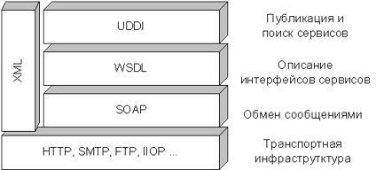

</div>
</div>
---

### SOAP

- SOAP обеспечивает взаимодействие распределённых систем независимо от используемой объектной модели и программной платформы.
- Данные в рамках SOAP передаются в виде XML-документов специального формата.
- Для вызова метода необходимо знать:
    - имя Web-сервиса;
    - имя вызываемого метода;
    - имена и типы параметров.
- Для известного Web-сервиса можно получить описание реализуемых методов — **WSDL**.

---
### Пример вызова метода

<div style="flex: 1; text-align: left; font-size: 70%;">

Условный вызов:

```text
sayHello("Web-service test")
```

SOAP-запрос:

```xml
<?xml version="1.0" encoding="UTF-8"?>
<soapenv:Envelope
    xmlns:soapenv="http://schemas.xmlsoap.org/soap/envelope/"
    xmlns:xsd="http://www.w3.org/2001/XMLSchema"
    xmlns:ns1="http://endpoint.helloservice/">

    <soapenv:Body>
        <ns1:sayHello>
            <arg0>Web-service test</arg0>
        </ns1:sayHello>
    </soapenv:Body>

</soapenv:Envelope>
```

Ответ сервиса:

```xml
<?xml version="1.0" encoding="UTF-8"?>
<soapenv:Envelope
    xmlns:soapenv="http://schemas.xmlsoap.org/soap/envelope/"
    xmlns:xsd="http://www.w3.org/2001/XMLSchema"
    xmlns:ns1="http://endpoint.helloservice/">

    <soapenv:Body>
        <ns1:sayHelloResponse>
            <return>Hello, Web-service test.</return>
        </ns1:sayHelloResponse>
    </soapenv:Body>

</soapenv:Envelope>
```

</div>

---

### WSDL
- **WSDL (Web Services Description Language)** — XML-документ, описывающий интерфейс Web-сервиса.
- В WSDL описываются, в частности:
    - сообщения;
    - операции;
    - входные и выходные параметры;
    - типы данных;
    - привязка к протоколу;
    - адрес сервиса.

---
### Фрагмент WSDL:

```xml
<message name="sayHello">
    <part element="tns:sayHello" name="parameters"/>
</message>

<message name="sayHelloResponse">
    <part element="tns:sayHelloResponse" name="parameters"/>
</message>

<portType name="Hello">
    <operation name="sayHello">
        <input message="tns:sayHello"/>
        <output message="tns:sayHelloResponse"/>
    </operation>
</portType>

<service name="HelloService">
    ...
</service>
```

- Таким образом, WSDL можно рассматривать как **машиночитаемое описание интерфейса Web-сервиса**.

---

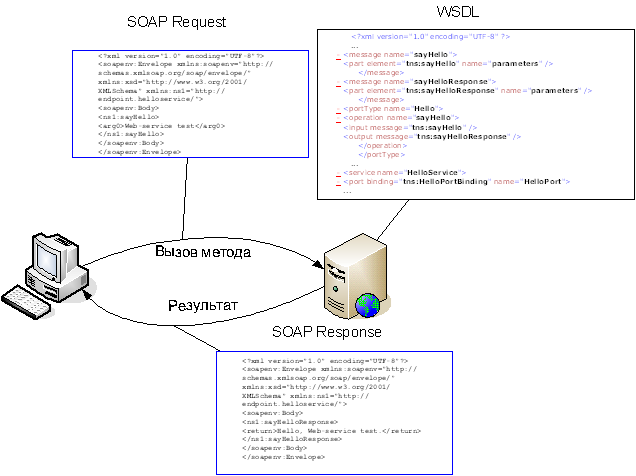

---

### Предварительный итог

Web-сервисы:

- представляют собой ещё одну технологию удалённого вызова методов;
- основаны на открытых стандартах;
- используют стандартные протоколы Интернета;
- адаптированы для работы в среде Интернет;
    - не требуют транспортного протокола с постоянным соединением;
    - используют XML в качестве языка представления данных;
    - легко обходит ограничения периметра (передаются текстовые файлы)
- позволяют использовать развитые инструментальные средства автоматизации разработки.

---

### Элементы технологии. Аннотации

- Аннотация `@WebService`

```java
@javax.jws.WebService
```
- используется для обозначения класса, являющегося Web-сервисом.
- Основные параметры:
    - `portName` — имя порта;
    - `serviceName` — имя сервиса;
    - `targetNamespace` — пространство имён;
    - `endpointInterface` — интерфейс сервиса.
- Указывать значения параметров необязательно.
- Например:

```java
@WebService
public class HelloServer{
    ...
}
```

---

### Аннотация `@WebMethod`

```java
@javax.jws.WebMethod
```

- используется для обозначения метода Web-сервиса.
- Основные параметры:
    - `operationName` — имя операции;
    - `exclude` — указывает, что метод не должен публиковаться.
- Например:

```java
@WebMethod
public String sayHello(String name) {
    return "Hello, " + name;
}
```

---

### Аннотация `@WebParam`

```java
@javax.jws.WebParam
```

- используется для обозначения параметра метода Web-сервиса.
- Основной параметр:
    - `name` — имя параметра.
- Например:

```java
@WebMethod
public String sayHello(
    @WebParam(name = "name") String name) {
    return "Hello, " + name;
}
```

---

### Основные классы

- `javax.xml.ws.Endpoint`: Класс `Endpoint` используется для публикации Web-сервиса.
- Основной метод (статический):

```java
Endpoint.publish(String endpointUrl, Object endpointClass)
```

- Например:

```java
HelloServer service = new HelloServer();

Endpoint.publish(
    "http://localhost:8080/Hello",
    service
);
```

---

### `javax.xml.namespace.QName`

- `QName` — полное квалифицированное имя XML-элемента.
- Состоит из:
    - **namespace** — пространства имён;
    - **localPart** — локального имени;
    - **prefix** — префикса.
- Префикс часто можно не указывать.

- Например:

```java
new QName(
    "http://soapdynamic/", 
    "HelloServerDynamicService"
)
```


---

### `javax.xml.ws.Service`

- Класс `Service` представляет сервис на стороне клиента.
- Для создания объекта сервиса используются методы `create`:

```java
Service create(QName serviceName)

Service create(
    URL wsdlDocumentLocation,
    QName serviceName
)
```
- После этого с помощью `getPort()` создаётся клиентский proxy-объект:

```java
<T> T getPort(
    QName portName,
    Class<T> serviceEndpointInterface
)
```

- Таким образом, клиент получает объект, интерфейс которого соответствует интерфейсу удалённого сервиса.

---

###  Необходимые библиотеки

- Для использования технологии Web-сервисов необходимо подключить соответствующую поддержку.
- Например, для maven:

```xml
<dependency>
    <groupId>com.sun.xml.ws</groupId>
    <artifactId>jaxws-ri</artifactId>
    <version>2.3.2</version>
    <type>pom</type>
</dependency>
```

- Версия зависит от JDK (Для JDK 17   версия `2.3.5`).

---

###  Пример: Hello World
- Рассмотрим простейший Web-сервис с одним методом.
- Последовательность разработки:
    - разработка сервиса;
    - публикация сервиса;
    - разработка Java-клиента;
    - генерация вспомогательных классов клиента (wsimport);
    - выполнение клиента.

---

### Разработка Web-сервиса

<div style="display: flex; gap: 20px; align-items: flex-start;">

<!-- Левая колонка: Код -->
<div style="flex: 1; text-align: left; font-size: 80%;">

Сервер:

```java
package soap;

import javax.jws.WebMethod;
import javax.jws.WebService;
import javax.xml.ws.Endpoint;

@WebService
public class HelloServer {

    public static final int port = 8080;

    @WebMethod
    public String sayHello(String name) {
        return String.format("Hello, %s!", name);
    }

    public static void main(String[] args) {
        HelloServer service = new HelloServer();

        String url =
            String.format(
                "http://localhost:%d/Hello",
                port
            );

        Endpoint.publish(url, service);
    }
}
```

</div>

<div style="flex: 1; text-align: left; font-size: 80%;" >

Здесь:

- `@WebService` помечает класс как Web-сервис;
- `@WebMethod` помечает публикуемый метод;
- `Endpoint.publish()` публикует сервис по заданному адресу.

Адрес сервиса:

```text
http://localhost:8080/Hello
```

</div>
</div>

---

### Получение WSDL

- После запуска Web-сервиса описание его интерфейса доступно по адресу:

```text
http://localhost:8080/Hello?wsdl
```

- Сервер формирует WSDL-документ, содержащий описание сервиса.
В нём можно увидеть:
    - `message`;
    - `portType`;
    - `operation`;
    - `binding`;
    - `service`;
  

---
### Пример WSDL

<div style="flex: 1; text-align: left; font-size: 58%;" >

```xml
<definitions xmlns:wsu="http://docs.oasis-open.org/wss/2004/01/oasis-200401-wss-wssecurity-utility-1.0.xsd" 
xmlns:wsp="http://www.w3.org/ns/ws-policy" xmlns:wsp1_2="http://schemas.xmlsoap.org/ws/2004/09/policy" 
xmlns:wsam="http://www.w3.org/2007/05/addressing/metadata" xmlns:soap="http://schemas.xmlsoap.org/wsdl/soap/" 
xmlns:tns="http://soapdynamic/" xmlns:xsd="http://www.w3.org/2001/XMLSchema" xmlns="http://schemas.xmlsoap.org/wsdl/" 
targetNamespace="http://soapdynamic/" name="HelloServerDynamicService">
<types>
<xsd:schema>
<xsd:import namespace="http://soapdynamic/" schemaLocation="http://localhost:8080/HelloDynamic?xsd=1"/>
</xsd:schema>
</types>
<message name="sayHello">
<part name="parameters" element="tns:sayHello"/>
</message>
<message name="sayHelloResponse">
<part name="parameters" element="tns:sayHelloResponse"/>
</message>
<portType name="HelloServerDynamic">
<operation name="sayHello">
<input wsam:Action="http://soapdynamic/HelloServerDynamic/sayHelloRequest" message="tns:sayHello"/>
<output wsam:Action="http://soapdynamic/HelloServerDynamic/sayHelloResponse" message="tns:sayHelloResponse"/>
</operation>
</portType>
<binding name="HelloServerDynamicPortBinding" type="tns:HelloServerDynamic">
<soap:binding transport="http://schemas.xmlsoap.org/soap/http" style="document"/>
<operation name="sayHello">
<soap:operation soapAction=""/>
<input>
<soap:body use="literal"/>
</input>
<output>
<soap:body use="literal"/>
</output>
</operation>
</binding>
<service name="HelloServerDynamicService">
<port name="HelloServerDynamicPort" binding="tns:HelloServerDynamicPortBinding">
<soap:address location="http://localhost:8080/HelloDynamic"/>
</port>
</service>
</definitions>
```

</div>

---

### Генерация клиентского кода

- WSDL содержит информацию, необходимую для автоматической генерации клиентского кода.
- Для этого используется утилита:

```text
wsimport
```

- `wsimport` ранее входила в состав JDK и была исключена из поставки начиная с JDK 11.
- В качестве альтернативы можно использовать дополнительные библиотеки и Maven-плагины.

---

### Генерация с помощью Maven

<div style="display: flex; gap: 20px; align-items: flex-start;">

<!-- Левая колонка: Код -->
<div style="flex: 1; text-align: left; font-size: 80%;">

Пример конфигурации:

```xml
<plugin>
    <groupId>org.codehaus.mojo</groupId>
    <artifactId>jaxws-maven-plugin</artifactId>
    <version>2.6</version>

    <executions>
        <execution>
            <id>wsimport-from-jdk</id>
            <goals>
                <goal>wsimport</goal>
            </goals>
        </execution>
    </executions>

    <configuration>
        <wsdlUrls>
            <wsdlUrl>
                http://localhost:8080/Hello?wsdl
            </wsdlUrl>
        </wsdlUrls>

        <keep>true</keep>

        <packageName>soap.webservice</packageName>

        <sourceDestDir>src/main/java</sourceDestDir>
    </configuration>
</plugin>
```

</div>

<div style="flex: 1; text-align: left; font-size: 70%;" >

При выполнении:

```text
mvn clean install
```

- Плагин описывается в разделе build pom.xml
- При запуске процесса построения (mvn clean install) URL с WSDL должен быть доступен (т.е. сервер должен быть запущен).


- Указание на URL, по которому доступен WSDL
<br>


- Имя пакета, в который должны быть помещены сгенерированные файлы


</div>
</div>

---
### Генерация вспомогательных файлов


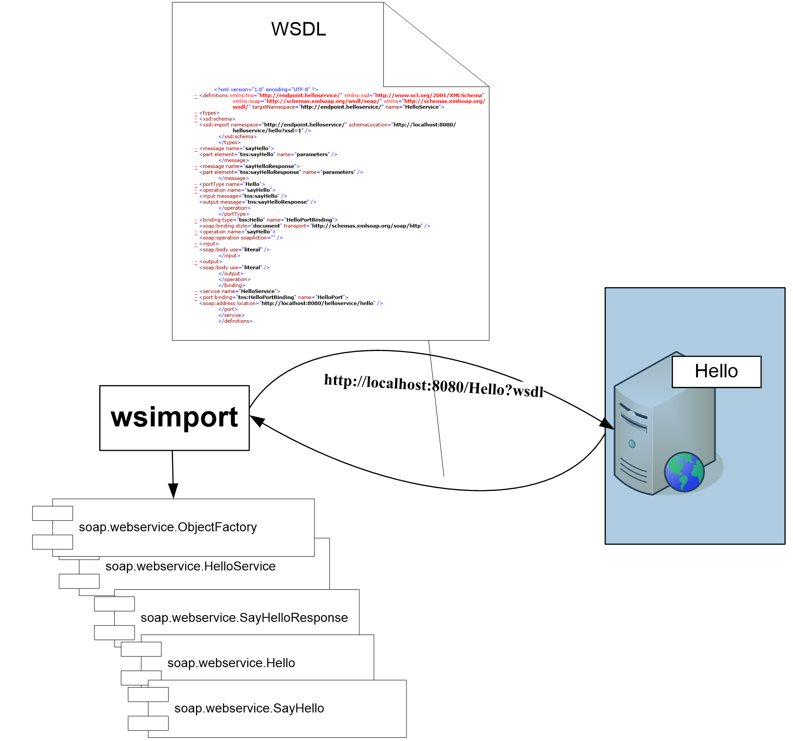


---
### Результат генерации

- После обработки WSDL создаются вспомогательные классы, например:

```text
soap.webservice.HelloService
soap.webservice.HelloServer
soap.webservice.ObjectFactory
soap.webservice.SayHelloResponse
```

- Клиентский код может использовать эти классы вместо ручного формирования SOAP-запросов.

---
### Клиент с кодогенерацией

<div style="display: flex; gap: 20px; align-items: flex-start;">

<!-- Левая колонка: Код -->
<div style="flex: 1; text-align: left; font-size: 80%;">

Пример клиента:

```java
package soap;

import soap.webservice.HelloServer;
import soap.webservice.HelloServerService;

import java.net.MalformedURLException;
import java.net.URL;

public class HelloClient {

    public static final int port = 8080;

    public static final String url =
        "http://localhost:%d/Hello?wsdl";

    public static void main(String[] args)
            throws MalformedURLException {

        HelloServer service =
            new HelloServerService(
                new URL(String.format(url, port))
            ).getHelloServerPort();

        System.out.println(
            service.sayHello("SOAP")
        );
    }
}
```

</div>

<div style="flex: 1; text-align: left; font-size: 70%;" >

<br><br>

- Пакет `soap.webservice` и его элементы генерируются автоматически.
- `HelloServerService` устанавливает взаимодействие с сервисом, а `getHelloServerPort()` возвращает proxy-объект, имеющий интерфейс сервиса.

- В результате удалённый вызов выглядит почти так же, как обычный вызов Java-метода:

```java
service.sayHello("SOAP");
```

</div>
</div>

---
### Web-сервис без кодогенерации
- Клиент может работать с Web-сервисом и без заранее сгенерированного клиентского пакета.
- Сначала определяется интерфейс:

```java
package soapdynamic;

import javax.jws.WebMethod;
import javax.jws.WebService;

@WebService
public interface HelloDynamic {

    @WebMethod
    String sayHello(String name);
}
```

- Интерфейс описывает методы Web-сервиса.

---
### Сервер без кодогенерации

<div style="display: flex; gap: 20px; align-items: flex-start;">

<!-- Левая колонка: Код -->
<div style="flex: 1; text-align: left; font-size: 70%;">

```java
package soapdynamic;

import javax.jws.WebMethod;
import javax.jws.WebService;
import javax.xml.ws.Endpoint;

@WebService
public class HelloServerDynamic
        implements HelloDynamic {

    public static final int port = 8080;

    @WebMethod
    @Override
    public String sayHello(String name) {
        return String.format(
            "Hello, %s!",
            name
        );
    }

    public static void main(String[] args) {

        HelloServerDynamic service =
            new HelloServerDynamic();
        String url =
            String.format(
                "http://localhost:%d/HelloDynamic",
                port
            );
        Endpoint.publish(url, service);
    }
}
```

</div>

<div style="flex: 1; text-align: left; font-size: 80%;" >

- На стороне сервера отличий от предыдущего варианта практически нет:
    - сервер реализует интерфейс;
    - создаёт объект сервиса;
    - публикует сервис.

</div>
</div>


---

### Динамический клиент

<div style="display: flex; gap: 20px; align-items: flex-start;">

<!-- Левая колонка: Код -->
<div style="flex: 1; text-align: left; font-size: 68%;">

```java
package soapdynamic;

import javax.xml.namespace.QName;
import javax.xml.ws.Service;
import java.net.URL;

public class HelloClient {
    public static final int port = 8080;
    public static final String url =
        "http://localhost:%d/HelloDynamic?wsdl";
    public static void main(String[] args)
            throws Exception {

        Service service = Service.create(
            new URL(String.format(url, port)),
            new QName(
                "http://soapdynamic/",
                "HelloServerDynamicService"
            )
        );

        HelloDynamic port =
            service.getPort(
                new QName(
                    "http://soapdynamic/",
                    "HelloServerDynamicPort"
                ),
                HelloDynamic.class
            );
        System.out.println(
            port.sayHello("Dynamic SOAP")
        );
    }
}
```

</div>

<div style="flex: 1; text-align: left; font-size: 70%;" >

Здесь:

- не используется сгенерированный клиентский пакет;
- клиентское представление сервиса создаётся вручную;
- при создании proxy-объекта указывается интерфейс `HelloDynamic`.

</div>
</div>

---

### Структура взаимодействия

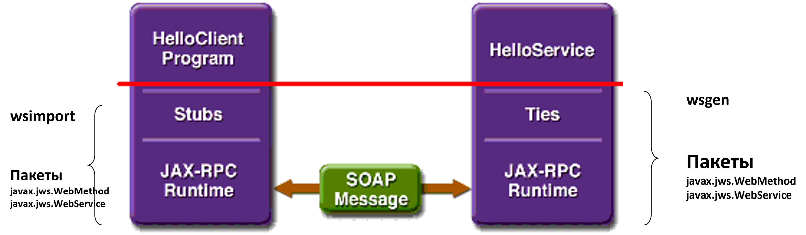

<div style="flex: 1; text-align: left; font-size: 75%;">

- В процессе разработки используются инструменты:
    - `wsimport` — генерация клиентских классов;
    - `wsgen` — генерация вспомогательных компонентов на стороне сервера.

- Используемые пакеты:
    - javax.jws.WebMethod
    - javax.jws.WebService

</div>

---

### Инструментальные средства
- К технологии Web-сервисов относятся серверные платформы и средства разработки.

- Серверы приложений
    - Sun Java System Application Server;
    - Apache Tomcat;
    - GlassFish;
    - IBM WebSphere Application Server;
    - и другие.

- Средства разработки
    - Java;
        - JDK (J2SE / J2EE)
    - .NET;
        - Visual Studio .NET.

---
### Сервер приложений


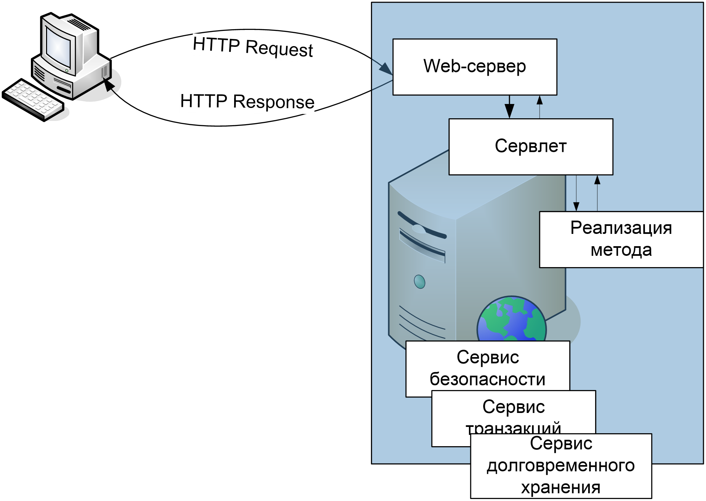

---
### Сервер приложений


---
### GlassFish

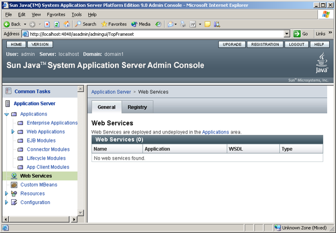

---
### Компиляция и инсталляция

- Процесс подготовки Web-приложения включает:
    - компиляцию исходного файла:
    - генерацию вспомогательных файлов:
    - подготовку структуры каталогов Web-приложения;
    - установку приложения на сервер приложений:

---
### Генерация вспомогательных модулей

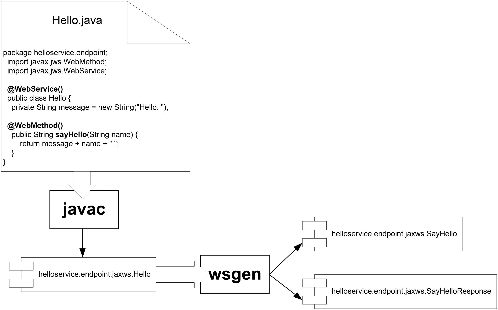

---
### Компиляция и инсталляция

Исходный Java-класс:

```java
package helloservice.endpoint;

import javax.jws.WebMethod;
import javax.jws.WebService;

@WebService()
public class Hello {

    private String message =
        new String("Hello, ");

    @WebMethod()
    public String sayHello(String name) {
        return message + name + ".";
    }
}
```

- После компиляции и генерации, создаются вспомогательные классы, например:

```text
helloservice.endpoint.jaxws.SayHello
helloservice.endpoint.jaxws.SayHelloResponse
helloservice.endpoint.jaxws.Hello
```

---
### Инсталляция Web-приложения

<div style="display: flex; gap: 20px; align-items: flex-start;">

<!-- Левая колонка: Код -->
<div style="flex: 1; text-align: left; font-size: 80%;">

Типичная структура приложения:

```text
Web-приложение
│
├── *.html
├── *.jsp
│
├── WEB-INF
│   ├── web.xml
│   ├── sun-web.xml
│   ├── sun-jaxws.xml
│   ├── classes/
│   └── lib/
│
└── ...
```

</div>

<div style="flex: 1; text-align: left; font-size: 65%;" >

 Назначение каталогов

- корневой каталог содержит HTML, JSP и другие файлы приложения;
- `WEB-INF/web.xml` — дескриптор Web-приложения;
- `WEB-INF/sun-web.xml` — параметры приложения, специфичные для сервера;
- `WEB-INF/sun-jaxws.xml` — параметры, необходимые для создания Web-сервиса;
- `WEB-INF/classes/` — классы приложения;
- `WEB-INF/lib/` — необходимые JAR-архивы.

Для установки в презентации используется команда:

```text
asadmin deploydir
```

После установки сервер приложений создаёт WSDL-файл.

</div>
</div>

---
### Инсталлированное приложение

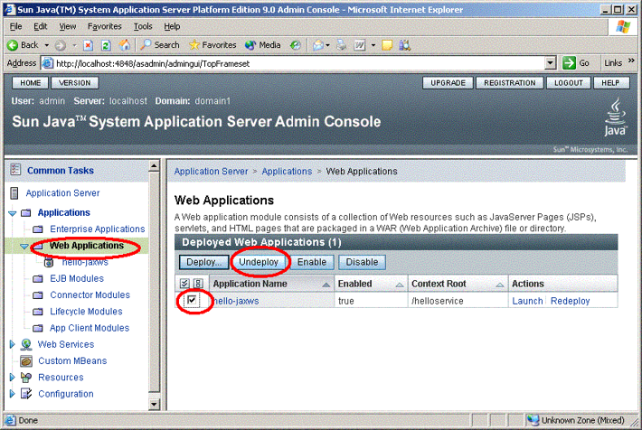

---
### Тестирование Web-сервиса

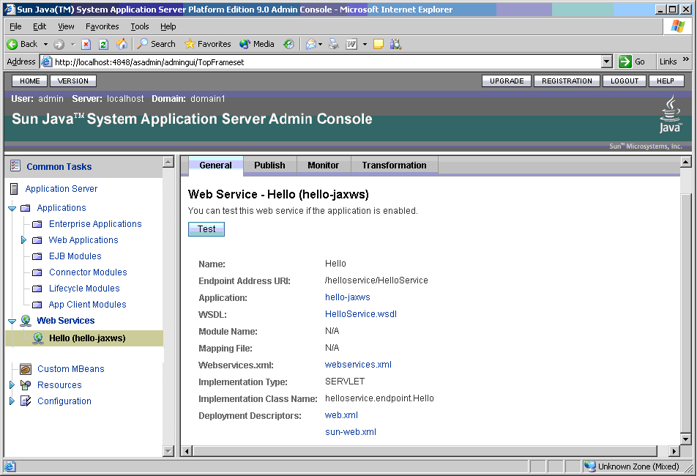

---

### Тестирование Web-сервиса

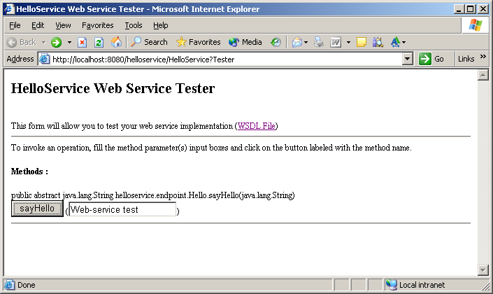

---

### Тестирование Web-сервиса

- После установки можно проверить работу Web-сервиса.

- В тестовом интерфейсе вызывается метод:

```text
sayHello
```

- Параметр:

```text
java.lang.String
Web-service test
```

- Результат:

```text
java.lang.String
"Hello, Web-service test."
```

---
### Тестирование Web-сервиса

- SOAP-запрос:

```xml
<soapenv:Envelope
    xmlns:soapenv="http://schemas.xmlsoap.org/soap/envelope/"
    xmlns:xsd="http://www.w3.org/2001/XMLSchema"
    xmlns:ns1="http://endpoint.helloservice/">

    <soapenv:Body>
        <ns1:sayHello>
            <arg0>Web-service test</arg0>
        </ns1:sayHello>
    </soapenv:Body>
</soapenv:Envelope>
```

- SOAP-ответ:

```xml
<soapenv:Envelope
    xmlns:soapenv="http://schemas.xmlsoap.org/soap/envelope/"
    xmlns:xsd="http://www.w3.org/2001/XMLSchema"
    xmlns:ns1="http://endpoint.helloservice/">

    <soapenv:Body>
        <ns1:sayHelloResponse>
            <return>Hello, Web-service test.</return>
        </ns1:sayHelloResponse>
    </soapenv:Body>
</soapenv:Envelope>
```


---

### Итог первой части

- Технология Web-сервисов является  кандидатом на использование, если приложение должно работать в среде Интернет
- Веб сервис может использовать выделенный сервер приложений, или быть реализован в виде независимого приложения 
- Использовать в Java-приложениях очень просто: имеется богатый набор библиотек и инструментальных средств


---
### Практический пример: Billing
- Рассмотрим пример Web-сервиса для обслуживания сети столовых.
- Реализуем:
    - Web-сервис;
    - Java-клиент;
    - Web-приложение, взаимодействующее с Web-сервисом.

---
### Web-сервис Billing
- Сервис содержит четыре метода:
    - `addNewCard`. Принимает массив объектов `Card` и заносит их в хэш-таблицу. Демонстрирует передачу массива объектов пользовательского типа.
    - `addMoney`, принимающий код карты и сумму начисления. Изменяет баланс карты.
    - `processOperation`. Принимает массив объектов `CardOperation` и выполняет соответствующие операции изменения баланса.
    - `getCard`. Принимает код карты и возвращает карту со всеми её атрибутами.

---
### Передача объектов сложных типов

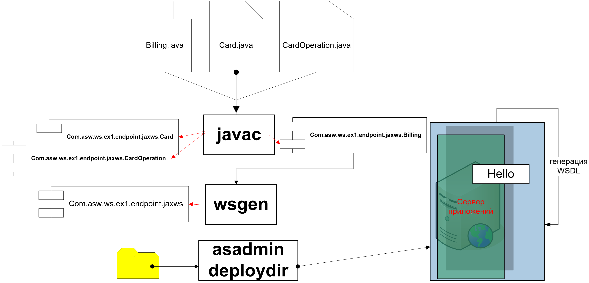

---
### Передача объектов сложных типов

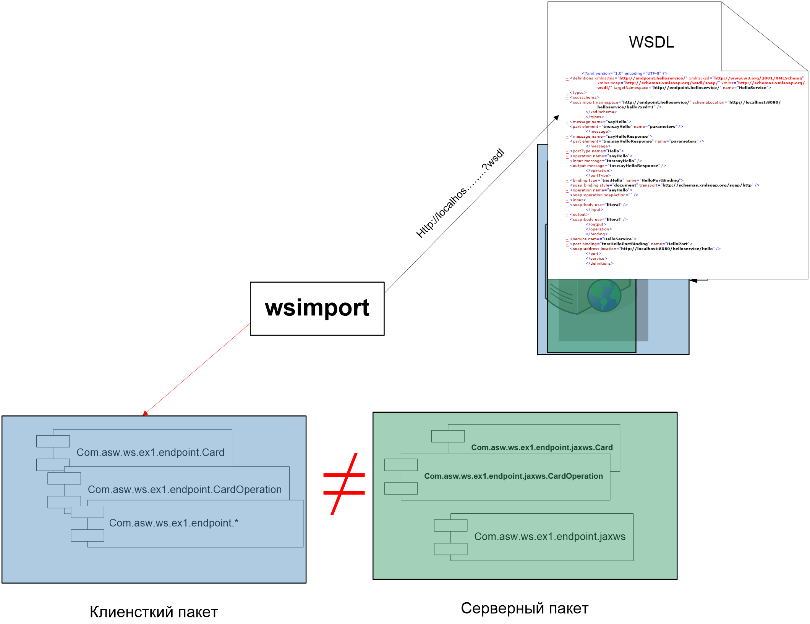

---
### Передача объектов сложных типов
- Web-сервис может передавать не только значения базовых типов, но и объекты пользовательских классов.
- Передача сложных типов для Web-сервиса прозрачна.
- Для клиента создаются специальные объекты-заглушки.
- В результате серверные классы и клиентские транспортные классы имеют соответствующую структуру, а преобразование данных выполняется автоматически.

---

### Billing. Web-сервис

```java
package com.asw.ws.ex1.endpoint;

import javax.jws.WebMethod;
import javax.jws.WebService;
import java.util.*;

@WebService()
public class Billing {
    private Map<String, Card> hash;
    public Billing() {
        hash = new HashMap<>();
    }

    @WebMethod()
    public void addNewCard(Card[] cards) {
        for (int i = 0; i < cards.length; i++) {
            hash.putIfAbsent(
                cards[i].cardNumber,
                cards[i]
            );
        }
    }
}
```

---

### Метод `addMoney`

```java
@WebMethod()
public void addMoney(String card, double money) {

    Card c = hash.get(card);

    if (c == null) {
        System.out.println(
            "Bad Card number\n"
        );
        return;
    }

    c.balance += money;
}
```

---

### Метод `processOperation`

```java
@WebMethod()
public void processOperation(CardOperation[] co) {

    for (int i = 0; i < co.length; i++) {

        Card c = hash.get(co[i].card);

        if (c == null) {
            System.out.println(
                "Bad Card number\n"
            );
        }

        c.balance += co[i].amount;
    }
}
```

Метод `getCard`:

```java
@WebMethod()
public Card getCard(String card) {
    return hash.get(card);
}
```

---
### Класс `Card`

<div style="flex: 1; text-align: left; font-size: 70%;" >

```java
package com.asw.ws.ex1.endpoint;

import java.util.*;

public class Card {

    public Card() {}

    public Card(
            String person,
            Date createDate,
            String cardNumber,
            double balance) {

        this.person = person;
        this.createDate = createDate;
        this.cardNumber = cardNumber;
        this.balance = balance;
    }

    public String person;
    public Date createDate;
    public String cardNumber;
    public double balance;

    public String toString() {
        return "Card: "
            + "cardNumber=" + cardNumber
            + "\tBalance=" + balance
            + "\tPerson=" + person
            + "\tCreateDate=" + createDate;
    }
}
```

</div>

---
### Класс `CardOperation`

```java
package com.asw.ws.ex1.endpoint;

import java.util.*;

public class CardOperation {

    public CardOperation() {}

    public CardOperation(
            String card,
            double amount,
            Date operationDate) {

        this.card = card;
        this.amount = amount;
        this.operationDate = operationDate;
    }

    public String card;
    public double amount;
    public Date operationDate;
}
```

---
### Инсталляция и тестирование Billing


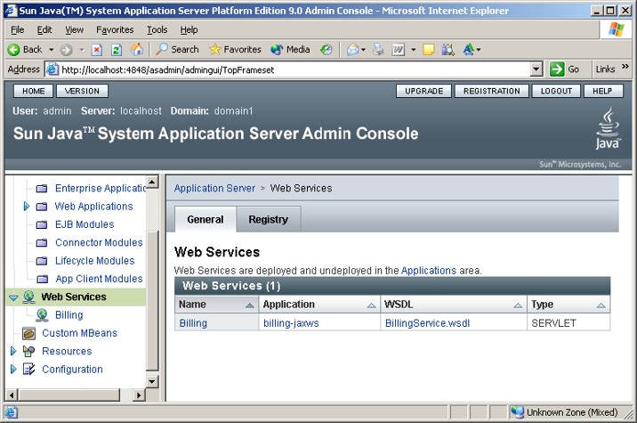

---
### Инсталляция и тестирование Billing


---
### Web-сервис без сервера приложений

<div style="flex: 1; text-align: left; font-size: 80%;" >

- Web-сервис может быть опубликован непосредственно из Java-приложения.
- Пример:

```java
package com.asw.ws.ex1.endpoint;

import javax.xml.ws.Endpoint;

public class Server {

    public static final int port = 8080;

    public static final String url =
        "http://localhost:%d/BillingService";

    public static void main(String[] args) {

        Billing service = new Billing();

        Endpoint.publish(
            String.format(url, port),
            service
        );
    }
}
```

- Таким образом, отдельный сервер приложений для публикации простого Web-сервиса не обязателен.

</div>

---
### BillingClient (начало)

Клиент использует сгенерированные классы:

```java
package com.asw.ws.ex1.client;

import com.asw.ws.ex1.webservice.*;
import javax.xml.datatype.*;
import java.net.URL;
import java.util.*;

public class BillingClient {

    public static final int port = 8080;
    public static final String url =
        "http://localhost:%d/BillingService";
    static BillingService service;
    public static void main(String[] args) throws Exception {
        service = new BillingService(
            new URL(String.format(url, port))
        );
        Billing port = service.getBillingPort();
        ArrayList<Card> vc = new ArrayList<>();
        vc.add(createCard("1","Piter",getCuttentDate(),0.0));
        vc.add(createCard("2","Stefan",getCuttentDate(),0.0));
        vc.add(createCard("3","Nataly",getCuttentDate(),0.0));
        port.addNewCard(vc);
```

---

### BillingClient (продолжение)

Клиент создаёт 30 000 операций:

```java
int cnt = 30000;

ArrayList<CardOperation> vco = new ArrayList<>();

for (int i = 0; i < cnt; i++) {
    switch (i % 3) {
        case 0: vco.add(createCardOperation("1", getCuttentDate(),1));  break;
        case 1: vco.add(createCardOperation("2", getCuttentDate(),2));  break;
        case 2: vco.add(createCardOperation("3", getCuttentDate(),3));  break;
    }
}

port.processOperation(vco);

printCard(port.getCard("1"));
printCard(port.getCard("2"));
printCard(port.getCard("3"));

public static void printCard(Card card) {
        System.out.println(card.getCardNumber() + "\t" + card.getPerson() + "\t"
                + card.getCreateDate() + "\t" + card.getBalance());
    }

```

---
### BillingClient (окончание)
```java
public static XMLGregorianCalendar getCuttentDate() {
        GregorianCalendar GC = new GregorianCalendar();
        GC.setTime(new Date());
        try {
            return DatatypeFactory.newInstance().newXMLGregorianCalendar(GC);
        } catch (DatatypeConfigurationException e) {return null;}
    }
    public static Card createCard(String cardNumber, String person,
     XMLGregorianCalendar 			createDate, double balance) {
        Card c = new Card();
        c.setPerson(person); c.setCreateDate(createDate);
        c.setCardNumber(cardNumber); c.setBalance(balance);
        return c;
    }
    public static CardOperation createCardOperation(String cardNumber,
     XMLGregorianCalendar 			operationDate, double amount) {
        CardOperation co = new CardOperation();
        co.setCard(cardNumber); co.setAmount(amount);
        co.setOperationDate(operationDate);
        return co;
    }
}


```
---

Вывод программы:

```text
1    Piter    ...    10000.0
2    Stefan   ...    20000.0
3    Nataly   ...    30000.0

BUILD SUCCESSFUL
```

---
### JSP-клиент
- С Web-сервисом может взаимодействовать не только Java-программа, но и Web-приложение.
- В примере используется JSP-клиент.
- Структура:

<div style="display: flex; gap: 20px; align-items: flex-start;">

<!-- Левая колонка: Код -->
<div style="flex: 1; text-align: left; font-size: 80%;">

```text
ShowBalance.jsp


ShowBalanceResponse.jsp


AddCard.jsp


AddCardResponse.jsp
```

</div>

<div style="flex: 1; text-align: left; font-size: 70%;" >

- `ShowBalance.jsp`: Содержит форму для передачи номера карты и вызывает `ShowBalanceResponse.jsp`.
- `ShowBalanceResponse.jsp`: Содержит код обращения к Web-сервису.
- `AddCard.jsp`: Содержит форму для добавления новой карты.
- `AddCardResponse.jsp`: Содержит код обращения к Web-сервису для добавления карты.

</div>
</div>

---
### `ShowBalance.jsp`

```jsp
<html>
<head>
    <title>BillingService</title>
</head>

<h2>Enter card number</h2>

<form method="get">

    <input
        type="text"
        name="cardnumber"
        size="25">

    <p></p>

    <input
        type="submit"
        value="Submit">

    <input
        type="reset"
        value="Reset">

</form>

<%
String cardnumber =
    request.getParameter("cardnumber");

if (cardnumber != null &&
    cardnumber.length() > 0) {
%>

    <%@include file="ShowBalanceResponse.jsp" %>

<%
}
%>

</body>
</html>
```

---

### `ShowBalanceResponse.jsp`

```jsp
<%@ page import="
    com.asw.ws.ex1.endpoint.BillingService,
    com.asw.ws.ex1.endpoint.Billing,
    com.asw.ws.ex1.endpoint.Card
" %>

<%
Card resp = null;

try {

    Billing billing =
        new BillingService().getBillingPort();

    resp = billing.getCard(
        request.getParameter("cardnumber")
    );

} catch (Exception ex) {

    resp = new Card();
}
%>

<h2>
    <font color="black">
        <%=resp.getPerson()
            + "\t"
            + resp.getBalance()%>
    </font>
</h2>
```

---

### `AddCard.jsp`

```jsp
<html>
<head>
    <title>BillingService</title>
</head>

<h2>Enter card number</h2>

<form method="get">

    <input
        type="text"
        name="cardnumber"
        size="25">

    <input
        type="text"
        name="person"
        size="25">

    <p></p>

    <input
        type="submit"
        value="Submit">

    <input
        type="reset"
        value="Reset">

</form>

<%
String cardnumber =
    request.getParameter("cardnumber");

String person =
    request.getParameter("person");

if (cardnumber != null &&
    cardnumber.length() > 0 &&
    person != null &&
    person.length() > 0) {
%>

    <%@include file="AddCardResponse.jsp" %>

<%
}
%>

</body>
</html>
```

---

### `AddCardResponse.jsp`

```jsp
<%@ page import="
    com.asw.ws.ex1.endpoint.BillingService,
    com.asw.ws.ex1.endpoint.Billing,
    com.asw.ws.ex1.endpoint.Card
" %>

<%
Card card = new Card();

try {

    Billing billing =
        new BillingService().getBillingPort();

    String _cardnumber =
        request.getParameter("cardnumber");

    String _person =
        request.getParameter("person");

    card.setPerson(_person);
    card.setCardNumber(_cardnumber);

    java.util.ArrayList<Card> v =
        new java.util.ArrayList<Card>();

    v.add(card);

    billing.addNewCard(v);

} catch (Exception ex) {
}
%>

<h2>
    <font color="black">
        <%=card.getPerson()
            + "\t"
            + card.getBalance()%>
    </font>
</h2>
```

---
### Инсталляция Web-клиента
- После генерации вспомогательных классов структура приложения содержит JSP-файлы и сгенерированные классы.
- Пример структуры:

```text
.
├── AddCard.jsp
├── AddCardResponse.jsp
├── ShowBalance.jsp
├── ShowBalanceResponse.jsp
├── META-INF/
│   └── MANIFEST.MF
└── WEB-INF/
    ├── classes/
    ├── sun-web.xml
    └── web.xml
```

- В `WEB-INF/classes/` находятся классы приложения и сгенерированные классы Web-сервиса.

---
- Генерация вспомогательных классов (wsimport) – пакет  com.asw.ws.ex1.endpoint
- Каталог приложения
<div style="flex: 1; text-align: left; font-size: 90%;" >
<pre>
.\AddCard.jsp
.\addcardresponse.jsp
.\ShowBalance.jsp
.\showbalanceresponse.jsp
.\META-INF\MANIFEST.MF
.\WEB-INF\classes
.\WEB-INF\sun-web.xml
.\WEB-INF\web.xml
.\WEB-INF\classes\com\asw\ws\ex1\endpoint\AddMoney.class
.\WEB-INF\classes\com\asw\ws\ex1\endpoint\AddMoneyResponse.class
.\WEB-INF\classes\com\asw\ws\ex1\endpoint\AddNewCard.class
.\WEB-INF\classes\com\asw\ws\ex1\endpoint\AddNewCardResponse.class
.\WEB-INF\classes\com\asw\ws\ex1\endpoint\Billing.class
.\WEB-INF\classes\com\asw\ws\ex1\endpoint\BillingService.class
.\WEB-INF\classes\com\asw\ws\ex1\endpoint\Card.class
.\WEB-INF\classes\com\asw\ws\ex1\endpoint\CardOperation.class
.\WEB-INF\classes\com\asw\ws\ex1\endpoint\GetCard.class
.\WEB-INF\classes\com\asw\ws\ex1\endpoint\GetCardResponse.class
.\WEB-INF\classes\com\asw\ws\ex1\endpoint\ObjectFactory.class
.\WEB-INF\classes\com\asw\ws\ex1\endpoint\package-info.class
.\WEB-INF\classes\com\asw\ws\ex1\endpoint\ProcessOperation.class
.\WEB-INF\classes\com\asw\ws\ex1\endpoint\ProcessOperationResponse.class
</pre>
</div>


---
### Тестирование

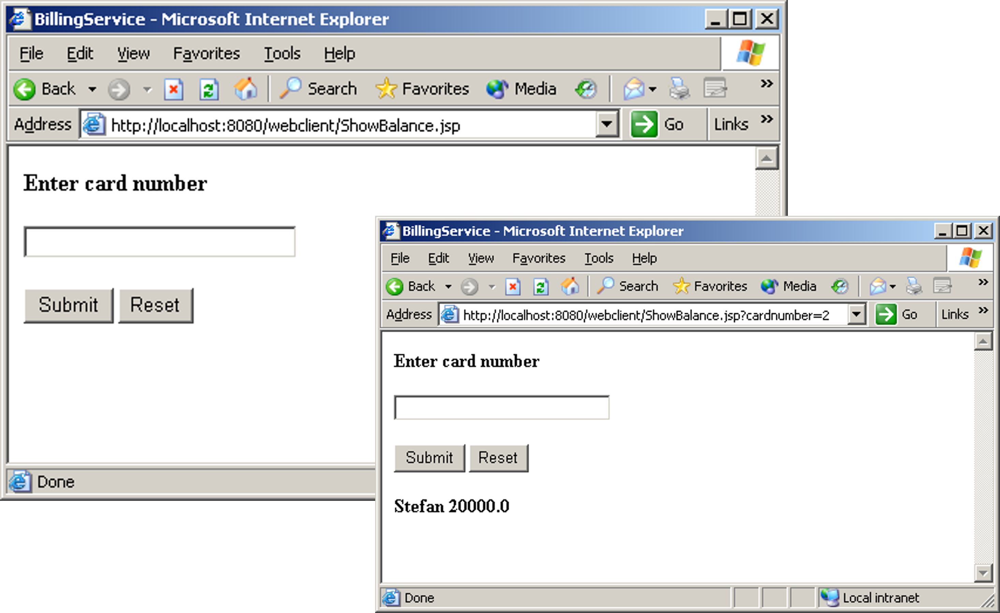

---
### Тестирование JSP-клиента

Для получения информации о карте пользователь:

1. открывает страницу `ShowBalance.jsp`;
2. вводит номер карты;
3. нажимает **Submit**;
4. JSP-клиент обращается к Web-сервису;
5. получает объект `Card`;
6. выводит данные карты.


---

### Создание новой карты

- Для создания новой карты используется другая страница:

```text
http://localhost:8080/webclient/AddCard.jsp
```

- Пользователь вводит:
    - номер карты;
    - имя владельца.
- После отправки формы JSP-клиент вызывает метод:

```text
addNewCard
```

---

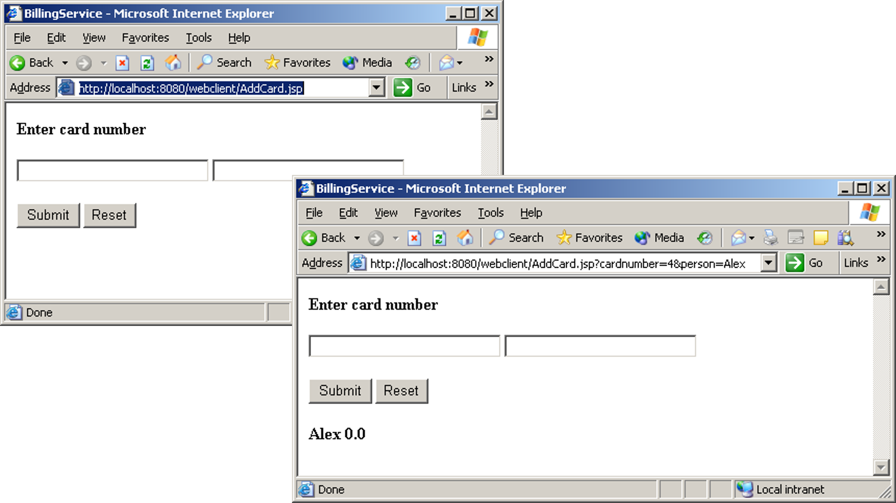

---

### Передача сложных типов: общая схема

- В рассматриваемом примере выполняется следующая цепочка генераций:

```text
Java-классы сервера
       │
       ▼
     wsgen
       │
       ▼
Описание типов в WSDL
       │
       ▼
    wsimport
       │
       ▼
Клиентские классы
```

- Клиент работает с транспортными классами, автоматически созданными на основании описания сервиса.
- При передаче сложных типов выполняется **копирование данных** между серверным и клиентским представлением объекта.

---
### Итоги
- Технология позволяет передавать как данные простых типов, так и данные сложных (пользовательских) типов данных
- При этом осуществляется отображение (автоматически) типа данных на XML-описание
- Клиент работает с транспортными типами (классами), которые имеют то же название, что и серверные, но являются автоматически сгенерированными из их описаний
- При передаче сложных типов данных, осуществляется копирование данных  

