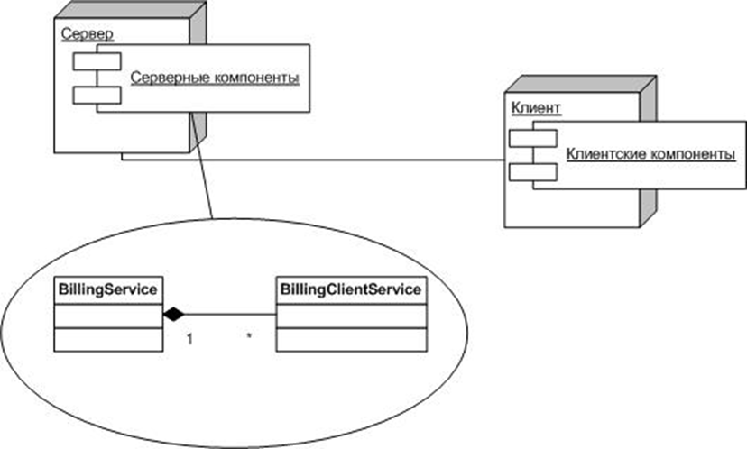

# План занятия
- Использование API java.net для работы с
    - UDP
    - TCP
- Примеры приложений (разработка, компиляция, запуск), использующих эти протокол

---
### Примитивы передачи данных
- Распределенные системы нуждаются в обмене данными и синхронизации между автономными распределенными процессами
    - Interprocess communication (IPC)
        - Разделяемые переменные <!-- .element: class="small_font"  -->
        - Передача сообщений <!-- .element: class="small_font"  -->
- Синхронизация
    - Процессы на различных компьютерах выполняются с различными скоростями
- Примитивы передачи данных
    - send expression_list to destination <!-- .element: class="small_font"  -->
    - receive variable_list from source <!-- .element: class="small_font"  -->
- Вопросы
    - Как определять адреса (как указывать процесс, которому передаются данные)?
    - Как добиваться синхронизации при передаче

---
### Передача сообщений. Примитивы 
- Каналы (Pipes). Локальный IPC.
    - Давний и один из самых простейших средств IPC 
    - Позволяют двум процессам взаимодействовать, используя буфер, реализуемый ядром ОС; данные сохраняются в буфере в порядке очереди (FIFO) 
    - Каналы обеспечивают возможность двум «родственным» (например, родитель/потомок) процессам взаимодействовать
- Другие локальные IPC
    - Очереди
    - Именованные каналы
    - Семафоры
    - Разделяемые переменные
    - …


---
### Передача сообщений. Примитивы 
Сокеты (Socket`s). Распределенный IPC.<!-- .element: class="left" -->
- Сокеты предоставляют мощнейший механизм взаимодействия распределенных процессов, однако при их использовании требуется аккуратность (на программиста возлагается ответственность за детали взаимодействия)
- Существуют стандартные интерфейсы, механизм поддерживается на всех значимых платформах
- Сокет предоставляет механизм для взаимодействия двух процессов
- Сокеты существуют, пока существуют взаимодействующие процесс


---
### Примитивы передачи данных

<div style="flex: 1; text-align: center; font-size: 85%;">

- Прямое наименование: имена процессов получателя и отправителя используются в качестве адресатов (пара имен однозначно определяет канал)
    ```code
    - send cur_status to monitor 
    - receive message from handler 
    ```
    - Просто реализовать и использовать
    - Позволяет процессу легко контролировать когда получать какое сообщение с какого процесса
    - Используется для реализации клиент-серверных приложений
        - хорошо подходящий способ, чтобы реализовать схему клиент/сервер, если есть один клиент и один сервер
        - в противном случае, сервер должен уметь принимать запросы от любого клиента в любое время,и клиент должен уметь обращаться к множеству сервисов в одно время, если доступно больше одного сервера
</div>


---
### Примитивы передачи данных
- глобальные имена или почтовые ящики: независимое имя процесса-приемника может использоваться процессами-источниками
    - Сообщения, посланные в почтовый ящик, могут получаться любым процессом
    - Чтобы реализовать  концепцию клиент-сервера
        - клиенты посылают сообщения в почтовый ящик, освободившийся сервер их обрабатывает
    - недостаток: дорогая реализация
        - сообщение послано в ящик
        - если один процесс решил получить сообщение, он должен его заблокировать
        - взаимное исключение при параллельном доступе

---
### Примитивы передачи данных
- Порты: почтовый ящик, но только одному процессу разрешаются получать сообщения
    - легко осуществимо - принимать может только один процесс - не нужна блокировка
    - подходит если один сервер и много клиентов
- Указание адресов при программировании в Internet
    - гибридная прямая схема присваивания имен/порта
    - порты соответствуют концепции “много процессов посылают, один принимает”

---
### Примитивы передачи сообщений
Семантика примитивов передачи сообщений
- Блокировка
    - не блокирующие: вызов не задерживает вызывающий процесс (управление возвращается сразу)
    - блокирующий: вызов не возвращает управление до завершения

---
### Примитивы передачи сообщений
- Синхронизация
    - синхронные: нет никакой буферизации
        - процессы синхронизируются по любому сообщению
        - источник блокируется до тех пор, пока получатель не будет готов к приему
        - приемщик блокируется, пока процесс-источник не будет готов к передаче
    - асинхронные: сообщения передаются с использованием неограниченного буфера
        - передающий процесс выполняет передачу неограниченное число раз
        - передающий никогда не блокируется
        - принимающий блокируется на пустой очереди
---
### Примитивы передачи сообщений
- буферизованные: буферизация с ограниченным буфером
    - передающий процесс может передавать до тех пор, пока не переполнился буфер
    - передающий блокируется при переполненном буфере
    - принимающий блокируется на пустой очереди


---
### Примитивы передачи сообщений
Не блокирующие примитивы для асинхронной или буферизированной передачи
- прием
    - фоновый вариант: процесс продолжает выполняться, при приеме получает прерывание (например, callback)
        - иногда сложно для реализации
    - программные опросы 
- отправка
    - передающий процесс ожидает освобождения буфера или удаляет из него не посланные сообщения

---
### Сокеты. TCP

<div style="display: flex; gap: 20px; align-items: flex-start;">

<!-- Левая колонка: Код -->
<div style="flex: 1; text-align: left;">

<svg width="100%" height="auto" viewBox="0 0 800 680" xmlns="http://www.w3.org/2000/svg" style="max-width: 800px; display: block; margin: 0 auto; font-family: sans-serif;">
  <!-- Заголовки -->
  <text x="150" y="40" text-anchor="middle" font-size="24" font-weight="bold" fill="#1e3a8a">Сервер</text>
  <text x="650" y="40" text-anchor="middle" font-size="24" font-weight="bold" fill="#166534">Клиент</text>
  <!-- ================= ЭТАПЫ СЕРВЕРА (Слева) ================= -->
  <!-- socket() -->
  <rect x="60" y="70" width="180" height="50" rx="8" fill="#dbeafe" stroke="#3b82f6" stroke-width="2"/>
  <text x="150" y="100" text-anchor="middle" font-family="monospace" font-size="18" fill="#1f2937">socket()</text>
  <line x1="150" y1="120" x2="150" y2="150" stroke="#9ca3af" stroke-width="2"/>
  <polygon points="150,150 145,140 155,140" fill="#9ca3af"/>
  <!-- bind() -->
  <rect x="60" y="150" width="180" height="50" rx="8" fill="#dbeafe" stroke="#3b82f6" stroke-width="2"/>
  <text x="150" y="180" text-anchor="middle" font-family="monospace" font-size="18" fill="#1f2937">bind()</text>
  <line x1="150" y1="200" x2="150" y2="230" stroke="#9ca3af" stroke-width="2"/>
  <polygon points="150,230 145,220 155,220" fill="#9ca3af"/>
  <!-- listen() -->
  <rect x="60" y="230" width="180" height="50" rx="8" fill="#dbeafe" stroke="#3b82f6" stroke-width="2"/>
  <text x="150" y="260" text-anchor="middle" font-family="monospace" font-size="18" fill="#1f2937">listen()</text>
  <line x1="150" y1="280" x2="150" y2="310" stroke="#9ca3af" stroke-width="2"/>
  <polygon points="150,310 145,300 155,300" fill="#9ca3af"/>
  <!-- accept() -->
  <rect x="60" y="310" width="180" height="50" rx="8" fill="#dbeafe" stroke="#3b82f6" stroke-width="2"/>
  <text x="150" y="340" text-anchor="middle" font-family="monospace" font-size="18" fill="#1f2937">accept()</text>
  <line x1="150" y1="360" x2="150" y2="380" stroke="#9ca3af" stroke-width="2"/>
  <polygon points="150,380 145,370 155,370" fill="#9ca3af"/>
  <!-- Блокировка процесса -->
  <rect x="40" y="380" width="220" height="60" rx="8" fill="#f3f4f6" stroke="#d1d5db" stroke-width="1" stroke-dasharray="4,4"/>
  <text x="150" y="405" text-anchor="middle" font-size="14" fill="#6b7280">Процесс блокируется</text>
  <text x="150" y="425" text-anchor="middle" font-size="14" fill="#6b7280">в ожидании клиента</text>
  <line x1="150" y1="440" x2="150" y2="470" stroke="#9ca3af" stroke-width="2"/>
  <polygon points="150,470 145,460 155,460" fill="#9ca3af"/>
  <!-- read() -->
  <rect x="60" y="470" width="180" height="50" rx="8" fill="#dbeafe" stroke="#3b82f6" stroke-width="2"/>
  <text x="150" y="500" text-anchor="middle" font-family="monospace" font-size="18" fill="#1f2937">read()</text>
  <line x1="150" y1="520" x2="150" y2="550" stroke="#9ca3af" stroke-width="2"/>
  <polygon points="150,550 145,540 155,540" fill="#9ca3af"/>
  <!-- write() -->
  <rect x="60" y="550" width="180" height="50" rx="8" fill="#dbeafe" stroke="#3b82f6" stroke-width="2"/>
  <text x="150" y="580" text-anchor="middle" font-family="monospace" font-size="18" fill="#1f2937">write()</text>
  <!-- ================= ЭТАПЫ КЛИЕНТА (Справа) ================= -->
  <!-- socket() -->
  <rect x="560" y="70" width="180" height="50" rx="8" fill="#dcfce7" stroke="#22c55e" stroke-width="2"/>
  <text x="650" y="100" text-anchor="middle" font-family="monospace" font-size="18" fill="#1f2937">socket()</text>
  <line x1="650" y1="120" x2="650" y2="310" stroke="#9ca3af" stroke-width="2" stroke-dasharray="5,5"/>
  <polygon points="650,310 645,300 655,300" fill="#9ca3af"/>
  <!-- connect() -->
  <rect x="560" y="310" width="180" height="50" rx="8" fill="#dcfce7" stroke="#22c55e" stroke-width="2"/>
  <text x="650" y="340" text-anchor="middle" font-family="monospace" font-size="18" fill="#1f2937">connect()</text>
  <line x1="650" y1="360" x2="650" y2="470" stroke="#9ca3af" stroke-width="2" stroke-dasharray="5,5"/>
  <polygon points="650,470 645,460 655,460" fill="#9ca3af"/>
  <!-- write() -->
  <rect x="560" y="470" width="180" height="50" rx="8" fill="#dcfce7" stroke="#22c55e" stroke-width="2"/>
  <text x="650" y="500" text-anchor="middle" font-family="monospace" font-size="18" fill="#1f2937">write()</text>
  <line x1="650" y1="520" x2="650" y2="550" stroke="#9ca3af" stroke-width="2"/>
  <polygon points="650,550 645,540 655,540" fill="#9ca3af"/>
  <!-- read() -->
  <rect x="560" y="550" width="180" height="50" rx="8" fill="#dcfce7" stroke="#22c55e" stroke-width="2"/>
  <text x="650" y="580" text-anchor="middle" font-family="monospace" font-size="18" fill="#1f2937">read()</text>
  <!-- ================= ВЗАИМОДЕЙСТВИЕ (Стрелки между ними) ================= -->
  <!-- 1. connect() -> accept() (Установка соединения) -->
  <line x1="560" y1="335" x2="240" y2="335" stroke="#6b7280" stroke-width="2"/>
  <polygon points="240,335 250,330 250,340" fill="#6b7280"/>
  <text x="400" y="325" text-anchor="middle" font-size="14" fill="#374151" font-weight="bold">Установка соединения</text>
  <!-- 2. write() -> read() (Отправка запроса) -->
  <line x1="560" y1="495" x2="240" y2="495" stroke="#6b7280" stroke-width="2"/>
  <polygon points="240,495 250,490 250,500" fill="#6b7280"/>
  <text x="400" y="485" text-anchor="middle" font-size="14" fill="#374151" font-weight="bold">Отправка запроса</text>
  <!-- 3. write() -> read() (Отправка ответа) -->
  <line x1="240" y1="575" x2="560" y2="575" stroke="#6b7280" stroke-width="2"/>
  <polygon points="560,575 550,570 550,580" fill="#6b7280"/>
  <text x="400" y="565" text-anchor="middle" font-size="14" fill="#374151" font-weight="bold">Отправка ответа</text>
</svg>

</div>

<!-- Правая колонка: -->
<div style="flex: 1; text-align: center; font-size: 70%;">

- Способ взаимодействия, ориентированный на соединение 
- Сервер: 
    - Создает сокет 
    - Связывает его с портом 
    - Инициирует прослушивание порта
    - Ожидает соединения клиента
- Клиент
    - Создает сокет
    - Соединяется с сервером (необходимые параметры – адрес сервера и порт)
- Двунаправленный обмен (+ механизм потоков )

</div>
</div>


---
### Механизм сокетов
<div style="flex: 1; text-align: center; font-size: 70%;">

- IPC основанный на TCP
    - Абстрактный сервис: поток байт принимается и получается
    - возможности
        - Размер сообщения: нет ограничений, TCP решает, когда послать сообщение транспортного уровня, состоящее из нескольких прикладных сообщений, непосредственная (немедленная) передача может ,быть принудительной
        - Ориентированный на соединение
        - Основанный на таймаутах механизм отслеживания потерянных сообщений
        - Очередь на приемщике
        - Блокирование при приеме
        - Отслеживание переполнения буферов
        - Сервер должен создавать новый поток для каждого принятого соединения
- API для потоков
    - Создание соединения
        - клиент: запрос коннекта
        - сервер: слушает порт и принимает запросы на соединение. Принимает соединение. Создает новый поток для соединения

</div>

---
### Сокеты. UDP

<div style="display: flex; gap: 20px; align-items: flex-start;">

<!-- Левая колонка: Код -->
<div style="flex: 1; text-align: left;">

<svg width="100%" height="auto" viewBox="0 0 800 580" xmlns="http://www.w3.org/2000/svg" style="max-width: 800px; display: block; margin: 0 auto; font-family: sans-serif;">
  <!-- Заголовки -->
  <text x="150" y="40" text-anchor="middle" font-size="24" font-weight="bold" fill="#1e3a8a">Сервер</text>
  <text x="650" y="40" text-anchor="middle" font-size="24" font-weight="bold" fill="#166534">Клиент</text>
  <!-- ================= ЭТАПЫ СЕРВЕРА (Слева) ================= -->
  <!-- socket() -->
  <rect x="60" y="70" width="180" height="50" rx="8" fill="#dbeafe" stroke="#3b82f6" stroke-width="2"/>
  <text x="150" y="100" text-anchor="middle" font-family="monospace" font-size="18" fill="#1f2937">socket()</text>
  <!-- Стрелка вниз -->
  <line x1="150" y1="120" x2="150" y2="150" stroke="#9ca3af" stroke-width="2"/>
  <polygon points="150,150 145,140 155,140" fill="#9ca3af"/>
  <!-- bind() -->
  <rect x="60" y="150" width="180" height="50" rx="8" fill="#dbeafe" stroke="#3b82f6" stroke-width="2"/>
  <text x="150" y="180" text-anchor="middle" font-family="monospace" font-size="18" fill="#1f2937">bind()</text>
  <!-- Стрелка вниз -->
  <line x1="150" y1="200" x2="150" y2="230" stroke="#9ca3af" stroke-width="2"/>
  <polygon points="150,230 145,220 155,220" fill="#9ca3af"/>
  <!-- recvfrom() -->
  <rect x="60" y="230" width="180" height="50" rx="8" fill="#dbeafe" stroke="#3b82f6" stroke-width="2"/>
  <text x="150" y="260" text-anchor="middle" font-family="monospace" font-size="18" fill="#1f2937">recvfrom()</text>
  <!-- Стрелка вниз -->
  <line x1="150" y1="280" x2="150" y2="310" stroke="#9ca3af" stroke-width="2"/>
  <polygon points="150,310 145,300 155,300" fill="#9ca3af"/>
  <!-- Блокировка процесса -->
  <rect x="40" y="310" width="220" height="60" rx="8" fill="#f3f4f6" stroke="#d1d5db" stroke-width="1" stroke-dasharray="4,4"/>
  <text x="150" y="335" text-anchor="middle" font-size="14" fill="#6b7280">Процесс блокируется</text>
  <text x="150" y="355" text-anchor="middle" font-size="14" fill="#6b7280">в ожидании данных</text>
  <!-- Стрелка вниз -->
  <line x1="150" y1="370" x2="150" y2="400" stroke="#9ca3af" stroke-width="2"/>
  <polygon points="150,400 145,390 155,390" fill="#9ca3af"/>
  <!-- Обработка запроса -->
  <rect x="60" y="400" width="180" height="50" rx="8" fill="#f3f4f6" stroke="#9ca3af" stroke-width="2"/>
  <text x="150" y="430" text-anchor="middle" font-size="16" fill="#1f2937">Обработка запроса</text>
  <!-- Стрелка вниз -->
  <line x1="150" y1="450" x2="150" y2="480" stroke="#9ca3af" stroke-width="2"/>
  <polygon points="150,480 145,470 155,470" fill="#9ca3af"/>
  <!-- sendto() -->
  <rect x="60" y="480" width="180" height="50" rx="8" fill="#dbeafe" stroke="#3b82f6" stroke-width="2"/>
  <text x="150" y="510" text-anchor="middle" font-family="monospace" font-size="18" fill="#1f2937">sendto()</text>
  <!-- ================= ЭТАПЫ КЛИЕНТА (Справа) ================= -->
  <!-- socket() -->
  <rect x="560" y="70" width="180" height="50" rx="8" fill="#dcfce7" stroke="#22c55e" stroke-width="2"/>
  <text x="650" y="100" text-anchor="middle" font-family="monospace" font-size="18" fill="#1f2937">socket()</text>
  <!-- Пунктир ожидания -->
  <line x1="650" y1="120" x2="650" y2="230" stroke="#9ca3af" stroke-width="2" stroke-dasharray="5,5"/>
  <polygon points="650,230 645,220 655,220" fill="#9ca3af"/>
  <!-- sendto() -->
  <rect x="560" y="230" width="180" height="50" rx="8" fill="#dcfce7" stroke="#22c55e" stroke-width="2"/>
  <text x="650" y="260" text-anchor="middle" font-family="monospace" font-size="18" fill="#1f2937">sendto()</text>
  <!-- Пунктир ожидания -->
  <line x1="650" y1="280" x2="650" y2="480" stroke="#9ca3af" stroke-width="2" stroke-dasharray="5,5"/>
  <polygon points="650,480 645,470 655,470" fill="#9ca3af"/>
  <!-- recvfrom() -->
  <rect x="560" y="480" width="180" height="50" rx="8" fill="#dcfce7" stroke="#22c55e" stroke-width="2"/>
  <text x="650" y="510" text-anchor="middle" font-family="monospace" font-size="18" fill="#1f2937">recvfrom()</text>
  <!-- ================= ВЗАИМОДЕЙСТВИЕ (Стрелки между ними) ================= -->
  <!-- 1. sendto() -> recvfrom() (Отправка запроса) -->
  <line x1="560" y1="255" x2="240" y2="255" stroke="#6b7280" stroke-width="2"/>
  <polygon points="240,255 250,250 250,260" fill="#6b7280"/>
  <text x="400" y="245" text-anchor="middle" font-size="14" fill="#374151" font-weight="bold">Отправка запроса</text>
  <!-- 2. sendto() -> recvfrom() (Отправка ответа) -->
  <line x1="240" y1="505" x2="560" y2="505" stroke="#6b7280" stroke-width="2"/>
  <polygon points="560,505 550,500 550,510" fill="#6b7280"/>
  <text x="400" y="495" text-anchor="middle" font-size="14" fill="#374151" font-weight="bold">Отправка ответа</text>
</svg>

</div>

<!-- Правая колонка: -->
<div style="flex: 1; text-align: center; font-size: 70%;">

- Способ взаимодействия, не ориентированный на соединение
    - Сервер:
        - Создает сокет
        - Связывает его с портом
        - Ожидает сообщение  клиента
    - Клиент
        - Создает сокет
        - Связывает его с портом
        - Посылает сообщение серверу, указывая адрес сервера и порт
- Механизм обмена сообщениями

</div>
</div>


---
### Механизм сокетов

<div style="flex: 1; text-align: center; font-size: 70%;">

- IPC базирующийся на UDP
    - Свойства UDP: нет гарантии порядка сообщений, сообщения теряются и дублируются
    - Необходимые шаги
        - создание сокета
        - связывание сокета с портом
            - клиент: произвольный свободный порт
            - сервер: порт сервера
    - Метод приемки: возвращает [Интернет адрес и порт отправителя] + [сообщение]
    - Размер сообщения: IP разрешает сообщения до 2 <sup> 16 </sup> = 65536 байт
        - Многие реализаций ограничивают 8 Kb
        - Большие сообщения увеличивают производительность передачи
        - Если передаваемое сообщение слишком велико, оно усекается
    - Отправка – не блокирующая 
    - Прием сообщений блокирующий

</div>

---
### Прикладные протоколы
 Типы сообщений (пример)
С – клиент, S – сервер


|Код|Тип|Отправитель|Получатель|Комментарий|
|-----|-----------|----|-----------|----|
|1|(REQ) request|C|S|Запрос клиента на получение данных|
|2|(REP) reply|S|C|Ответ сервера на запрос клиента|
|3|(ACK) ack|S/C|C/S|Предыдущее сообщение доставлено|
|4|(AYA) are you alive?|C |S|Тестовое сообщение для проверки работоспособности сервера |
|5|(IAA) I am alive |S |C|Ответ сервера о его работоспособности |
|6|(TA) try again|S|C|Сервер перегружен и не имеет ресурсов для обработки запроса |
---
### Прикладные протоколы
- Основными типами сообщений являются типы 1 и 2 
- Тип 3 служит для повышения надежности 
- Типы 4-6: не обязательны, но добавляют дополнительную функциональность
- Необходимость в типах 4-5: Предположим, что клиент послал запрос. Что, если нет ответа, за приемлемое время? Сервер все еще работает или сервер потерпел крах?
    - Клиент использует AYA сообщение для проверки сервера, если IAA (или REP) сообщение получено, значит все в порядке;  Иначе, если после нескольких  AYA сообщений, нет  обратных IAA/REP, клиент может предположить, что сервер недоступен
---
### Примеры

<svg width="100%" height="auto" viewBox="0 0 900 650" xmlns="http://www.w3.org/2000/svg" style="max-width: 900px; display: block; margin: 0 auto; font-family: sans-serif;">
  <!-- ========================================== -->
  <!-- 1. ПРОСТОЙ ПРОТОКОЛ (Верхний левый)         -->
  <!-- ========================================== -->
  <!-- Заголовки -->
  <rect x="70" y="30" width="60" height="30" rx="5" fill="#dcfce7" stroke="#22c55e" stroke-width="2"/>
  <text x="100" y="50" text-anchor="middle" font-size="14" font-weight="bold" fill="#166534">Клиент</text>
  <rect x="320" y="30" width="60" height="30" rx="5" fill="#dbeafe" stroke="#3b82f6" stroke-width="2"/>
  <text x="350" y="50" text-anchor="middle" font-size="14" font-weight="bold" fill="#1e3a8a">Сервер</text>
  <!-- Линии времени -->
  <line x1="100" y1="60" x2="100" y2="250" stroke="#22c55e" stroke-width="2" stroke-dasharray="5,5"/>
  <line x1="350" y1="60" x2="350" y2="250" stroke="#3b82f6" stroke-width="2" stroke-dasharray="5,5"/>
  <!-- REQ (Клиент -> Сервер) -->
  <line x1="110" y1="110" x2="340" y2="110" stroke="#6b7280" stroke-width="2"/>
  <polygon points="340,110 330,105 330,115" fill="#6b7280"/>
  <text x="225" y="100" text-anchor="middle" font-size="14" fill="#374151" font-weight="bold">REQ</text>
  <!-- REP (Сервер -> Клиент) -->
  <line x1="340" y1="170" x2="110" y2="170" stroke="#6b7280" stroke-width="2"/>
  <polygon points="110,170 120,165 120,175" fill="#6b7280"/>
  <text x="225" y="160" text-anchor="middle" font-size="14" fill="#374151" font-weight="bold">REP</text>
  <!-- Название протокола -->
  <text x="225" y="290" text-anchor="middle" font-size="16" fill="#1f2937" font-weight="bold">Простой протокол</text>
  <!-- ========================================== -->
  <!-- 2. ПОДТВЕРЖДЕНИЕ КАЖДОГО СООБЩЕНИЯ (Верхний правый) -->
  <!-- ========================================== -->
  <!-- Заголовки -->
  <rect x="520" y="30" width="60" height="30" rx="5" fill="#dcfce7" stroke="#22c55e" stroke-width="2"/>
  <text x="550" y="50" text-anchor="middle" font-size="14" font-weight="bold" fill="#166534">Клиент</text>
  <rect x="770" y="30" width="60" height="30" rx="5" fill="#dbeafe" stroke="#3b82f6" stroke-width="2"/>
  <text x="800" y="50" text-anchor="middle" font-size="14" font-weight="bold" fill="#1e3a8a">Сервер</text>
  <!-- Линии времени -->
  <line x1="550" y1="60" x2="550" y2="250" stroke="#22c55e" stroke-width="2" stroke-dasharray="5,5"/>
  <line x1="800" y1="60" x2="800" y2="250" stroke="#3b82f6" stroke-width="2" stroke-dasharray="5,5"/>
  <!-- REQ -->
  <line x1="560" y1="100" x2="790" y2="100" stroke="#6b7280" stroke-width="2"/>
  <polygon points="790,100 780,95 780,105" fill="#6b7280"/>
  <text x="675" y="90" text-anchor="middle" font-size="14" fill="#374151" font-weight="bold">REQ</text>
  <!-- ACK -->
  <line x1="790" y1="140" x2="560" y2="140" stroke="#6b7280" stroke-width="2"/>
  <polygon points="560,140 570,135 570,145" fill="#6b7280"/>
  <text x="675" y="130" text-anchor="middle" font-size="14" fill="#374151" font-weight="bold">ACK</text>
  <!-- REP -->
  <line x1="790" y1="190" x2="560" y2="190" stroke="#6b7280" stroke-width="2"/>
  <polygon points="560,190 570,185 570,195" fill="#6b7280"/>
  <text x="675" y="180" text-anchor="middle" font-size="14" fill="#374151" font-weight="bold">REP</text>
  <!-- ACK -->
  <line x1="560" y1="230" x2="790" y2="230" stroke="#6b7280" stroke-width="2"/>
  <polygon points="790,230 780,225 780,235" fill="#6b7280"/>
  <text x="675" y="220" text-anchor="middle" font-size="14" fill="#374151" font-weight="bold">ACK</text>
  <!-- Название протокола -->
  <text x="675" y="290" text-anchor="middle" font-size="16" fill="#1f2937" font-weight="bold">С подтверждением каждого сообщения</text>
  <!-- ========================================== -->
  <!-- 3. ПОДТВЕРЖДЕНИЕ ЗАПРОСА (Нижний левый)     -->
  <!-- ========================================== -->
  <!-- Заголовки -->
  <rect x="70" y="340" width="60" height="30" rx="5" fill="#dcfce7" stroke="#22c55e" stroke-width="2"/>
  <text x="100" y="360" text-anchor="middle" font-size="14" font-weight="bold" fill="#166534">Клиент</text>
  <rect x="320" y="340" width="60" height="30" rx="5" fill="#dbeafe" stroke="#3b82f6" stroke-width="2"/>
  <text x="350" y="360" text-anchor="middle" font-size="14" font-weight="bold" fill="#1e3a8a">Сервер</text>
  <!-- Линии времени -->
  <line x1="100" y1="370" x2="100" y2="560" stroke="#22c55e" stroke-width="2" stroke-dasharray="5,5"/>
  <line x1="350" y1="370" x2="350" y2="560" stroke="#3b82f6" stroke-width="2" stroke-dasharray="5,5"/>
  <!-- REQ -->
  <line x1="110" y1="410" x2="340" y2="410" stroke="#6b7280" stroke-width="2"/>
  <polygon points="340,410 330,405 330,415" fill="#6b7280"/>
  <text x="225" y="400" text-anchor="middle" font-size="14" fill="#374151" font-weight="bold">REQ</text>
  <!-- ACK -->
  <line x1="340" y1="460" x2="110" y2="460" stroke="#6b7280" stroke-width="2"/>
  <polygon points="110,460 120,455 120,465" fill="#6b7280"/>
  <text x="225" y="450" text-anchor="middle" font-size="14" fill="#374151" font-weight="bold">ACK</text>
  <!-- REP -->
  <line x1="340" y1="510" x2="110" y2="510" stroke="#6b7280" stroke-width="2"/>
  <polygon points="110,510 120,505 120,515" fill="#6b7280"/>
  <text x="225" y="500" text-anchor="middle" font-size="14" fill="#374151" font-weight="bold">REP</text>
  <!-- Название протокола -->
  <text x="225" y="600" text-anchor="middle" font-size="16" fill="#1f2937" font-weight="bold">С подтверждением получения запроса</text>
  <!-- ========================================== -->
  <!-- 4. ЖИВУЧЕСТЬ И ФУНКЦИОНАЛЬНОСТЬ (Нижний правый) -->
  <!-- ========================================== -->
  <!-- Заголовки -->
  <rect x="520" y="340" width="60" height="30" rx="5" fill="#dcfce7" stroke="#22c55e" stroke-width="2"/>
  <text x="550" y="360" text-anchor="middle" font-size="14" font-weight="bold" fill="#166534">Клиент</text>
  <rect x="770" y="340" width="60" height="30" rx="5" fill="#dbeafe" stroke="#3b82f6" stroke-width="2"/>
  <text x="800" y="360" text-anchor="middle" font-size="14" font-weight="bold" fill="#1e3a8a">Сервер</text>
  <!-- Линии времени -->
  <line x1="550" y1="370" x2="550" y2="580" stroke="#22c55e" stroke-width="2" stroke-dasharray="5,5"/>
  <line x1="800" y1="370" x2="800" y2="580" stroke="#3b82f6" stroke-width="2" stroke-dasharray="5,5"/>
  <!-- AYA (Are You Alive) -->
  <line x1="560" y1="400" x2="790" y2="400" stroke="#6b7280" stroke-width="2"/>
  <polygon points="790,400 780,395 780,405" fill="#6b7280"/>
  <text x="675" y="390" text-anchor="middle" font-size="14" fill="#374151" font-weight="bold">AYA</text>
  <!-- IAA (I Am Alive) -->
  <line x1="790" y1="440" x2="560" y2="440" stroke="#6b7280" stroke-width="2"/>
  <polygon points="560,440 570,435 570,445" fill="#6b7280"/>
  <text x="675" y="430" text-anchor="middle" font-size="14" fill="#374151" font-weight="bold">IAA</text>
  <!-- REQ -->
  <line x1="560" y1="480" x2="790" y2="480" stroke="#6b7280" stroke-width="2"/>
  <polygon points="790,480 780,475 780,485" fill="#6b7280"/>
  <text x="675" y="470" text-anchor="middle" font-size="14" fill="#374151" font-weight="bold">REQ</text>
  <!-- ACK -->
  <line x1="790" y1="520" x2="560" y2="520" stroke="#6b7280" stroke-width="2"/>
  <polygon points="560,520 570,515 570,525" fill="#6b7280"/>
  <text x="675" y="510" text-anchor="middle" font-size="14" fill="#374151" font-weight="bold">ACK</text>
  <!-- REP -->
  <line x1="790" y1="560" x2="560" y2="560" stroke="#6b7280" stroke-width="2"/>
  <polygon points="560,560 570,555 570,565" fill="#6b7280"/>
  <text x="675" y="550" text-anchor="middle" font-size="14" fill="#374151" font-weight="bold">REP</text>
  <!-- Название протокола -->
  <text x="675" y="610" text-anchor="middle" font-size="16" fill="#1f2937" font-weight="bold">С обеспечением живучести (AYA/IAA)</text>
</svg>

---
### Java API для UDP (java.net)

<div style="flex: 1; text-align: center; font-size: 80%;">

- Класс DatagramPacket 
    - Представляет собой пакет для передачи по сети. Обычно содержит адрес и порт процесса-получателя
- Класс DatagramSocket 
    - Служит для получения и отправки пакетов данных посредством UDP
    - send (DatagramPacket dp) отправляет пакет
    - receive(DatagramPacket p) принимает пакет

</div>

<svg width="50%" height="auto" viewBox="0 0 700 450" xmlns="http://www.w3.org/2000/svg" style="max-width: 700px; display: block; margin: 0 auto; font-family: sans-serif;">
  <!-- ================= ГОЛОВНЫЕ БЛОКИ (Участники) ================= -->
  <!-- Application -->
  <rect x="50" y="20" width="120" height="40" rx="4" fill="#f3f4f6" stroke="#6b7280" stroke-width="2"/>
  <text x="110" y="45" text-anchor="middle" font-size="14" font-weight="bold" fill="#1f2937">Application</text>
  <!-- DatagramSocket -->
  <rect x="280" y="20" width="140" height="40" rx="4" fill="#dbeafe" stroke="#3b82f6" stroke-width="2"/>
  <text x="350" y="45" text-anchor="middle" font-size="14" font-weight="bold" fill="#1e3a8a">:DatagramSocket</text>
  <!-- DatagramPacket dp -->
  <rect x="510" y="20" width="140" height="40" rx="4" fill="#dcfce7" stroke="#22c55e" stroke-width="2"/>
  <text x="580" y="45" text-anchor="middle" font-size="14" font-weight="bold" fill="#166534">dp:DatagramPacket</text>
  <!-- ================= ЛИНИИ ЖИЗНИ (Lifelines) ================= -->
  <line x1="110" y1="60" x2="110" y2="420" stroke="#6b7280" stroke-width="2" stroke-dasharray="5,5"/>
  <line x1="350" y1="60" x2="350" y2="420" stroke="#3b82f6" stroke-width="2" stroke-dasharray="5,5"/>
  <line x1="580" y1="60" x2="580" y2="420" stroke="#22c55e" stroke-width="2" stroke-dasharray="5,5"/>
  <!-- ================= ПОЛОСЫ АКТИВАЦИИ (Activation boxes) ================= -->
  <!-- Application (активна всё время) -->
  <rect x="105" y="80" width="10" height="320" fill="#e5e7eb" stroke="#9ca3af" stroke-width="1"/>
  <!-- Socket (активен после создания) -->
  <rect x="345" y="130" width="10" height="270" fill="#bfdbfe" stroke="#3b82f6" stroke-width="1"/>
  <!-- Packet (активен после создания) -->
  <rect x="575" y="210" width="10" height="190" fill="#bbf7d0" stroke="#22c55e" stroke-width="1"/>
  <!-- ================= СООБЩЕНИЯ (Messages) ================= -->
  <!-- 1. new (Application -> Socket) -->
  <line x1="115" y1="110" x2="340" y2="110" stroke="#6b7280" stroke-width="2"/>
  <polygon points="340,110 330,105 330,115" fill="#6b7280"/>
  <!-- Плашка текста -->
  <rect x="200" y="95" width="40" height="20" rx="4" fill="white" stroke="#d1d5db" stroke-width="1"/>
  <text x="220" y="110" text-anchor="middle" font-size="14" font-weight="bold" fill="#374151">new</text>
  <text x="220" y="128" text-anchor="middle" font-size="12" fill="#6b7280">(создание сокета)</text>
  <!-- 2. new (Application -> Packet) -->
  <line x1="115" y1="190" x2="570" y2="190" stroke="#6b7280" stroke-width="2"/>
  <polygon points="570,190 560,185 560,195" fill="#6b7280"/>
  <!-- Плашка текста -->
  <rect x="300" y="175" width="40" height="20" rx="4" fill="white" stroke="#d1d5db" stroke-width="1"/>
  <text x="320" y="190" text-anchor="middle" font-size="14" font-weight="bold" fill="#374151">new</text>
  <text x="320" y="208" text-anchor="middle" font-size="12" fill="#6b7280">(создание пакета dp)</text>
  <!-- 3. send(dp) (Application -> Socket) -->
  <line x1="115" y1="290" x2="340" y2="290" stroke="#6b7280" stroke-width="2"/>
  <polygon points="340,290 330,285 330,295" fill="#6b7280"/>
  <!-- Плашка текста -->
  <rect x="190" y="275" width="80" height="20" rx="4" fill="white" stroke="#d1d5db" stroke-width="1"/>
  <text x="230" y="290" text-anchor="middle" font-size="14" font-weight="bold" fill="#374151">send(dp)</text>
  <text x="230" y="308" text-anchor="middle" font-size="12" fill="#6b7280">(передача данных)</text>
</svg>

---
### Пример использования UDP (java.net)

<div style="flex: 1; text-align: center; font-size: 70%;">

- Сервер
    - Создает DatagramSocket и связывает его с определенным портом
    - Ожидает сообщение от клиента 
    - Формирует пакет – ответ, перенося в него данные, полученные от клиента, адрес и порт клиента извлекает из пришедшего пакета
    - Отправляет пакет-ответ клиенту
- Клиент
    - Создает DatagramSocket
    - Создает DatagramPacket
    - Упаковывает в пакет необходимые данные и параметры (адрес и порт сервера)
    - Передает пакет на сервер
    - Ожидает сообщение от сервера
    - Печатает пришедшее сообщение

</div>

---
### Клиент (UDP, java.net)
```java
import java.net.*;
import java.io.*;
public class UDPClient{
    public static void main(String args[]){ 
 // args give message contents and destination hostname
 try {
  DatagramSocket aSocket = new DatagramSocket();      // create socket 
  byte [] message = args[0].getBytes();
  InetAddress aHost = InetAddress.getByName(args[1]); // DNS lookup
  int serverPort = 8080;                                                   
  DatagramPacket request = 
    new DatagramPacket(message,  args[0].length(), aHost, serverPort);
  aSocket.send(request);     //send message
  byte[] buffer = new byte[1000];
  DatagramPacket reply = new DatagramPacket(buffer, buffer.length); 
  aSocket.receive(reply);     //wait for reply
  System.out.println("Reply: " + new String(reply.getData())); 
  aSocket.close();
 } catch (SocketException e){ System.out.println("Socket: " + e.getMessage()); 
  // socket creation failed
 } catch (IOException e){ System.out.println("IO: " + e.getMessage()); 
  // can be caused by send
 }
    }
}
```

---
### Сервер (UDP, java.net)
```java
import java.net.*;
import java.io.*;
public class UDPServer {
    public static void main(String args[]) {
        try (DatagramSocket aSocket = new DatagramSocket(8080)) {
            // create socket at agreed port
            byte[] buffer = new byte[1000];
            while (true) {
                DatagramPacket request = new DatagramPacket(buffer, buffer.length);
                aSocket.receive(request);
                DatagramPacket reply = new DatagramPacket(request.getData(), request.getLength(),
                        request.getAddress(), request.getPort());
                aSocket.send(reply);
            }
        } catch (SocketException e) {
            System.out.println("Socket: " + e.getMessage()); // socket creation failed
        } catch (IOException e) {
            System.out.println("IO: " + e.getMessage());
        }
    }
}
```
---
### Сервер (UDP, java.net)
- ServerSocket представляет сокет на стороне сервера
    - В конструкторе принимает порт, на котором будут ожидаться соединения клиентов
    - Для ожидания клиентов вызывает блокирующий метод accept, возвращающий Socket
- Socket класс для работы с соединением (клиент и сервер)
    - Конструктор для создания сокета и соединения с удаленным узлом и портом 
    - Методы для работы с входными и выходными потоками


---
### Рассылка сообщений в UDP (Multicast)
<div style="flex: 1; text-align: center; font-size: 80%;">

- До сих пор мы рассматривали Unicast (точечную доставку): один отправитель → один получатель.
- Специфика UDP позволяет эффективно реализовать одновременную рассылку пакетов группе узлов.
- Виды рассылок:
    - Broadcast (Широковещание): пакет доставляется всем узлам в локальной сети (например, адрес 255.255.255.255). Запрещен в интернет-маршрутизации.
    - Multicast (Мультикаст): пакет доставляется группе узлов, которые подписались на определенный адрес (например, диапазон 224.0.0.0 — 239.255.255.255).
- Почему это возможно только в UDP?
    - TCP требует установки соединения и подтверждения доставки. Рассылка соединений множеству адресов не имеет смысла и неэффективна.
    - UDP работает по принципу «отправил и забыл» (fire-and-forget), что идеально для пакетов-анонсов.
</div>

---
### Java API для Multicast (java.net)
<div style="flex: 1; text-align: center; font-size: 80%;">

- Для приема multicast-пакетов используется класс MulticastSocket (наследник DatagramSocket).
- Жизненный цикл получателя:
    - Создание MulticastSocket на определенном порту.
    - Присоединение к группе рассылки: socket.joinGroup(InetAddress group).
    - Прием пакетов стандартным методом receive(DatagramPacket p).
    - Выход из группы: socket.leaveGroup(InetAddress group).
- Отправитель:
    - Использует обычный DatagramSocket.
    - В качестве адреса получателя в DatagramPacket указывает multicast-адрес группы.
- Особенности:
    - Сообщение получат все участники группы в сети.
    - Отправитель также может получить собственное сообщение (если он в той же группе).
</div>

---
### Пример: Паттерн Service Discovery
<div style="flex: 1; text-align: center; font-size: 80%;">

- Проблема: В распределенной системе (микросервисы) новые экземпляры сервисов могут динамически запускаться и останавливаться. Как клиентам узнать, по каким адресам они работают?
- Решение: Паттерн Service Discovery (саморегистрация).
    - Запускается Центр обнаружения (Discovery Service) и слушает multicast-порт.
    - Новый сервис (Discovery Client) при старте начинает периодически слать UDP-пакет со своим адресом в multicast-группу: "Я сервис X, работаю на порту Y".
    - Центр обнаружения принимает пакет, запоминает сервис в своем реестре и отправляет обратно unicast-ответ (ACK).
    - Получив ACK, сервис прекращает рассылку (или продолжает слать "heartbeat" для контроля живучести).
- Любой желающий может запросить у Центра обнаружения список активных сервисов (например, по HTTP).
</div>

---
### Service Discovery: Центр обнаружения (код)
```java
public class DiscoveryService implements Runnable{
    final MulticastSocket socket;
    public static final int udpPort = 7070;
    final InetAddress group;
    final Set<String> services; // Реестр найденных сервисов

    public DiscoveryService() throws IOException {
        socket = new MulticastSocket(udpPort);
        group = InetAddress.getByName("230.0.0.0");
        socket.joinGroup(group); // Подписываемся на multicast-группу
        services = new HashSet<>();
        // ... запуск HTTP сервера для выдачи реестра ...
    }

    @SneakyThrows
    @Override
    public void run() {
        byte[] buf = new byte[256];
        while (true) {
            DatagramPacket packet = new DatagramPacket(buf, buf.length);
            socket.receive(packet); // Ждем анонс от клиента
            String received = new String(packet.getData(), 0, packet.getLength());
            services.add(received); // Добавляем в реестр
            // Отправляем подтверждение (ACK) обратно клиенту (unicast)
            DatagramPacket answer = new DatagramPacket(
                "DiscoveryService".getBytes(), 16, packet.getAddress(), packet.getPort());
            socket.send(answer);
        }
    }
}
```

---
### Service Discovery: Клиент (код)
```java
public class DiscoveryClient{
    final InetAddress group;
    final DatagramSocket socket; // Обычный сокет для отправки
    final String serviceName;

    public DiscoveryClient(int servicePort, String name) throws Exception {
        group = InetAddress.getByName("230.0.0.0");
        socket = new DatagramSocket();
        // Формируем уникальный идентификатор: Имя:Хост:Порт
        serviceName = name + ":" + InetAddress.getLocalHost().getHostName() + ":" + servicePort;

        // Таймер: каждые 1000 мс отправляем анонс (heartbeat)
        new Timer().schedule(new TimerTask() {
            public void run() {
                byte[] buf = serviceName.getBytes();
                socket.send(new DatagramPacket(buf, buf.length, group, 7070));
            }
        }, 100, 1000);

        // Таймер: ждем ответа (ACK) от Центра обнаружения
        new Timer().schedule(new TimerTask() {
            @SneakyThrows
            public void run() {
                DatagramPacket packet = new DatagramPacket(new byte[512], 512);
                socket.receive(packet); // Блокирующий прием
                String received = new String(packet.getData(), 0, packet.getLength());
                if (received.startsWith("DiscoveryService")) {
                    System.out.println("Успешно зарегистрированы!");
                    this.cancel(); // Останавливаем таймеры
                }
            }
        }, 100, 1000);
    }
}
```
---
### Иллюстрация работы Service Discovery

<div style="display: flex; gap: 20px; align-items: flex-start;">

<!-- Левая колонка: Описание -->
<div style="flex: 1; text-align: center; font-size: 60%;">

Жизненный цикл:

- Discovery Service запускается и вступает в группу 230.0.0.0.
- Запускается Клиент (например, UserService).
- Клиент шлет multicast-пакет: "UserService:192.168.1.10:1520".
- Сервис принимает пакет, сохраняет его в Set<String>.
- Сервис отправляет unicast-ответ: "DiscoveryService".
- Клиент получает ответ, понимает, что его заметили, и замолкает.
- Потребитель делает HTTP-запрос GET /services к Центру и получает список доступных узлов.

Плюсы подхода:
- Не нужно жестко прописывать IP-адреса.
- Динамическое масштабирование.

</div>

<!-- Правая колонка: SVG диаграмма -->
<div style="flex: 1; text-align: center;">

<svg width="100%" height="auto" viewBox="0 0 600 400" xmlns="http://www.w3.org/2000/svg" style="max-width: 600px; font-family: sans-serif;">
<!-- Заголовки участников -->
<rect x="50" y="20" width="120" height="30" rx="5" fill="#dbeafe" stroke="#3b82f6" stroke-width="2"/>
<text x="110" y="40" text-anchor="middle" font-size="14" font-weight="bold" fill="#1e3a8a">Client</text>
<rect x="240" y="20" width="120" height="30" rx="5" fill="#f3f4f6" stroke="#6b7280" stroke-width="2"/>
<text x="300" y="40" text-anchor="middle" font-size="14" font-weight="bold" fill="#374151">Multicast Group</text>
<rect x="430" y="20" width="120" height="30" rx="5" fill="#dcfce7" stroke="#22c55e" stroke-width="2"/>
<text x="490" y="40" text-anchor="middle" font-size="14" font-weight="bold" fill="#166534">Discovery Service</text>
<!-- Линии времени -->
<line x1="110" y1="50" x2="110" y2="350" stroke="#3b82f6" stroke-width="2" stroke-dasharray="5,5"/>
<line x1="490" y1="50" x2="490" y2="350" stroke="#22c55e" stroke-width="2" stroke-dasharray="5,5"/>
<!-- 1. Multicast Send -->
<line x1="110" y1="100" x2="480" y2="100" stroke="#6b7280" stroke-width="2" stroke-dasharray="4,4"/>
<polygon points="480,100 470,95 470,105" fill="#6b7280"/>
<text x="295" y="90" text-anchor="middle" font-size="14" fill="#374151" font-weight="bold">1. send (Multicast)</text>
<text x="295" y="115" text-anchor="middle" font-size="11" fill="#6b7280">"UserService:host:port"</text>
<!-- 2. Multicast Receive -->
<rect x="475" y="130" width="30" height="40" fill="#bbf7d0" stroke="#22c55e" stroke-width="1"/>
<text x="490" y="155" text-anchor="middle" font-size="11" fill="#166534">recv</text>
<!-- 3. Unicast ACK -->
<line x1="490" y1="200" x2="120" y2="200" stroke="#6b7280" stroke-width="2"/>
<polygon points="120,200 130,195 130,205" fill="#6b7280"/>
<text x="305" y="190" text-anchor="middle" font-size="14" fill="#374151" font-weight="bold">2. send (Unicast ACK)</text>
<text x="305" y="215" text-anchor="middle" font-size="11" fill="#6b7280">"DiscoveryService"</text>
<!-- 4. Client Receive ACK -->
<rect x="95" y="230" width="30" height="40" fill="#bfdbfe" stroke="#3b82f6" stroke-width="1"/>
<text x="110" y="255" text-anchor="middle" font-size="11" fill="#1e3a8a">recv</text>
<!-- 5. HTTP Request (опционально) -->
<text x="295" y="310" text-anchor="middle" font-size="12" fill="#9ca3af" font-style="italic">Позже: Потребитель делает HTTP GET /services</text>
<line x1="110" y1="330" x2="480" y2="330" stroke="#9ca3af" stroke-width="2" stroke-dasharray="2,2"/>
<polygon points="480,330 470,325 470,335" fill="#9ca3af"/>
<text x="295" y="350" text-anchor="middle" font-size="14" fill="#374151" font-weight="bold">3. HTTP GET /services</text>
</svg>

</div>
</div>

---
### Предварительные итоги по UDP

- Пакет java.net позволяет реализовывать как точечные (Unicast), так и групповые (Multicast) взаимодействия.
- Multicast идеально подходит для обнаружения сервисов (Service Discovery) и heartbeats.
- Отсутствие гарантии доставки в UDP требует применения прикладных протоколов (например, таймеров повторной отправки, как в DiscoveryClient).


---
### Java API для TCP

<div style="flex: 1; text-align: center; font-size: 70%;">

- ServerSocket представляет сокет на стороне сервера
    - В конструкторе принимает порт, на котором будут ожидаться соединения клиентов
    - Для ожидания клиентов вызывает блокирующий метод accept, возвращающий Socket
- Socket класс для работы с соединением (клиент и сервер)
    - Конструктор для создания сокета и соединения с удаленным узлом и портом 
    - Методы для работы с входными и выходными потоками

</div>


<svg width="70%" height="auto" xmlns="http://www.w3.org/2000/svg" viewBox="0 0 820 480" font-family="Segoe UI, Arial, sans-serif" font-size="13px">
  <defs>
    <marker id="arrow" markerWidth="10" markerHeight="10" refX="9" refY="3" orient="auto" markerUnits="strokeWidth">
      <path d="M0,0 L0,6 L9,3 z" fill="#333" />
    </marker>
    <style>
      .participant { fill: #f8f9fa; stroke: #dee2e6; stroke-width: 1.5; }
      .lifeline { stroke: #adb5bd; stroke-dasharray: 4 4; stroke-width: 1.5; }
      .activation { fill: #e9ecef; stroke: #adb5bd; stroke-width: 1; }
      .msg { stroke: #333; stroke-width: 1.5; fill: none; }
      .note { fill: #fff3cd; stroke: #ffe69c; stroke-width: 1; }
      .note-text { fill: #664d03; }
      .text { fill: #333; }
    </style>
  </defs>
  <!-- Participants -->
  <rect x="50" y="20" width="200" height="40" rx="5" class="participant"/>
  <text x="150" y="45" text-anchor="middle" font-weight="bold" class="text">Client Application</text>
  <rect x="350" y="20" width="200" height="40" rx="5" class="participant"/>
  <text x="450" y="45" text-anchor="middle" font-weight="bold" class="text">Server Application</text>
  <!-- Lifelines -->
  <line x1="150" y1="60" x2="150" y2="460" class="lifeline"/>
  <line x1="450" y1="60" x2="450" y2="460" class="lifeline"/>
  <!-- Server Activation (accept blocks) -->
  <rect x="446" y="90" width="8" height="180" class="activation"/>
  <!-- 1. Server calls accept() -->
  <path d="M 450 90 L 490 90 L 490 105 L 458 105" class="msg" marker-end="url(#arrow)"/>
  <text x="495" y="102" class="text">accept()</text>
  <!-- Note 1 -->
  <path d="M 480 120 L 780 120 L 780 180 L 480 180 Z" class="note"/>
  <path d="M 770 120 L 780 120 L 780 130 Z" fill="#ffe69c" stroke="#f8d775" stroke-width="1"/>
  <text x="490" y="140" class="note-text">Метод accept() блокирует вызывающий</text>
  <text x="490" y="155" class="note-text">поток до тех пор, пока не будет</text>
  <text x="490" y="170" class="note-text">установлено соединение.</text>
  <!-- 2. Client creates Socket -->
  <path d="M 150 210 L 110 210 L 110 225 L 142 225" class="msg" marker-end="url(#arrow)"/>
  <text x="105" y="222" text-anchor="end" class="text">new Socket()</text>
  <!-- 3. Connection Request -->
  <line x1="150" y1="260" x2="446" y2="260" class="msg" marker-end="url(#arrow)"/>
  <text x="298" y="250" text-anchor="middle" class="text">Запрос на соединение</text>
  <!-- 4. Connection Established / Returns Socket -->
  <line x1="446" y1="310" x2="154" y2="310" class="msg" marker-end="url(#arrow)"/>
  <text x="298" y="300" text-anchor="middle" class="text">Соединение установлено</text>
  <!-- Client Activation -->
  <rect x="146" y="310" width="8" height="40" class="activation"/>
  <!-- Note 2 -->
  <path d="M 200 340 L 420 340 L 420 380 L 200 380 Z" class="note"/>
  <path d="M 410 340 L 420 340 L 420 350 Z" fill="#ffe69c" stroke="#f8d775" stroke-width="1"/>
  <text x="310" y="365" text-anchor="middle" class="note-text">Два сокета теперь соединены.</text>
</svg>


---
### Пример использования TCP (java.net)

<div style="flex: 1; text-align: center; font-size: 80%;">

- Сервер
    - Создает ServerSocket, связывает его с портом, на котором будут ожидаться клиенты
    - Ожидает клиентов (accept)
    - При подключении клиента, создает новый класс-Thread (Connection), передавая ему клиента для обработки
    - Класс Connection создает потоки ввода и вывода, ассоциированные с сокетом
    - Считывает данные клиента, а затем передает их же клиенту, после чего прекращает свою работу
- Клиент
    - Создает Socket, соединяется с сервером
    - Создает потоки ввода и вывода, связанные с сокетом
    - Записывает в поток вывода (пересылает на сервер) строку, а затем читает из потока ввода (принимает от сервера) ответ
    - Печатает ответ

</div>

---
### Клиент (TCP, java.net)
```java
import java.net.*;
import java.io.*;
public class TCPClient {
    public static void main(String args[]) {
        // arguments supply message and hostname
        int serverPort = 8080;
        try (Socket s = new Socket(args[1], serverPort)) {
            System.out.println("Connected to "+args[1]);
            DataInputStream in = new DataInputStream(s.getInputStream());
            DataOutputStream out = new DataOutputStream(s.getOutputStream());
            out.writeUTF(args[0]); // UTF is a string encoding
            String data = in.readUTF(); // read a line of data from the stream
            System.out.println("Received: " + data);
        } catch (UnknownHostException e) {
            System.out.println("Socket:" + e.getMessage()); // host cannot be resolved
        } catch (EOFException e) {
            System.out.println("EOF:" + e.getMessage()); // end of stream reached
        } catch (IOException e) {
            System.out.println("readline:" + e.getMessage()); // error in reading the stream
        }
    }
}
```
---
### Сервер (TCP, java.net) [начало]
```java
import java.net.*;
import java.io.*;
public class TCPServer {
    public static void main (String args[]) {
        try {
            int serverPort = 8080; // the server port
            ServerSocket listenSocket = new ServerSocket(serverPort); // new server port generated
            while(true) {
                Socket clientSocket = listenSocket.accept(); // listen for new connection
                ClientConnection c = new ClientConnection(clientSocket); // launch new thread
            }
        } catch(IOException e) { System.out.println("Listen socket:"+e.getMessage());
        }
    }
}
```
---
### Сервер (TCP, java.net) [окончание]
```java
class ClientConnection extends Thread {
 DataInputStream in;
 DataOutputStream out;
 Socket clientSocket;
 public Connection (Socket aClientSocket) {
  try {
   clientSocket = aClientSocket;
   in = new DataInputStream( clientSocket.getInputStream());
   out = new DataOutputStream( clientSocket.getOutputStream());
   this.start();
  } catch(IOException e){System.out.println("Connection:"+e.getMessage());
  }
 }
 public void run() { // an echo server
  try {   
   String data = in.readUTF(); // read a line of data from the stream 
   out.writeUTF(data); // write a line to the stream
   clientSocket.close();
  } catch (EOFException e){System.out.println("EOF:"+e.getMessage());
  } catch (IOException e) {System.out.println("readline:"+e.getMessage());
  }
 }
}
```
---
### Немного доработаем сервер
```java
package net.tcp;

import java.io.*;
import java.net.*;
import java.util.concurrent.*;

public class SmartTCPServer {
    public static final int N_THREADS = 10;
    public static final int PORT  = 8080;
    private static final Executor executor = Executors.newFixedThreadPool(N_THREADS);
    private static final BlockingQueue<Socket> connectionQueue= new LinkedBlockingQueue<>();

    public static void main(String[] args) throws IOException {
        ServerSocket serverSocket = new ServerSocket(PORT);
        for (int i = 0; i < N_THREADS; i++ ){
            executor.execute(SmartTCPServer::run);
        }
        while (true) connectionQueue.add(serverSocket.accept());
    }

    private static void run() {
        while (true) {
            try {
                Socket socket = connectionQueue.take();
                System.out.println("Thread "+ Thread.currentThread() + " work with connection "+socket);
                var in = new DataInputStream(socket.getInputStream());
                var out = new DataOutputStream(socket.getOutputStream());
                String data = in.readUTF(); // read a line of data from the stream
                out.writeUTF(data); // write a line to the stream
                socket.close();
            } catch (Exception e) {
                e.printStackTrace();
            }
        }
    }
}
```

---
### Полезные классы. URL (java.net)
- Класс java.net.URL представляет собой идентификатор ресурса – Uniform Resource Locator
- Включает в себя протокол и имя ресурса
- Имя ресурса:
    - Имя узла
    - Порт
    - Имя файла
    - Параметры
- Пример:
    - https://www.yandex.ru:443/search/?text=Java
---
### URL (java.net)

Создание абсолютного URL из строки <!-- .element: class="left" -->

```java
URL url = new URL("https://www.yandex.ru/"); 
```

Создание абсолютного URL по частям <!-- .element: class="left" -->

```java
URL yandex = new URL("https", “www.Yandex.ru", 443, “search/?text=java"); 
```

Создание относительного URL <!-- .element: class="left" -->

```java
URL baseURL = new URL("https://www.Yandex.ru/search/"); 
URL search1URL = new URL(baseURL, "?text=Java"); 
URL search2URL = new URL(baseURL, " ?text=Oracle"); 
```

После создания URL не может быть изменен <!-- .element: class="left" -->

---
### URL (java.net)
```java
public class UrlMain {
    public static void main(String[] args) throws Exception{
        try {
            URL url = new URL("https://www.yandex.ru:443/search/?text=Java");
            System.out.println(url.getQuery());
            System.out.println(url.getHost());
            System.out.println(url.getPort());
            System.out.println(url.getProtocol());
            try(BufferedReader br = new BufferedReader(
  new InputStreamReader(url.openStream()))){
                System.out.println(br.readLine());
            }catch(Exception e){
                e.printStackTrace();
            }
        } catch (MalformedURLException e) {
            e.printStackTrace();
        }
    }
}
```
---
### Передача данных в гетерогенных системах
Проблема передачи данных <!-- .element: class="left" -->
- Информация, представленная как данные определяется внутри процесса
- Информация в сообщениях состоит только из последовательностей байтов
- Разные платформы по разному представляют примитивные типы
    - integers (big-endian &little-endian)
    - floating-point numbers
    - characters (ASCII & Unicode)
- Данные должны быть упакованы перед передачей и восстановлены по прибытию
---
### Передача данных в гетерогенных системах

<div style="flex: 1; text-align: center; font-size: 80%;">

Представление данных <!-- .element: class="left" -->
- Решение проблемы представления данных
    - Соглашение об использовании внешнего представления – два преобразования
    - Используется формат источника или приемщика – одно преобразование
- Передача структурированных типов
    - Типы данных могут не изменяться при передаче
    - Использование упакованных форматов (структуры «сплющиваются»)
- Форматы представления данных
    - SUN Microsystems XDR (eXternal Data Representation)
    - CORBA CDR (Common Data Representation)
    - ASN.1 (OSI layer 6)

</div>

---
### Передача данных в гетерогенных системах

- marshalling/unmarshalling
    - marshalling: преобразование исходных данных к виду, удобному для передачи
    - unmarshalling: восстановление исходных данных
    - Обычно выполняется промежуточным программным обеспечением (middleware)
---
### Предварительные итоги
- Пакет java.net предоставляет возможность работать с протоколами UDP и TCP
- Протокол TCP является надежным протоколом
    - Для  обмена данными используется механизм потоков (Stream)
- Протокол UDP является ненадежным протоколом
    - Обмен пакетами данных
    - Возможно использование прикладных протоколов поверх UDP, обеспечивающих нужный уровень надежности 
---
### Примеры
- Пример распределенной системы с использованием API java.net.
- Задачи:
    - Научиться передавать данные простых типов с использованием  API java.net
    - Научиться передавать данные сложных типов с использованием  API java.net и сериализации
---
### Описание задачи

<div style="flex: 1; text-align: center; font-size: 80%;">

Имеется сеть столовых. <br> Необходимо разработать систему, автоматизирующую участок работы, связанный с обслуживанием пластиковых карт. <br>
В указанных столовых предусмотрен дополнительный сервис: постоянным клиентам выдают пластиковые карты, при предъявлении которых клиент получает существенную скидку. <br>
При этом на карту можно положить некоторую сумму денег и расплачиваться за обеды не наличными, а средствами, находящимися на карте. <br>
В целях экономии затрат на эмиссию карты закуплены не чиповые, а штриховые (такая карта несет только код – идентификатор клиента). <br>
Карта, выданная в одной столовой, может использоваться в другой столовой. Между столовыми нет устойчивых защищенных каналов связи, в связи с этим встает проблема передачи баланса карт между столовыми. Кроме того, в будущем, руководство предполагает изучать предпочтения клиентов, чтобы формировать более гибкую ценовую политику и более рационально управлять ассортиментом предлагаемых блюд. <!-- .element: class="left" -->

</div>

---
### Обсуждение
- Операции
    - Выдача новой карты
    - Пополнение счета
    - Оплата покупки с помощью карты
    - Запрос баланса карты
- Ограничения
    - Одновременное обслуживание сервером нескольких столовых
    - Передача «пакетов» данных (связь неустойчивая)
---
### Обсуждение

<div style="display: flex; gap: 20px; align-items: flex-start;">

<!-- Левая колонка: Код -->
<div style="flex: 1; text-align: left;">

- Архитектура системы

<br> <br> <br> <br> <br> <br> <br>

- Формат сообщения

</div>

<!-- Правая колонка: -->
<div style="flex: 1; text-align: center; font-size: 70%;">

 <br>

| Код операции | Данные |
|--------------|--------|
|  <код операции> | <параметры операции>  |

</div>
</div>


---
### Класс BillingService (начало)
```java
package com.asw.net.ex1;
import java.net.*;
import java.util.HashMap;
import java.io.*;

public class BillingService extends Thread{
 public static final int ADD_NEW_CARD = 1;
 public static final int ADD_MONEY = 2;
 public static final int SUB_MONEY = 3;
 public static final int GET_CARD_BALANCE = 4;
 public static final int EXIT_CLIENT = 5;
 
 private int serverPort = 7896;
 private ServerSocket ss;
 private HashMap<String, Double> hash;
 
 public static void main(String[] args) {
  BillingService bs = new BillingService();
  bs.start();
 }
 public BillingService(){
  hash = new HashMap<>();
 }
```
---
### Класс BillingService (окончание)
```java
 public void run(){
     try {
  ss = new ServerSocket(serverPort);  System.out.println("Server started");
  while(true){
      Socket s = ss.accept();  System.out.println("Client accepted");
      BillingClientService bcs = new BillingClientService(this,
   new DataInputStream(s.getInputStream()),new            DataOutputStream(s.getOutputStream()));
      bcs.start();
  }
     } catch (IOException e) {e.printStackTrace();}
 }
 public void addNewCard(String personName, String card){ hash.put(card, new Double(0.0));}
 public void addMoney(String card, double money) { 
  Double d = hash.get(card);
  if (d!=null) hash.put(card,new Double(d.doubleValue()+money));}
 public void subMoney(String card, double money) {
  Double d = hash.get(card);
  if (d!=null) hash.put(card,new Double(d.doubleValue()-money));}
 public double getCardBalance(String card) {
  Double d = hash.get(card);
  if (d!=null) return d.doubleValue();  return 0;}
}
```
---
### Класс BillingClientService (начало)
```java
package com.asw.net.ex1;
import java.io.*;
public class BillingClientService extends Thread {
 DataInputStream dis;  DataOutputStream dos;  BillingService bs;
 public BillingClientService(BillingService bs,DataInputStream dis,DataOutputStream dos){
  this.bs = bs;  this.dis = dis;  this.dos = dos;
 }
 public void run(){  System.out.println("ClientService thread started");
  boolean work = true;
  while (work) { int command;
   try {  command = dis.readInt();
    switch (command) {
    case BillingService.ADD_NEW_CARD: addNewCard();  break;
    case BillingService.ADD_MONEY:         addMoney();  break;
    case BillingService.SUB_MONEY:         subMoney(); break;
    case BillingService.GET_CARD_BALANCE:  getCardBalance();break;
    case BillingService.EXIT_CLIENT:  work = false; break;
    default: System.out.println("Bad operation:" + command);
    }
   } catch (IOException e) {e.printStackTrace();}
  }
 }
```
---
### Класс BillingClientService (окончание)
```java
 void addNewCard() throws IOException{
  String personName = dis.readUTF();
  String card = dis.readUTF();
  bs.addNewCard(personName,card);
 }
 void addMoney() throws IOException{
  String card = dis.readUTF();
  double money = dis.readDouble();
  bs.addMoney(card,money);
 }
 void subMoney() throws IOException{
  String card = dis.readUTF();
  double money = dis.readDouble();
  bs.subMoney(card,money);
 }
 void getCardBalance() throws IOException{
  String card = dis.readUTF();
  double money = bs.getCardBalance(card);
  dos.writeDouble(money);
 }
}
```
---
### Класс BillingClient (начало)
```java
package com.asw.net.ex1;
import java.net.*;
import java.io.*;
public class BillingClient {
    int serverPort = 7896; String serverName; Socket s; DataInputStream dis; DataOutputStream dos;
    public BillingClient(String serverName){ this.serverName = serverName;}
    public static void main(String[] args) {
 BillingClient bc = new BillingClient(args[0]);
 try { bc.startTest(); } catch (IOException e) { e.printStackTrace(); }}
    public void startTest() throws IOException{
 connectToServer(); 
 sendNewCardOperation("Piter","1"); sendNewCardOperation("Stefan","2");     sendNewCardOperation("Nataly","3");
 for (int i = 0; i < 1000;i++){
     sendAddMoneyOperation("1", i%10);sendAddMoneyOperation("2", i%20);             sendAddMoneyOperation("3", i%30);
 }
 System.out.println("1:"+sendGetCardBalanceOperation("1")); System.out.println("2:"+sendGetCardBalanceOperation("2"));
 System.out.println("3:"+sendGetCardBalanceOperation("3")); closeConnection();}
    void connectToServer() throws UnknownHostException, IOException{
        s = new Socket(serverName, serverPort); 
        dis = new DataInputStream(s.getInputStream());
        dos = new DataOutputStream(s.getOutputStream());}  
```
---
### Класс BillingClient (окончание)
```java
 void sendNewCardOperation(String personName, String card) throws IOException{
  dos.writeInt(BillingService.ADD_NEW_CARD);
  dos.writeUTF(personName);
  dos.writeUTF(card);
 }
 void sendAddMoneyOperation(String card, double money) throws IOException{
  dos.writeInt(BillingService.ADD_MONEY);
  dos.writeUTF(card);
  dos.writeDouble(money);
 }
 void sendSubMoneyOperation(String card, double money) throws IOException{
  dos.writeInt(BillingService.SUB_MONEY);
  dos.writeUTF(card);
  dos.writeDouble(money);
 }
 double sendGetCardBalanceOperation(String card) throws IOException{
  dos.writeInt(BillingService.GET_CARD_BALANCE);
  dos.writeUTF(card);
  return dis.readDouble();
 }
 void closeConnection() throws IOException{
  dos.writeInt(BillingService.EXIT_CLIENT);
 }
}
```
---
### Обсуждение результатов
- Используемый прикладной протокол
    - Низкая надежность
    - Сложность поддержки
- Используемый механизм параллельной обработки 
    - Непредсказуемые (в общем виде - НЕПРАВИЛЬНЫЕ) результаты из-за «гонок потоков»
- Вывод: приложение работает неудовлетворительно
- Решение:
    - Другой прикладной протокол
    - Механизм блокировки ресурсов
---
### Прикладной протокол
- Сериализация Java
    - Сериализуются значения полей
    - Необходимо реализовывать интерфейс Serializable
    - Интерфейс Serializable - тэгирующий
---
### Классы – «сообщения»
- Карта (владелец; дата выдачи; номер карты; баланс )
- Операция по изменению баланса (номер карты; сумма; дата операции)
---
### Класс Card
```java
package com.asw.net.ex2;
import java.io.Serializable;
import java.util.*;

public class Card implements Serializable{
 public Card(String person, Date createDate, String cardNumber,double balance){
  this.person = person;
  this.createDate = createDate;
  this.cardNumber = cardNumber;
  this.balance = balance;
 }
 public final String person;
 public final transient Date createDate;
 public final String cardNumber;
 public final double balance;
 public String toString(){
  return "Card:cardNumber="+cardNumber+"\tBalance=“
   +balance+"\tPerson="+person+"\tCreateDate="+createDate+"";
 }
}
```
---
### Класс CardOperation
```java
package com.asw.net.ex2;
import java.util.*;
import java.io.*;


public class CardOperation implements Serializable {
 public CardOperation(String card,double amount,Date operationDate){
  this.card = card;
  this.amount = amount;
  this.operationDate = operationDate;
 }
 public final String card;
 public final double amount;
 public final Date operationDate;
}
```
---
## Класс BillingService (начало)
```java
package com.asw.net.ex2;
import java.net.*;
import java.util.HashMap;
import java.io.*;

public class BillingService extends Thread{
 private int serverPort = 7896;  private ServerSocket ss;  private HashMap<String, Card> hash;
 public static void main(String[] args) {
  BillingService bs = new BillingService(); bs.start();
 }
 public BillingService(){  hash = new HashMap<>(); }
 public void run(){
  try { ss = new ServerSocket(serverPort);
   System.out.println("Server started");
   while(true){ System.out.println("new client waiting...");
    Socket s = ss.accept();
    System.out.println("Client accepted");
    BillingClientService bcs = new BillingClientService(this,s);
    System.out.println("bcs created");
    bcs.start();
   }
  } catch (IOException e) { e.printStackTrace(); }
  
 }
```
---
### Класс BillingService (окончание)
```java
 public void addNewCard(Card card) {
  hash.put(card.cardNumber, card);
 }

 public void addMoney(String card, double money) {
  Card c = hash.get(card);
  if (c==null) {
   System.out.println("Bad Card number\n");
   return;
  };
  c.balance+=money;
  hash.put(card,c);
 }

 public Card getCard(String card){
  return hash.get(card);
 }
 
}
```
---
### Класс BillingClientService
```java
package com.asw.net.ex2;
import java.io.*;
import java.net.*;
public class BillingClientService extends Thread {
    ObjectInputStream ois;  ObjectOutputStream oos;   BillingService bs;   Socket s;
    public BillingClientService(BillingService bs,Socket s){
 System.out.println("Constructor BillingClientService\n");
 this.bs = bs;  this.s = s;
 try {  this.oos = new ObjectOutputStream(s.getOutputStream());  
                 this.ois = new ObjectInputStream(s.getInputStream());
 } catch (IOException e) {  e.printStackTrace(); }
    }
    public void run(){
 System.out.println("ClientService thread started\n");  boolean work = true;
 while (work) { int command;      Object o;
             try { o = ois.readObject();
  if (o instanceof Card[]) {Card[] cards = (Card[])o;
   for (int i=0;i<cards.length;i++){  bs.addNewCard(cards[i]); }
  }else if (o instanceof CardOperation[]){  CardOperation[] co = (CardOperation[])o;
   for (int i=0;i<co.length;i++){  bs.addMoney(co[i].card,co[i].amount); }
  }else if (o instanceof String){  oos.writeObject(bs.getCard((String)o)); 
  }else System.out.println("Bad operation");
             } catch (IOException e) {  e.printStackTrace();
     } catch (ClassNotFoundException e) { e.printStackTrace(); }
 }
    }
}
```
---
### Класс BillingClient (начало)
```java
package com.asw.net.ex2;
import java.net.*;
import java.util.Date;
import java.io.*;
public class BillingClient {
    int serverPort = 7896; String serverName; Socket s; ObjectInputStream ois;ObjectOutputStream oos;
    public BillingClient(String serverName){  this.serverName = serverName;  }
    public void startTest() throws IOException{
 connectToServer();
 Card[] cards = {new Card("Piter",new Date(),"1",0.0), new Card("Stefan",new Date(),"2",0.0)
  ,new Card("Nataly",new Date(),"3",0.0)};
 processCard(cards);
 int cnt = 30000;  CardOperation[] co = new CardOperation[cnt];
 for (int i = 0; i < cnt; i++) { switch (i%3){
  case 0: co[i] = new CardOperation("1",1,new Date());break;
  case 1: co[i] = new CardOperation("2",2,new Date());break;
  case 2: co[i] = new CardOperation("3",3,new Date());break;
          }
 }
 processOperation(co);
 try { System.out.println("getCard: "+getCard("1")); System.out.println("getCard: "+getCard("2"));   System.out.println("getCard: "+getCard("3"));
 } catch (IOException e1) {e1.printStackTrace();
 } catch (ClassNotFoundException e1) {e1.printStackTrace();}
      
    }
    void connectToServer() throws UnknownHostException, IOException{
 s = new Socket(serverName, serverPort); System.out.println("connection established\n");
 ois = new ObjectInputStream(s.getInputStream());  oos = new ObjectOutputStream(s.getOutputStream());
 } 
```
---
### Класс BillingClient (окончание)
```java
 void processOperation(CardOperation[] co) throws IOException{
  System.out.println(co);
  oos.writeObject(co);
 }
 void processCard(Card[] c) throws IOException{
  System.out.println("processCard: c="+c);
  oos.writeObject(c);
 }
 Card getCard(String card) throws IOException, ClassNotFoundException{
  oos.writeObject(card);
  return (Card)ois.readObject();
 }
 public static void main(String[] args) throws Exception{
  BillingClient bc = new BillingClient(args[0]);
  try {
   bc.startTest();
  } catch (IOException e) {
   e.printStackTrace();
  }
   
 }
}
```
---
### Итоги
- API java.net позволяет реализовывать распределенные приложения
- Выбор прикладного протокола – важная часть проектирования 
- Обеспечение корректной работы в параллельной среде – необходимая часть реализации распределенного приложения
- Сериализация – встроенный механизм Java, обеспечивающий широкие возможности по передаче данных сложной структуры

