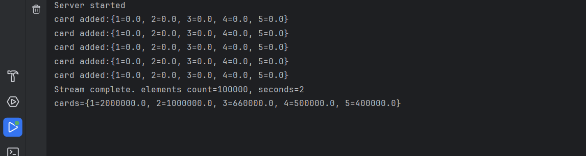
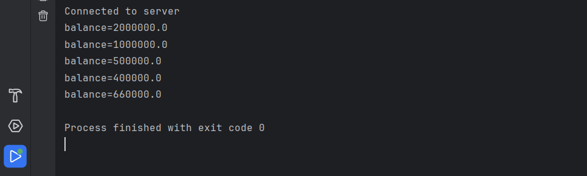

#### Методы и средства построения распределенных программных систем с использованием технологии Java
##### gRPC
---
### gRPC - система удаленного вызова процедур
 - Разработана компанией Google в 2015 г.
 - Использует HTTP/2 в качестве транспорта 
 - Используется Protocol Buffers в качестве описания формата передаваемых данных
 - Поддерживает блокирующие и неблокирующие вызовы, таймауты и отмену запроса, потоковую обработку
 - Поддерживает большинство современных языков программирования (Java, C++, Go, …)
---
### gRPC - система удаленного вызова процедур


fhttps://grpc.io/img/landing-2.svg<!-- .element: class="copyright-reference"  -->
 - Задача –предоставить быстрый и надежный, не зависящий от языка программирования  механизм RPC

---
### Protocol Buffers (protobuf)
 - Формат сериализации используемый по умолчанию для передачи данных между клиентом и сервером. 
 - Использует строгую типизацию полей и бинарный формат для передачи данных.
 - Время выполнения процесса сериализации/десериализации значительно меньше (как и размер сообщений) чем для JSON/XML.
 - Для написания protobuf файлов используют язык описания интерфейсов (IDL)
 ​
---
### Protocol Buffers IDL
 - Предназначен для определения сервисов
 - Содержит встроенные типы данных
 - Позволяет определять пользовательские типы данных
 - Содержит встроенные средства для обеспечения обратной совместимости
 - Имеются средства автоматической генерации кода (как клиентского, так и серверного)
 - Описание 3-ей версии: [https://developers.google.com/protocol-buffers/docs/proto3](https://developers.google.com/protocol-buffers/docs/proto3)
---
### Hello (IDL)
```proto 
syntax = "proto3";                               //Версия протокола
package grpc;                                    //Имя пакета
option java_multiple_files = true;               //Разные типы ->разные файлы
option java_package = "grpc";                    //Имя пакета для java
option java_outer_classname = "EchoServiceProto";//Имя класса для класса-дескриптора
//Имя типа-сообщения
message EchoRequest{
    string message = 1;             //Поле сообщения и его порядковый номер            
}
//Имя типа-сообщения
message EchoResponse{
    string message = 1;             //Поле сообщения и его порядковый номер             
}
service EchoService{                //Сервис                          
    //Методы сервиса (их мы и будем вызывать удаленно)
    rpc echo(EchoRequest) returns (EchoResponse){}
}
```
---
### Hello. Кодогенерация
 - Для генерации кода на целевом языке нужен 
     - компилятор (protoc) ([https://github.com/protocolbuffers/protobuf/releases/](https://github.com/protocolbuffers/protobuf/releases/))
     - Плагин (для java – protoc-gen-rpc-java) ([https://github.com/grpc/grpc-java/tree/master/compiler](https://github.com/grpc/grpc-java/tree/master/compiler))
     - Или плагин кодогенерации для вашей системы сборки (maven, gradle, …)

```bash 
protoc --plugin=protoc-gen-grpc-java="путь до плагина" \
        --grpc-java_out="директория для серверной заглушки" \
        --java_out="директория для оберток типов данных" \
        --proto_path=" директория, где лежит proto-файл" hello.proto

```
---
### Hello. Кодогенерация
Для кодогенерации может быть использован плагин для соответствующей системы сборки, например для maven:
```xml [1-31]
<extensions>
    <extension>
        <groupId>kr.motd.maven</groupId>
        <artifactId>os-maven-plugin</artifactId>
        <version>1.6.1</version>
    </extension>
</extensions>
<plugins>
    <plugin>
        <groupId>org.xolstice.maven.plugins</groupId>
        <artifactId>protobuf-maven-plugin</artifactId>
        <version>0.6.1</version>
        <configuration>
            <protocArtifact>com.google.protobuf:protoc:3.3.0:exe:${os.detected.classifier}</protocArtifact>
            <pluginId>grpc-java</pluginId>
            <pluginArtifact>io.grpc:protoc-gen-grpc-java:1.4.0:exe:${os.detected.classifier}</pluginArtifact>
        </configuration>
        <executions>
            <execution>
                <goals>
                    <goal>compile</goal>
                    <goal>compile-custom</goal>
                </goals>
            </execution>
        </executions>
    </plugin>
</plugins>
```
---
### Hello. Кодогенерация. Результат
```txt 
grpc                                        Пакет (java)
|--EchoRequest.java                         Класс-обертка для EchoRequest
|-- EchoRequestOrBuilder.java               Билдер для EchoRequest
|-- EchoResponse.java                       Класс-обертка для EchoResponse
|-- EchoResponseOrBuilder.java              Билдер для EchoResponse
|-- EchoServiceGrpc.java                    Заготовка для серверного класса
|-- EchoServiceProto.java                   Дескриптор сервиса 
                                            (позволяет для сервиса получить 
                                            его описание)

```
---
### Hello. Кодогенерация. EchoServiceGrpc
 - public static final class EchoServiceStub - представление сервиса (прокси-объект) для асинхронного вызова его методов
 - public static final class EchoServiceBlockingStub - представление сервиса (прокси-объект) для блокирующего вызова его методов
 - public static final class EchoServiceFutureStub  - представление сервиса (прокси-объект), для вызова его методов с использованием механизма ListenableFuture (асинхронные вызовы) 
---
### Hello. Кодогенерация. EchoServiceGrpc
 - public static abstract class EchoServiceImplBase – класс, от которого нужно наследовать сервис, перекрывая методы, определенные в описании IDL (hello.proto)
 - EchoServiceStub newStub(io.grpc.Channel channel) – метод создания асинхронного клиента
 - EchoServiceBlockingStub newBlockingStub(io.grpc.Channel channel) – метод создания синхронного клиента
 - EchoServiceFutureStub newFutureStub(io.grpc.Channel channel)  - метод создания клиента с механизмом ListenableFuture
---
### Hello. Кодогенерация. Классы - сообщения
 - Для каждого сообщения (message), определенного в proto-файле строится два класса:
     - \<MessageName> - класс, представляющий сообщение. Имеет методы билдер (builder) для построения сообщения с установкой значения полей и методы получения значений полей сообщения (getter`s)
     - \<MessageName>OrBuilder – интерфейс, который реализуется классом-сообщением
---
### Hello. Кодогенерация. EchoServiceProto
 - Позволяет предоставить клиенту описание сервиса (функциональный аналог описанию WSDL для веб-сервиса)
 - Существуют специальные инструментальные средства, позволяющие «прочитать» это описание и показать методы и типы сообщений, обрабатываемые сервисом:
     - [https://github.com/ktr0731/evans](https://github.com/ktr0731/evans)
     - [https://github.com/fullstorydev/grpcurl](https://github.com/fullstorydev/grpcurl) 
     - [https://github.com/gusaul/grpcox](https://github.com/gusaul/grpcox) 
     - [https://github.com/grpc/grpc-java/blob/master/documentation/server-reflection-tutorial.md#enable-server-reflection](https://github.com/grpc/grpc-java/blob/master/documentation/server-reflection-tutorial.md#enable-server-reflection) 
---
### Hello. Методы сервера
 - В случае, если не используется стримминг, метод принимает два аргумента – принимаемое сообщение и StreamObserver, параметризованный возвращаемым сообщением, и ничего не возвращает. Например:

```java 
public void echo(EchoRequest request,
                 io.grpc.stub.StreamObserver<EchoResponse> responseObserver)

```
 - request содержит поля сообщения
 - responseObserver используется для возврата значения методом
---
### Hello. ResponseObserver

```java 
public interface StreamObserver<V> {
    void onNext(V var1);
    void onError(Throwable var1);
    void onCompleted();

```
- Параметризуется классом – сообщением, которое должно быть возвращено
 - onNext принимает очередное сообщение, которое должно быть отправлено
 - onComplete вызывается, когда подготовка «пакета» сообщений завершена и его можно передавать клиенту. 

---
### Hello. Соединение с сервером
- Для представления соединения используется специальный класс io.grpc.Channel
- Для получения нового соединения (Channel) используется класс io.grpc.ManagedChannelBuilder с методами
     - forAddress(host,port) – указывает хост и порт для соединения
     - forTarget(String target) – указывает строку соединения с использованием различных механизмов разрешения имени
     - …
     - build() – заканчивает построение соединения
---
### Hello. Запуск сервера
- io.grpc.Server – класс для представления сервера GRPC.
     - start() – запускает сервер
     - awaitTermination() – ожидает завершения сервера
 - io.grpc. ServerBuilder – класс для регистрации нашего сервиса и создания сервера
     - forPort(int port) – порт, на котором будет работать сервис
     - addService(BindableService bindableService) – добавляет реализацию сервиса
     - build() – завершает создание сервера
---
## Hello. Сервер

```java [1-22|5|15|16|17|18|19|20|7-8|9-10|11|12]
package hello;
import io.grpc.*;
import grpc.*;

public class EchoServer extends EchoServiceGrpc.EchoServiceImplBase {
    @Override
    public void echo(EchoRequest request,
                     io.grpc.stub.StreamObserver<EchoResponse> responseObserver) {
        EchoResponse response = EchoResponse.newBuilder()
            .setMessage("hello from server:"+request.getMessage()).build();
        responseObserver.onNext(response);
        responseObserver.onCompleted();
    }

    public static void main(String[] args) throws Exception{
        Server server = ServerBuilder
                .forPort(8080)
                .addService(new EchoServer()).build();
        server.start();
        server.awaitTermination();
    }
}
```
---
## Hello. Клиент

```java [1-23|7|18-20|21|11-12|13|14]
package hello;
import grpc.*;
import io.grpc.*;
import java.util.Scanner;
public class EchoClient {
    public static void main(String[] args) {
        EchoServiceGrpc.EchoServiceBlockingStub client = createClient("localhost",8080);
        Scanner console = new Scanner(System.in);
        String message;
        while((message = console.nextLine())!=null){
            EchoRequest request = EchoRequest.newBuilder()
                                    .setMessage(message).build();
            EchoResponse response = client.echo(request);
            System.out.println("response="+response.getMessage());
        }
    }
    private static EchoServiceGrpc.EchoServiceBlockingStub  createClient(String host, int port){
        Channel channel = ManagedChannelBuilder.forAddress(host,port)
                .usePlaintext()
                .build();
        return EchoServiceGrpc.newBlockingStub(channel);
    }
}
```
---
## Hello. Компиляция и запуск
 - Для компиляции и запуска нужны библиотеки с реализацией необходимых пакетов.
 - Список зависимостей для maven ([https://github.com/grpc/grpc-java](https://github.com/grpc/grpc-java)):

```xml
<dependency>
    <groupId>io.grpc</groupId>
    <artifactId>grpc-netty</artifactId>
    <version>1.32.2</version>
</dependency>
<dependency>
    <groupId>io.grpc</groupId>
    <artifactId>grpc-protobuf</artifactId>
    <version>1.32.2</version>
</dependency>
<dependency>
    <groupId>io.grpc</groupId>
    <artifactId>grpc-stub</artifactId>
    <version>1.32.2</version>
</dependency>
<dependency>
    <groupId>io.grpc</groupId>
    <artifactId>grpc-services</artifactId>
    <version>1.32.2</version>
</dependency>

```
---
## Hello. Компиляция и запуск
 - Запуск с использованием системы сборки maven:
     - сервер
```bash
mvn exec:java -Dexec.mainClass=hello.EchoServer
```
     - клиент
```bash
mvn exec:java -Dexec.mainClass=hello.EchoClient
```
---
## Protocol Buffers IDL (скалярные типы)
|proto|Комментарий|тип Java|
|-----|-----------|----|
|float|     	|float|
|double|		|double|
|int32|	Использует кодировку переменной длины. Неэффективен для кодирования отрицательных чисел - если в вашем поле вероятны отрицательные значения, используйте вместо sint32|	int|
|int64|	Использует кодировку переменной длины.Неэффективен для кодирования отрицательных чисел - если в вашем поле вероятны отрицательные значения, используйте вместо этого sint64.|	long|
|uint32|	Беззнаковые	|int|
|uint64|	Беззнаковые	|long|
|sint32|	Использует кодировку переменной длины. Знаковое значение int. Они более эффективно кодируют отрицательные числа, чем обычные int32.|	int|
|sint64|	Использует кодировку переменной длины. Знаковое значение int. Они более эффективно кодируют отрицательные числа, чем обычные int64.|	long|
|fixed32|	Всегда четыре байта. Более эффективен, чем uint32, если значения часто больше 2 ^ 28.	|int|
|fixed64|	Всегда восемь байт. Более эффективен, чем uint64, если значения часто больше 2 ^ 56.	|long|
|sfixed32|	Всегда 4 байта	|int|
|sfixed64|	Всегда 8 байт	|long|
|bool|		|boolean|
|string|	Строка всегда должна содержать текст в кодировке UTF-8 или 7-битный ASCII и не может быть длиннее 2^32.|	String|
|bytes|	Может содержать любую произвольную последовательность байтов не более 2^32.	|ByteString|
---
## Protocol Buffers IDL (сообщения)
```proto
/* SearchRequest represents a search query, with pagination options to
 * indicate which results to include in the response. */

message SearchRequest { //Имя типа (сообщения)
    //Тип поля, его имя и индекс
    string query = 1;
    int32 page_number = 2;  // Which page number do we want?
    int32 result_per_page = 3;  // Number of results to return per page.
} 

message Foo {                   //Резервирование полей для дальнейшего 
    reserved 2, 15, 9 to 11;    //использования в будущем, или для 
    reserved "foo", "bar";      //обратной совместимости с прошлыми версиями
} 
```
---
## Protocol Buffers IDL (перечислимый тип)
```proto 
message SearchRequest {         //Имя типа 
    string query = 1;
    int32 page_number = 2;
    int32 result_per_page = 3;
    enum Corpus {               //Допустимые значения 
        UNIVERSAL = 0;          //(значение по умолчанию - нулевое)
        WEB = 1;
        IMAGES = 2;
        LOCAL = 3;
        NEWS = 4;
        PRODUCTS = 5;
        VIDEO = 6;
    }
    Corpus corpus = 4;
} 
```
---
## Protocol Buffers IDL (Вложенные типы)

```proto
message SearchResponse {            //Имя типа
  message Result {                  //Имя вложенного типа
    string url = 1;
    string title = 2;
    repeated string snippets = 3;   //Массив строк
  }
  repeated Result results = 1;      //Массив структур типа Result
} 

```
---
## Protocol Buffers IDL (oneOf – запись с вариантами)

```proto
message SampleMessage {
  oneof test_oneof {
    string name = 4;
    SubMessage sub_message = 9;
  }
} 

```

 - Вариант - 
    - Либо строка
    - Либо пользовательский тип

Запись любого из вариантов уничтожает остальные:

```java
SampleMessage message;
message.set_name("name");
CHECK(message.has_name());
message.mutable_sub_message();   // Will clear name field.
CHECK(!message.has_name());
```
---
## Protocol Buffers IDL (хэш-таблицы)
```proto
message Project {
    int32 page_number = 2;
    int32 result_per_page = 3;
}

message SampleMessage {
    /* Хэш-таблица. Ключ – строка, значение - Project */
    map<string, Project> projects = 3; 
}

```
---
## Protocol Buffers IDL (определение сервиса)

```proto
//Без стриминга
service SearchService {
  rpc Search(SearchRequest) returns (SearchResponse);
} 
//Поток от клиента
service SearchService {
  rpc Search(stream SearchRequest) returns (SearchResponse);
} 
//Поток от сервера
service SearchService {
  rpc Search(SearchRequest) returns (stream SearchResponse);
}
//Двунаправленный стриминг
service SearchService {
  rpc Search(stream SearchRequest) returns (stream SearchResponse);
} 

```
---
## gRPC. Предварительные итоги
 - Еще одна (современная, мультиплатформенная, быстрая, …) реализация RPC
 - Обладает развитым языком описания интерфейсов (IDL)
 - Проста в использовании, есть много документации (элементарное введение здесь: [https://grpc.io/docs/languages/java/basics/](https://grpc.io/docs/languages/java/basics/))
 - Java – одна из целевых платформ => хорошая поддержка, много инструментов и т.д.

---
## Расширенные примеры
 - Реализация программы обслуживания сети столовых, с использованием gRPC:
     - Пример 1: определяется интерфейс, содержащий методы, осуществляющие базовые единичные операции (блокирующие вызовы)
     - Пример 2: интерфейс содержит методы, осуществляющие массированные операции (стриминг)
---
## Элементы технологии
 - Определение интерфейса (IDL)
 - Кодогенерация
 - Реализация серверного класса
 - Реализация клиентского класса
---
## Определение интерфейса (IDL)

```proto [1-25|2|7-10|11-14|15-17|18-20|21-27|23|1-27]
syntax = "proto3";
import "google/protobuf/empty.proto"; //импорт других proto-файлов
package grpc;
option java_multiple_files = true;
option java_package = "grpc";
option java_outer_classname = "BillingServiceProto";
message AddNewCardRequest{
    string personname = 1;
    string card = 2;
}
message MoneyRequest{           //Типы для передачи сообщений и возвратов методов
    string card = 1;
    double money = 2;
}
message GetCardBalanceRequest{  //Типы для передачи сообщений и возвратов методов
    string card = 1;
}
message GetCardBalanceResponse{ //Типы для передачи сообщений и возвратов методов
    double balance = 1;
}
service BillingService{         //Определение интерфейса сервиса
    rpc addNewCard(AddNewCardRequest) returns (google.protobuf.Empty); //возврат void
    rpc addMoney(MoneyRequest) returns (google.protobuf.Empty);
    rpc subMoney(MoneyRequest) returns (google.protobuf.Empty);
    rpc getCardBalance(GetCardBalanceRequest) returns (GetCardBalanceResponse); }
```
---
## Реализация сервера (1)

```java [1-24|9|11-16|17-23|19|1-24]
package grpcex1;
import com.google.protobuf.Empty;
import grpc.*;
import io.grpc.Server;
import io.grpc.ServerBuilder;
import java.util.Map;
import java.util.concurrent.ConcurrentHashMap;

public class BillingService extends BillingServiceGrpc.BillingServiceImplBase {
    Map<String, Double> cards = new ConcurrentHashMap<>();
    public void addNewCard(grpc.AddNewCardRequest request,
                           io.grpc.stub.StreamObserver<com.google.protobuf.Empty> responseObserver) {
        cards.putIfAbsent(request.getCard(),0.0); System.out.println("card added:"+cards);
        responseObserver.onNext(Empty.newBuilder().build());
        responseObserver.onCompleted();
    }
    public void addMoney(grpc.MoneyRequest request,
                         io.grpc.stub.StreamObserver<com.google.protobuf.Empty> responseObserver) {
        cards.computeIfPresent(request.getCard(),(key,value)->value + request.getMoney());
        System.out.println("card money added:"+cards);
        responseObserver.onNext(Empty.newBuilder().build());
        responseObserver.onCompleted();
    }
```
---
## Реализация сервера (2)

```java [1-23|1-7|3|8-14|15-22|16|17|18|19|21|1-23]
    public void subMoney(grpc.MoneyRequest request,
                         io.grpc.stub.StreamObserver<com.google.protobuf.Empty> responseObserver) {
        cards.computeIfPresent(request.getCard(),(key,value)->value - request.getMoney());
        System.out.println("card money sub:"+cards);
        responseObserver.onNext(Empty.newBuilder().build());
        responseObserver.onCompleted();
    }
    public void getCardBalance(grpc.GetCardBalanceRequest request,
                               io.grpc.stub.StreamObserver<grpc.GetCardBalanceResponse> responseObserver) {
        GetCardBalanceResponse response = GetCardBalanceResponse.newBuilder().setBalance(cards.get(request.getCard()))
                                                                .build();
        responseObserver.onNext(response);
        responseObserver.onCompleted();
    }
    public static void main(String[] args) throws Exception{
        Server server = ServerBuilder
                .forPort(8080)
                .addService(new BillingService()).build();
        server.start();
        System.out.println("Server started");
        server.awaitTermination();
    }
}
```
---
## Реализация клиента

```java [1-23|6|17-22|18|19|20|21|7-8|9|10|11-12|13|14|15]
package grpcex1;
import grpc.*;
import io.grpc.*;
public class BillingCllient {
    public static void main(String[] args) {
        BillingServiceGrpc.BillingServiceBlockingStub client = createClient("localhost",8080);
        AddNewCardRequest cardRequest = AddNewCardRequest.newBuilder().setCard("1")
                                                                .setPersonname("Ivan").build();
        client.addNewCard(cardRequest);
        MoneyRequest moneyRequest = MoneyRequest.newBuilder().setCard("1").setMoney(100.0).build();
        client.addMoney(moneyRequest);
        client.subMoney(moneyRequest);
        GetCardBalanceRequest balanceRequest = GetCardBalanceRequest.newBuilder().setCard("1").build();
        GetCardBalanceResponse balanceResponse = client.getCardBalance(balanceRequest);
        System.out.println("balance:"+balanceResponse.getBalance());
    }
    private static BillingServiceGrpc.BillingServiceBlockingStub createClient(String host, int port){
        Channel channel = ManagedChannelBuilder.forAddress(host,port)
                .usePlaintext()
                .build();
        return BillingServiceGrpc.newBlockingStub(channel);
    }
}
```
---
## Компиляция и выполнение
 - Для сборки проекта используем систему сборки maven и соответствующий плагин кодогенерации (https://github.com/grpc/grpc-java)
     - Запуск сервера:
```bash
mvn exec:java -Dexec.mainClass=grpcex1.BillingService
```
     - Запуск клиента:
```bash
mvn exec:java -Dexec.mainClass=grpcex1.BillingCllient
```
---
## Пример 2
 - Для передачи потока операций от клиента к серверу используем стриминг
 - Используем неблокирующие вызовы (на клиенте)
---
## Определение интерфейса (IDL)

```proto [1-25|23]
syntax = "proto3";
import "google/protobuf/empty.proto";
package grpc;
option java_multiple_files = true;
option java_package = "grpc";
option java_outer_classname = "BillingServiceProto";
message AddNewCardRequest{
    string personname = 1;
    string card = 2;
}
message MoneyRequest{
    string card = 1;
    double money = 2;
}
message GetCardBalanceRequest{
    string card = 1;
}
message GetCardBalanceResponse{
    double balance = 1;
}
service BillingService{
    rpc addNewCard(AddNewCardRequest) returns (google.protobuf.Empty);
    rpc processOperation(stream MoneyRequest) returns (google.protobuf.Empty);
    rpc getCardBalance(GetCardBalanceRequest) returns (GetCardBalanceResponse);}
```
---
## Прием потока(stream) на сервере
 - Метод, принимающий поток, определяется следующим образом:

```java
public io.grpc.stub.StreamObserver<grpc.ex2.MoneyRequest> processOperation(
        io.grpc.stub.StreamObserver<com.google.protobuf.Empty> responseObserver)
```
 - метод принимает StreamObserver, параметризованный типом возвращаемого сообщения
 - и возвращает StreamObserver, параметризованный типом принимаемого сообщения
---
## Прием потока(stream) на сервере
 - Возвращаемый методом StreamObserver используется следующим образом:
    - его метод onNext вызывается в момент прихода от клиента очередного сообщения
    - onCompleted вызывается при завершении передачи клиентом потока
    - onError вызывается при возникновении ошибки 
---
## Реализация сервера (1)
```java [1-28|20|1-28]
package grpcex2;
import com.google.protobuf.Empty;
import grpc.*;
import io.grpc.*;
import io.grpc.stub.StreamObserver;
import java.util.Map;
import java.util.concurrent.ConcurrentHashMap;
import static java.util.concurrent.TimeUnit.NANOSECONDS;

public class BillingService extends BillingServiceGrpc.BillingServiceImplBase {
    public static void main(String[] args) throws Exception{
        Server server = ServerBuilder.forPort(8080).addService(new BillingService()).build();
        server.start();  System.out.println("Server started");
        server.awaitTermination();
    }
    Map<String, Double> cards = new ConcurrentHashMap<>();
    public void addNewCard(grpc.AddNewCardRequest request,
        io.grpc.stub.StreamObserver<com.google.protobuf.Empty> responseObserver) {
        cards.putIfAbsent(request.getCard(),0.0);
        System.out.println("card added:"+cards);
        responseObserver.onNext(Empty.newBuilder().build());
        responseObserver.onCompleted();
    }
```
---
## Реализация сервера (2)
```java [1-35|1-8|9-33|11-13|15-20|25-32]
public void getCardBalance(grpc.GetCardBalanceRequest request,
        io.grpc.stub.StreamObserver<grpc.GetCardBalanceResponse> responseObserver){
        GetCardBalanceResponse response = GetCardBalanceResponse.newBuilder()
                .setBalance(cards.get(request.getCard())).build();
        responseObserver.onNext(response); responseObserver.onCompleted();
    }
public io.grpc.stub.StreamObserver<grpc.MoneyRequest> processOperation(
        io.grpc.stub.StreamObserver<com.google.protobuf.Empty> responseObserver){
    return new StreamObserver<MoneyRequest>() {
        long count = 0;  long startTime = System.nanoTime();
        @Override public void onNext(MoneyRequest moneyRequest) {
            cards.computeIfPresent(moneyRequest.getCard(), (key,value)->value + moneyRequest.getMoney()); count++;
        }
        @Override public void onError(Throwable throwable) {throwable.printStackTrace();}
        @Override public void onCompleted() {
            System.out.println(String.format("Stream complete. elements count=%s, seconds=%s",
                 count, NANOSECONDS.toSeconds(System.nanoTime() - startTime)));
            System.out.println("cards="+cards);
            responseObserver.onNext(Empty.newBuilder().build()); responseObserver.onCompleted();
        }
    };
}
}
```
---
## Клиент. Асинхронные вызовы
 - Клиентский прокси-объект, позволяющий делать асинхронные вызовы, формируется с помощью специального метода:

```java 
public static BillingServiceStreamStub newStub(io.grpc.Channel channel)
```
 - для того, чтобы обработать результат асинхронного вызова, используется специальный объект типа StreamObserver, передаваемый в метод

```java 
public void getCardBalance(grpc.ex2.GetCardBalanceRequest request,
    io.grpc.stub.StreamObserver<grpc.ex2.GetCardBalanceResponse> responseObserver)
```
---
## Клиент. Отслеживание результата вызова 

```java [1-23|5|6|7|8-10|11-14|20-22|1-23]
package grpcex2;
import io.grpc.stub.StreamObserver;
import java.util.concurrent.CountDownLatch;
import java.util.function.Consumer;
public class WaitObserver<T> implements StreamObserver<T> {
    private final CountDownLatch latch; //Барьер
    private final Consumer<T> consumer; //Вызываем при приходе сообщения
    public WaitObserver(CountDownLatch latch, Consumer<T> consumer){
        this.latch = latch;  this.consumer = consumer;
    }
    @Override                   //Вызывается при приходе сообщения от сервера
    public void onNext(T t) {
        consumer.accept(t);     //Вызываем пользовательскую функцию
    }
    @Override                   //Вызывается при возникновении ошибки
    public void onError(Throwable throwable) {
        throwable.printStackTrace();
    }
    @Override                   //Вызывается при завершении передачи от сервера
    public void onCompleted() {
        latch.countDown();      //Уменьшаем значение в барьере
    }
}
```
---
## Клиент. Передача потока(stream) на сервер
 - Метод, принимающий поток имеет следующую сигнатуру:

```java 
public io.grpc.stub.StreamObserver<grpc.ex2.MoneyRequest> processOperation(
    io.grpc.stub.StreamObserver<com.google.protobuf.Empty> responseObserver)
```
 - он возвращает StreamObserver, который используется для **передачи** потока на сервер
 - Клиент формирует сообщения и отправляет их в поток, вызывая метод onNext
 - Когда формирование потока закончено, клиент вызывает onCompleted
---
## Реализация клиента (1)

```java [1-31|13|14|8-11|10|16|17|18-22|19-20|21|23]
package grpcex2;
import com.google.protobuf.Empty;
import grpc.*;
import io.grpc.*;
import io.grpc.stub.StreamObserver;
import java.util.concurrent.*;
public class BillingClient {
    private static BillingServiceGrpc.BillingServiceStub createClient(String host, int port){
        Channel channel = ManagedChannelBuilder.forAddress(host,port).usePlaintext().build();
        return BillingServiceGrpc.newStub(channel); //для неблокирующих
    }
    public static void main(String[] args) throws Exception{
        final int cardCount = 5, operationCount = 100000;
        BillingServiceGrpc.BillingServiceStub asyncClient = createClient("localhost",8080);
        //барьер для ожидания завершения указанного количества вызовов
        final CountDownLatch addCardsLatch = new CountDownLatch(cardCount);
        WaitObserver<Empty> observer = new WaitObserver<>(addCardsLatch, t->{});
        for (int i = 1; i <= cardCount; i++) {
            AddNewCardRequest cardRequest = AddNewCardRequest.newBuilder()
                                            .setCard(String.valueOf(i)).setPersonname("Client "+i).build();
            asyncClient.addNewCard(cardRequest,observer);//неблокирующий вызов
        }
        addCardsLatch.await(1, TimeUnit.MINUTES); //ожидание завершения ВСЕХ вызовов
```
---
## Реализация клиента (2)

```java [1-23|1|2|3|4-10|6-8|9|11|12|13|14-15|16-20|19|21|1-23]
        final CountDownLatch operationLatch = new CountDownLatch(1);
        observer = new WaitObserver<>(operationLatch, t->{});
        StreamObserver<MoneyRequest> requestObserver = asyncClient.processOperation(observer);
        for(int i = 1;i <= operationCount; i++){
            int card = i % cardCount + 1;
            MoneyRequest moneyRequest = MoneyRequest.newBuilder()
                    .setCard( String.valueOf(card))
                    .setMoney(100 / card).build();
            requestObserver.onNext(moneyRequest);
        }
        requestObserver.onCompleted();
        operationLatch.await(1, TimeUnit.MINUTES);
        final CountDownLatch balanceLatch = new CountDownLatch(cardCount);
        WaitObserver<GetCardBalanceResponse> balanceObserver = new WaitObserver<>(balanceLatch, 
                                t->System.out.println("balance="+t.getBalance()));
        for (int i = 1; i <= cardCount; i++) {
            GetCardBalanceRequest cardBalanceRequest = GetCardBalanceRequest.newBuilder()
                                                .setCard(String.valueOf(i)).build();
            asyncClient.getCardBalance(cardBalanceRequest, balanceObserver);
        }
        balanceLatch.await(1, TimeUnit.MINUTES);
    }
}
```
---
## Запуск
Почему даже при первом вызове addNewCard выводятся все карты? <!-- .element: class="left" -->
 
 <!-- .element: class="small_image" -->

---
## Итоги
 - gRPC позволяет быстро строить распределенные приложения
 - Имеется возможность использовать неблокирующие вызовы и стриминг (в том числе двунаправленный)
 - Имеются удобные инструментальные средства поддержки  Java (и других языков тоже)


