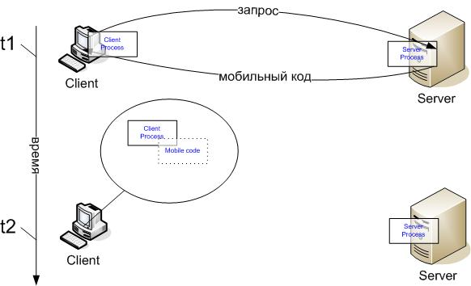
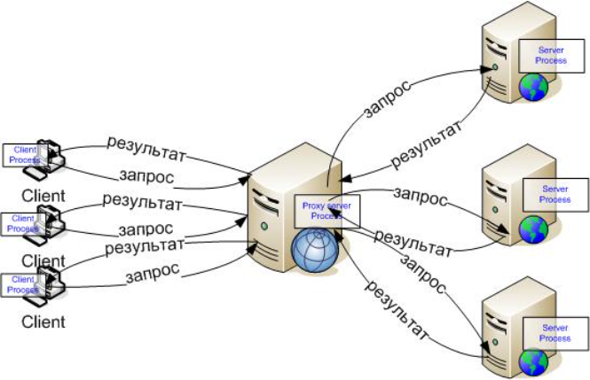
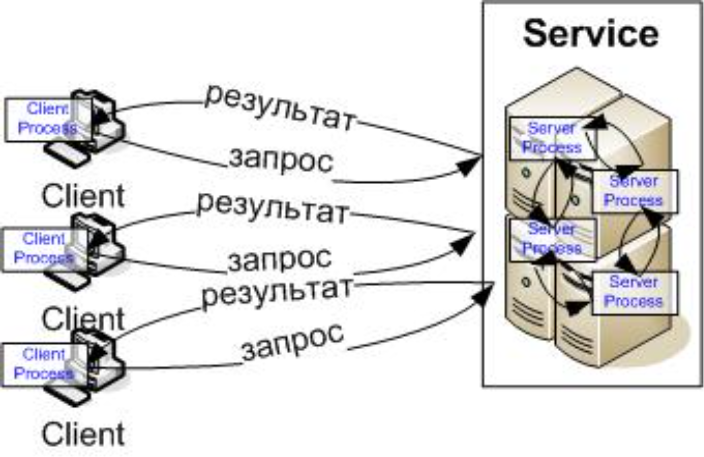

# Введение
---
### Определения
 - «Распределенная система это набор независимых узлов (компьютеров), которые представляются пользователю как единая система.»<!-- .element: class="size"  -->
 - «Распределенная система это собрание независимых компьютеров соединенных сетью с программным обеспечением, обеспечивающим их совместное функционирование.»<!-- .element: class="size"  -->
 - «Система, состоящая из набора двух или более независимых узлов, которые координируют свою работу посредством синхронного или асинхронного обмена сообщениями.»<!-- .element: class="size"  -->
 - «Система, чьи компоненты размещены на различных узлах, взаимодействующие и управляемые только посредством передачи сообщений.»<!-- .element: class="size"  -->
 - «...система нескольких автономных вычислительных узлов, взаимодействующих для выполнения общей цели.»<!-- .element: class="size"  -->
 - «…я не могу объяснить, что такое распределенная система, но узнаю ее как только мне ее покажут»<!-- .element: class="size"  -->
---
### Определения
 - В рамках этого курса мы будем рассматривать такие системы, компоненты которых *выполняются на различных узлах* и взаимодействуют между собой посредством какой-либо *сети передачи данных*
---
### Очевидные последствия
 - Дополнительный компонент с *низкой* надежностью - сеть
    - Значительная задержка при передаче данных (латентность при передаче)
    - Незначительная (по сравнению с RAM) пропускная способность (для RAM десятки ГБайт\с, для сети Гбиты\с)
    - Проблемы безопасности в сети (возможность перехвата и подмены трафика)
    - топология сети может изменяться во время работы приложения
 - Любое распределенное приложение - по определению параллельное
    - гонки потоков
    - необходимость в синхронизации
---
### Очевидные последствия
 - Сложности с развертыванием приложения
     - Как обновлять приложение, состоящее из десятков компонентов
     - Части приложения могут разворачиваться на "чужих" площадках - вне периметра безопасности
 - Сложности с эксплуатацией и обнаружением сбоев
     - Как понять, что какие-то компоненты распределенного приложения вышли из строя
 - Нет "глобального" состояния системы (нет ни одного процесса в распределенной системе, который бы знал текущее глобальное состояние системы)
 - Строго говоря - нет "глобального" времени (ограниченная точность синхронизации часов) 
---
### Очевидные последствия
 - Распределенные системы сложно проектировать
 - ... сложно разрабатывать
 - ... сложно эксплуатировать

 Зачем они вообще нужны?
---
### Мотивация
 - Естественное разделение. Существуют ситуации, в которых распределенная система - единственная возможность
     - почтовый клиент и почтовый сервер
     - браузер и HTTP-сервер
     - банкомат и процессинговая система банка
     - касса в магазине и процессинг банка\система магазина
     - ...
 - Большинство ИТ-систем, с которыми пользователь сегодня сталкивается - распределенные. Потому что пользователь и выполнение его сервиса находятся в разных местах    
---
### Мотивация
 - Повышение производительности
    - Зачастую один узел системы не может справиться с вычислительной нагрузкой. Увеличивать мощность узла нежелательно (например, дорого). В систему добавляют дополнительные узлы
    - Для обеспечения *масштабируемости* система должна быть специальным образом спроектирована. Например, при ее создании могут использоваться специализированные шаблоны или целые библиотеки
    - Вы уже знакомы с таким подходом: MPI как раз решает эту задачу 
---
### Мотивация
 - Отказоустойчивость
    - Отдельные (или все) компоненты системы могут быть дублированы на разных (независимых) узлах. Тогда выход из строя одного (или нескольких - зависит от количества запущенных дубликатов) узла не приводит к прекращению работы системы
    - Часто используется в варианте, когда происходит не дублирование компонентов, а их *перенос* с аварийного узла на рабочий. При этом перерыв в сервисе есть, но он минимальный
    - Часто используется совместно с мероприятиями по обеспечению масштабируемости
---
### Мотивация
 - Другие, чаще всего "экономические" причины : если ваша систем разбита на небольшие компоненты, между которыми четко определен интерфейс, то
    - можно повысить T2M (время от идеи до внедрения) 
        - в такие компоненты можно быстро вносить изменения
        - развертывать при изменении можно отдельные компоненты, а не все приложение
    - можно повысить продуктивность разработки 
        - разные компоненты могут быть написаны на разных ЯП (наиболее подходящих для решения задачи), использовать разные СУБД
        - разные компоненты могут разрабатывать разные команды разработчиков
---
### Общие соображения
 - В зависимости от того, чем именно вызвана необходимость создания распределенной системы, к ее компонентам могут предъявляться разные требования. Однако, можно сформулировать ряд общих требований, видимо подходящих для большинства систем:
     - При проектировании межмодульного интерфейса необходимо внимательно следить за объемом передаваемых данных. Если данных *слишком много*, возможно, вы неправильно провели границы между модулями
     - При прочих равных отдавать предпочтение массированным операциям передачи данных. Передать массив значений *выгоднее*, чем отдельное значение
---
### Общие соображения
 - Старайтесь избегать сильной связанности между компонентами. Компоненты должны "знать" только о тех компонентах, которые им нужны для работы (с которыми они взаимодействуют)
 - Инкапсулируйте компоненты - предоставляйте интерфейс(API), за которым скрыта вся внутренняя логика работы
 - Если есть возможность реализовать компонент без хранения состояния (stateless) - сделайте это
 - Если заботитесь о надежности - позаботьтесь, чтобы в системе не было единой точки отказа (одного компонента, выход из строя которого приведет к краху всей системы)    
---
### Общие соображения
В настоящее время, из соображений максимальной независимости компонентов друг от друга, принят подход, при котором все взаимодействие между компонентами осуществляется посредством API компонента. Это означает, что компонент должен полностью отвечать за сохранение своего состояния (если оно есть), т.е. каждый компонент имеет свою собственную СУБД. Это в корне отличается от привычного подхода, при котором данные всей системы хранятся согласованно и централизованно <!-- .element: class="left small_font" -->

  - Плюсы такого подхода: <!-- .element: class="size"  -->
     - каждый компонент выбирает СУБД и схему данных оптимальную для решения своей задачи <!-- .element: class="size"  -->
     - СУБД и схема данных может быть в любой момент изменена, если это не сказывается на API <!-- .element: class="size"  -->
     - нет единой точки отказа (центральной СУБД) <!-- .element: class="size"  -->
     - нет единого "бутылочного горлышка" производительности (центральной СУБД) <!-- .element: class="size"  --> 
 - Минусы <!-- .element: class="size"  -->
     - необходимо самостоятельно решать проблему согласованности данных для СУБД разных компонент, что может оказаться очень сложной задачей <!-- .element: class="size"  -->
     - у нас теперь нет "простых" транзакций в общей СУБД, любая транзакция становится распределенной <!-- .element: class="size"  -->
---
### Микросервисная архитектура
 - набор правил и соглашений для компонентов распределенной системы
     - сервис решает бизнес-задачу (группировка по бизнес-задачам)
     - сервис **маленький** (разрабатывается одной командой, и его способен понять один человек) 
     - сервисы слабосвязаны (поэтому их при желании можно повторно использовать)
     - используется децентрализованное управление сервисами
     - используется децентрализованное управление данными (у каждого сервиса свое хранилище)
     - используется автоматизация развертывания и мониторинга
---
### Микросервисная архитектура
 - Плюсы
     - маленькие сервисы проще создавать и сопровождать
     - упрощается обновление системы - маленькие автономные сервисы могут быть обновлены независимо
     - для каждого сервиса - подходящая ему технология (ЯП, СУБД, ...)
     - высокая стабильность - отказ сервиса может быть обнаружен и исправлен (в т.ч. автоматически)
     - возможность масштабирования как средство увеличения производительности и надежности
 
---
### Микросервисная архитектура
 - Минусы
     - сервисы маленькие -> много взаимодействий. может страдать производительность -> производительность (и надежность) сети критически важна
     - сервисов много -> нужно много оборудования (узлов) для их развертывания. зачастую *больше* чем для развертывания монолита
     - много сервисов и оборудования - критическая зависимость от средств автоматизации управления
     - много API. нужны способы его описания 
     - при проектировании нужно учитывать много особенностей - асинхронный характер взаимодействия, то, что отдельные сервисы могут быть недоступны и т.д. и т.п. 
---
### Теорема CAP
в любой реализации распределённых вычислений возможно обеспечить не более двух из трёх следующих свойств (это эвристическое утверждение!):<!-- .element: class="left" -->
 - согласованность данных (англ. consistency) — во всех вычислительных узлах в один момент времени данные не противоречат друг другу;
 - доступность (англ. availability) — любой запрос к распределённой системе завершается корректным откликом, однако без гарантии, что ответы всех узлов системы совпадают;
 - устойчивость к разделению (англ. partition tolerance) — расщепление распределённой системы на несколько изолированных секций не приводит к некорректности отклика от каждой из секций.
---
### Теорема CAP
<!-- .element: width="40%" -->

https://i0.wp.com/proselyte.net/wp-content/uploads/2022/03/CAP_diagram.png<!-- .element: class="copyright-reference"  -->

Таким образом, при создании распределенной системы приходится идти на компромисс и выбирать какой-то из вариантов<!-- .element: class="left small_font" -->
---
### Модели архитектуры
  - Модель архитектуры отвечает на вопрос:
     - какие компоненты составляют нашу распределенную систему (и какие у них роли)
     - как компоненты взаимодействуют между собой
  - Выбор архитектуры при проектировании - критически важен. Он влияет на будущие эксплуатационные свойства 
  - Самой простой моделью архитектуры является модель "клиент-сервер"   
---
### Клиент-сервер
 - Клиент: процесс, желающий получить доступ к данным, использует ресурсы и/или выполняет действия на удаленном узле
 - Сервер: процесс, управляющий данными и всеми другими разделяемыми ресурсами, обеспечивающий клиентам доступ к ресурсам и производящий вычисления
 - Взаимодействие: пары запрос/результат. **обычно** (но не обязательно) взаимодействие *синхронное*
 - Пример
     - http-сервер: клиент (броузер) запрашивает страницу, сервер поставляет страницу
     - клиент посылает SQL-запрос на сервер СУБД, сервер его выполняет и возвращает ответ
---
### Клиент-сервер (мобильный код)
 - Мобильный код: код, посланный клиенту, чтобы выполнить его же задачу

---
### Клиент-сервер (мобильный код)
 - Выполнение программы (код + данные), которая перемещается между узлами в сети
     - Выполняет автономную задачу обычно под управлением некоторого другого процесса
     - Имеет внутреннее знание и цели
 - Преимущество: всюду локальный доступ
     - Снижает затраты на коммуникации
 - Потенциальная угроза безопасности
     - Ограниченная применимость
 - Примеры: сбор данных из многих источников, установка программ, программы типа червей (электронная почта)
---
### Модель с прокси-сервером

---
### Модель с прокси-сервером
 - Кэш: «близкая» копия, наиболее часто используемых данных
     - ЗНАЧИТЕЛЬНО повышает производительность большинства приложений
     - Но требует усилий по поддержанию когерентности
 - Прокси-сервер: разделяемый кэш ресурсов
     - Еще сложнее, чем простой Кэш…
     - Обычно используется (и хорошо подходит) для доступа к мало меняющимся или *неважным* данным
---
### Модель «пул серверов» (сервис)

---
### Модель «пул серверов» (сервис) 
 - Услуги могут обеспечиваться многими серверами 
 - Распределенные между серверами объекты
 - Реплицированные объекты
     - Увеличение производительности, доступности и отказоустойчивости
 - Но требуют координации копий / консистентности представления
 - Например, высокодоступные серверы (порталы, диллинговые центры), информационные службы
 - Серверы, обслуживающие распределенную БД
---
### Модели архитектуры 
 - Другой часто применяемой моделью построения распределенных приложений является **событийная модель**
 - В рамках этой модели система разрабатывается как набор компонентов, обменивающихся сообщениями
 - Взаимодействие компонентов в рамках этой модели **обычно** *асинхронное*  
---
### Событийная модель 
 - Плюсы
     - слабая связанность между компонентами системы. в систему легко добавляются новые компоненты
     - разные компоненты независимы и могут запускаться в разное время
     - легче проектировать системы с высокой масштабируемостью  
 - Минусы
     - необходим дополнительный компонент (брокер сообщений, шина, ...)
     - может быть сложно реализовать некоторые сценарии (обработка событий в строгом порядке, откат операций, гарантированная доставка *единственного экземпляра* события и т.д.) 
     - как следствие часто более сложный код 
---
### Событийная модель 
 - Обычно используют следующие варианты взаимодействия при использовании событийной модели:
     - взаимодействие вида "точка-точка". При этом сообщение отправляется конкретному получателю и при его получении не может быть прочитано другим получателем. Вариант реализации посредника - *очередь*
     - взаимодействие типа "издатель-подписчик". При этом одно сообщение, сформированное издателем, может быть получено несколькими подписчиками, тем или иным образом, подписанных на него.  Вариант реализации посредника - *тема*(topic)
---
Некоторые часто встречающиеся задачи и типичные шаблоны для их решения
---
### 
 - Распределенные системы часто включают много компонентов и имеют очень сложную структуру. Тем не менее, часто (но не всегда) можно разделить все компоненты системы на части:
     - **Frontend** - компонент (или компоненты), непосредственно взаимодействующие с внешними пользователями (это могут быть другие системы, не обязательно люди), получают запросы, для их обработки обращаются к Backend`у
     - **Backend** - компоненты, отвечающие на "запросы" frontend`a, реализующие основную бизнес-логику системы
     - часто выделяют еще одну группу компонентов - **Data Storage** (хранилище данных)
---
### API Gateway 
 шаблон, представляющий собой единый Frontend для всех сервисов системы<!-- .element: class="left" -->

 <!-- .element: width="60%" -->

 https://ishantgaurav131.files.wordpress.com/2020/08/api-gateway-1.png<!-- .element: class="copyright-reference" -->
---
### API Gateway 
 - Может решать следующие задачи:
     - Кэширование: ответ от служб может быть кэширован в API-шлюзе
     - Авторизация/Аутентификация: вместо проверки личности клиента и аутентификации на каждом сервисе это можно реализовать в API-шлюзе.
     - Подмена протокола: например https может терминироваться на шлюзе (и тогда для всех сервисов нам нужен только один сертификат)
     - Ограничение количества запросов: шлюз может ограничивать количество запросов от клиентов, защищая сервисы от перегрузки.
     - Сбор показателей: шлюз может собирать метрики по всем или только необходимым запросам.
---
### API Gateway 
 - Может решать следующие задачи:
     - Сбор логов: шлюз может логгировать события.
     - Клиенту не нужно ничего знать о службах - можно легко добавить новую или изменить\удалить старую.
 - Минусы
     - Может стать слишком сложным (и отрицательно влиять на производительность\время отклика)
     - Может стать единой точкой отказа всей системы 
---
### Балансировщик
 - Есть несколько экземпляров одного сервиса, которые могут выполнить запрос клиентов
 - Задача - распределить запросы клиентов между ними

<!-- .element: width="70%" --> 

https://www.cloud4u.com/upload/medialibrary/5a6/0_CCK15OF3DizmOITk.png<!-- .element: class="copyright-reference" -->
---
### Балансировщик. Возможные цели
 - справедливость: нужно гарантировать, чтобы на обработку каждого запроса выделялись системные ресурсы и не допустить возникновения ситуаций, когда один запрос обрабатывается, а все остальные ждут своей очереди;
 - эффективность: все серверы, которые обрабатывают запросы, должны быть примерно одинаково загружены;
 - сокращение времени выполнения запроса: нужно обеспечить минимальное время между началом обработки запроса (или его постановкой в очередь на обработку) и его завершения;
 - сокращение времени отклика: нужно минимизировать время ответа на запрос пользователя.
 - и др. 
---
### Балансировщик. Стратегии
 - **Round Robin** (или алгоритм кругового обслуживания), представляет собой перебор по круговому циклу: первый запрос передаётся одному серверу, затем следующий запрос передаётся другому и так до достижения последнего сервера, а затем всё начинается сначала.
     - плюсы
         - очень просто реализовать, не нагружает балансировщик
     - минусы
         - не учитывает текущую ситуацию - часть серверов может быть перегружена или недогружена
     - хорошо работает в случае однотипных запросов, с примерно одинаковым временем исполнения, сервисы выполняются на одинаковых узлах
---
### Балансировщик. Стратегии
 - **Weighted Round Robin** (усовершенствованная версия алгоритма Round Robin): каждому серверу присваивается весовой коэффициент в соответствии с его производительностью (или какой-то другой характеристикой).
     - плюсы
         - очень просто реализовать, не нагружает балансировщик
     - минусы
         - требует предварительной настройки весов. учет текущей нагрузки - условный  
     - хорошо работает в случае однотипных запросов, с примерно одинаковым временем исполнения, сервисы выполняются на узлах с разной производительностью. 
---
### Балансировщик. Стратегии
 - **Least Connections**. Учитывает количество запросов, выполняемых серверами в текущий момент времени. Каждый следующий запрос передаётся серверу с наименьшим количеством активных подключений.
    - плюсы
         - до некоторой степени учитывает сложившуюся нагрузку, более *справедливый*
     - минусы
         - нужен *умный* планировщик, реализация сложнее. Не учитывает возможную разную производительность узлов  
     - может обрабатывать в том числе сложный профиль нагрузки с разнотипными запросами
---
### Балансировщик. Стратегии
 - **Sticky Sessions** — алгоритм распределения входящих запросов, при котором cессии пользователя могут быть закреплены за конкретным сервером. Хорош в случае сервисов, состояние которых зависит от пользователя
     - плюсы
         - хорош в случае специфических требований приложения (запросы конкретного пользователя должны попадать на один и тот же сервер)
     - минусы
         - нужен *умный* планировщик, реализация сложнее. Если у разных пользователей разный профиль нагрузки может плохо распределять нагрузку  
---
### Балансировщик (на сервере)
 - Где может осуществляться балансировка? Например - на сервере

 <!-- .element: width="60%" --> 

https://https://grpc.io/img/image_0.png<!-- .element: class="copyright-reference" -->
---
### Балансировщик (на сервере)
 - плюсы
    - доступны все стратегии балансировки (на сервере у нас есть вся информация о соединениях и нагрузке) 
    - нет зависимости от "порядочности" клиента
    - за балансировщиком можно скрыть внутреннюю структуру
 - минусы
    - может оказаться "узким горлышком" системы
    - часто реализует сложные алгоритмы, и в свою очередь должен быть "распределен"
    - в общем случае - более высокая задержка ответа  
---
### Балансировщик (на клиенте)
- Где может осуществляться балансировка? Например - на клиенте

<!-- .element: width="60%" --> 

https://https://grpc.io/img/image_1.png<!-- .element: class="copyright-reference" -->
---
### Балансировщик (на клиенте)
- плюсы
    - может быть достигнута более высокая скорость отклика за счет исключения *лишних* компонентов
    - может быть достигнута большая общая пропускная способность системы в целом (не нужно пропускать весь трафик через один компонент)
 - минусы
    - более сложный клиент, который **знает** внутреннюю структуру сервиса, и которому необходимо **доверить** стратегию балансировки
    - для сложных алгоритмов балансировки необходимо получать информацию от серверов (например, об их загрузке запросами других клиентов) 
---
### Балансировщик (важные замечания)
 - во всех случаях балансировщик должен каким-то образом узнать о серверах (их адресах), нагрузку на которые он балансирует 
 - состав серверов может изменяться во времени (Service Discovery)
 - балансировщик должен суметь обработать ситуацию отказа одного или нескольких серверов из списка доступных 
---
### Шардирование данных
Зачастую, данных в сервисе так много, что они не могут быть обработаны на одном узле
 - не хватает места (дискового пространства) 
 - не хватает **производительности** узла, чтобы выполнить все запросы других сервисов

Приходится запускать *несколько экземпляров* сервиса на разных узлах, и при этом как-то *распределять* данные между узлами
---
### Шардирование данных
Данные между узлами можно распределить **горизонтально** или **вертикально**

<!-- .element: width="60%" --> 

https://hazelcast.com/wp-content/uploads/2021/12/31_Sharding.png<!-- .element: class="copyright-reference" -->

---
### Шардирование данных
При вертикальном распределении на разных узлах оказываются разные схемы данных. Что обычно<!-- .element: class="left" -->
  - неудобно
  - ограничивает возможности масштабирования

Поэтому в микросервисах чаще используют горизонтальный шардинг (часто под шардингом по умолчанию подразумевают именно такое распределение)<!-- .element: class="left" -->
 
---
### Шардирование данных
Для определения шарда используется понятие **ключа шардирования**. В качестве ключа могут использоваться:
 - неизменяемый идентификатор записи (id, guid)
 - hash от неизменяемых атрибутов данных (login, email, ...)
 - геопозиция клиента (удобно для больших, геораспределенных систем) 
 - ... или ip-адрес клиента
 - или любое другое *простое* правило, которое позволит по элементу данных определить его шард

 определив шард, в котором хранятся наши данные, мы определяем узел, который их обрабатывает 
---
### Шардирование данных
<!-- .element: width="60%" --> 

https://assets.digitalocean.com/articles/understanding_sharding/DB_image_2_cropped.png<!-- .element: class="copyright-reference" -->
---
### Шардирование данных
<!-- .element: width="60%" --> 

https://assets.digitalocean.com/articles/understanding_sharding/DB_image_3_cropped.png<!-- .element: class="copyright-reference" -->
---
### Репликация
При работе с данными в распределенных системах часто возникает задача обеспечения отказоустойчивости, т.е. сохранения данных, при отказе одного или нескольких узлов системы. Одним из способов обеспечения отказоустойчивости является репликация данных.
При использовании master-slave репликации один из узлов (master) рассылает изменения данных на другие узлы (slave). При этом изменения данных допускаются только на master-узле, все остальные узлы могут только читать данные, но не изменять их.
 Количество узлов, на которые происходит репликация часто называют replication factor для системы. Это то количество узлов, которое может быть потеряно, без потери данных
 Использование репликации может помочь распределить нагрузку по узлам системы, поскольку операции чтения можно выполнять на репликах <!-- .element: class="left small_font" -->

<!-- .element: width="40%" --> 

https://mariadb.com/sites/default/files/pictures/Images/dbreplication173.png<!-- .element: class="copyright-reference" -->
---
### Репликация & шардинг
Часто репликация и шардинг используется совместно. При этом узел может хранить один мастер-шард, в который вносятся изменения и несколько копий шардов других узлов, которые используются для обеспечения сохранения данных в случае отказа. При таком подходе нагрузка по изменению данных также может быть распределена между узлами<!-- .element: class="left small_font" -->

<!-- .element: width="50%" --> 

https://cdn.educba.com/academy/wp-content/uploads/2020/04/Kafka-Cluster-with-replication-factor-2.png.webp<!-- .element: class="copyright-reference" -->
---
### Транзакции 2pc

---
### Транзакции SAGA

---
### Command and Query Responsibility Segregation (CQRS)
---
### Service Discovery (на стороне клиента)

---
### Service Discovery (на стороне сервера)
---
### Circuit Breaker

---
### Command Query Responsibility Segregation, CQRS