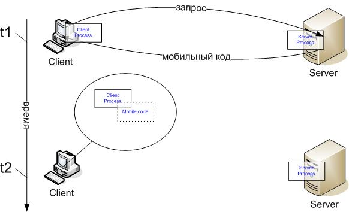
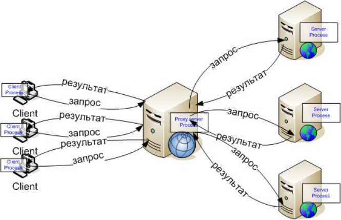
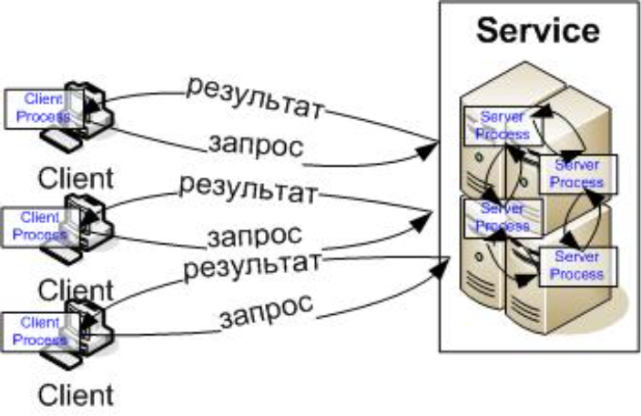

# Введение
---
### Определения
 - «Распределенная система это набор независимых узлов (компьютеров), которые представляются пользователю как единая система.»<!-- .element: class="size"  -->
 - «Распределенная система это собрание независимых компьютеров соединенных сетью с программным обеспечением, обеспечивающим их совместное функционирование.»<!-- .element: class="size"  -->
 - «Система, состоящая из набора двух или более независимых узлов, которые координируют свою работу посредством синхронного или асинхронного обмена сообщениями.»<!-- .element: class="size"  -->
 - «Система, чьи компоненты размещены на различных узлах, взаимодействующие и управляемые только посредством передачи сообщений.»<!-- .element: class="size"  -->
 - «...система нескольких автономных вычислительных узлов, взаимодействующих для выполнения общей цели.»<!-- .element: class="size"  -->
 - «…я не могу объяснить, что такое распределенная система, но узнаю ее как только мне ее покажут»<!-- .element: class="size"  -->
---
### Определения
 - В рамках этого курса мы будем рассматривать такие системы, компоненты которых *выполняются на различных узлах* и взаимодействуют между собой посредством какой-либо *сети передачи данных*
---
### Очевидные последствия
 - Дополнительный компонент с *низкой* надежностью - сеть
    - Значительная задержка при передаче данных (латентность при передаче)
    - Незначительная (по сравнению с RAM) пропускная способность (для RAM десятки ГБайт\с, для сети Гбиты\с)
    - Проблемы безопасности в сети (возможность перехвата и подмены трафика)
    - топология сети может изменяться во время работы приложения
 - Любое распределенное приложение - по определению параллельное
    - гонки потоков
    - необходимость в синхронизации
---
### Очевидные последствия
 - Сложности с развертыванием приложения
     - Как обновлять приложение, состоящее из десятков компонентов
     - Части приложения могут разворачиваться на "чужих" площадках - вне периметра безопасности
 - Сложности с эксплуатацией и обнаружением сбоев
     - Как понять, что какие-то компоненты распределенного приложения вышли из строя
 - Нет "глобального" состояния системы (нет ни одного процесса в распределенной системе, который бы знал текущее глобальное состояние системы)
 - Строго говоря - нет "глобального" времени (ограниченная точность синхронизации часов) 
---
### Очевидные последствия
 - Распределенные системы сложно проектировать
 - ... сложно разрабатывать
 - ... сложно эксплуатировать

 Зачем они вообще нужны?
---
### Мотивация
 - Естественное разделение. Существуют ситуации, в которых распределенная система - единственная возможность
     - почтовый клиент и почтовый сервер
     - браузер и HTTP-сервер
     - банкомат и процессинговая система банка
     - касса в магазине и процессинг банка\система магазина
     - ...
 - Большинство ИТ-систем, с которыми пользователь сегодня сталкивается - распределенные. Потому что пользователь и выполнение его сервиса находятся в разных местах    
---
### Мотивация
 - Повышение производительности
    - Зачастую один узел системы не может справиться с вычислительной нагрузкой. Увеличивать мощность узла нежелательно (например, дорого). В систему добавляют дополнительные узлы
    - Для обеспечения *масштабируемости* система должна быть специальным образом спроектирована. Например, при ее создании могут использоваться специализированные шаблоны или целые библиотеки
    - Вы уже знакомы с таким подходом: MPI как раз решает эту задачу 
---
### Мотивация
 - Отказоустойчивость
    - Отдельные (или все) компоненты системы могут быть дублированы на разных (независимых) узлах. Тогда выход из строя одного (или нескольких - зависит от количества запущенных дубликатов) узла не приводит к прекращению работы системы
    - Часто используется в варианте, когда происходит не дублирование компонентов, а их *перенос* с аварийного узла на рабочий. При этом перерыв в сервисе есть, но он минимальный
    - Часто используется совместно с мероприятиями по обеспечению масштабируемости
---
### Мотивация
 - Другие, чаще всего "экономические" причины : если ваша систем разбита на небольшие компоненты, между которыми четко определен интерфейс, то
    - можно повысить T2M (время от идеи до внедрения) 
        - в такие компоненты можно быстро вносить изменения
        - развертывать при изменении можно отдельные компоненты, а не все приложение
    - можно повысить продуктивность разработки 
        - разные компоненты могут быть написаны на разных ЯП (наиболее подходящих для решения задачи), использовать разные СУБД
        - разные компоненты могут разрабатывать разные команды разработчиков
---
### Общие соображения
 - В зависимости от того, чем именно вызвана необходимость создания распределенной системы, к ее компонентам могут предъявляться разные требования. Однако, можно сформулировать ряд общих требований, видимо подходящих для большинства систем:
     - При проектировании межмодульного интерфейса необходимо внимательно следить за объемом передаваемых данных. Если данных *слишком много*, возможно, вы неправильно провели границы между модулями
     - При прочих равных отдавать предпочтение массированным операциям передачи данных. Передать массив значений *выгоднее*, чем отдельное значение
---
### Общие соображения
 - Старайтесь избегать сильной связанности между компонентами. Компоненты должны "знать" только о тех компонентах, которые им нужны для работы (с которыми они взаимодействуют)
 - Инкапсулируйте компоненты - предоставляйте интерфейс(API), за которым скрыта вся внутренняя логика работы
 - Если есть возможность реализовать компонент без хранения состояния (stateless) - сделайте это
 - Если заботитесь о надежности - позаботьтесь, чтобы в системе не было единой точки отказа (одного компонента, выход из строя которого приведет к краху всей системы)    
---
### Общие соображения
В настоящее время, из соображений максимальной независимости компонентов друг от друга, принят подход, при котором все взаимодействие между компонентами осуществляется посредством API компонента. Это означает, что компонент должен полностью отвечать за сохранение своего состояния (если оно есть), т.е. каждый компонент имеет свою собственную СУБД. Это в корне отличается от привычного подхода, при котором данные всей системы хранятся согласованно и централизованно <!-- .element: class="left small_font" -->

  - Плюсы такого подхода: <!-- .element: class="size"  -->
     - каждый компонент выбирает СУБД и схему данных оптимальную для решения своей задачи <!-- .element: class="size"  -->
     - СУБД и схема данных может быть в любой момент изменена, если это не сказывается на API <!-- .element: class="size"  -->
     - нет единой точки отказа (центральной СУБД) <!-- .element: class="size"  -->
     - нет единого "бутылочного горлышка" производительности (центральной СУБД) <!-- .element: class="size"  --> 
 - Минусы <!-- .element: class="size"  -->
     - необходимо самостоятельно решать проблему согласованности данных для СУБД разных компонент, что может оказаться очень сложной задачей <!-- .element: class="size"  -->
     - у нас теперь нет "простых" транзакций в общей СУБД, любая транзакция становится распределенной <!-- .element: class="size"  -->
---
### Микросервисная архитектура
 - набор правил и соглашений для компонентов распределенной системы
     - сервис решает бизнес-задачу (группировка по бизнес-задачам)
     - сервис **маленький** (разрабатывается одной командой, и его способен понять один человек) 
     - сервисы слабосвязаны (поэтому их при желании можно повторно использовать)
     - используется децентрализованное управление сервисами
     - используется децентрализованное управление данными (у каждого сервиса свое хранилище)
     - используется автоматизация развертывания и мониторинга
---
### Микросервисная архитектура
 - Плюсы
     - маленькие сервисы проще создавать и сопровождать
     - упрощается обновление системы - маленькие автономные сервисы могут быть обновлены независимо
     - для каждого сервиса - подходящая ему технология (ЯП, СУБД, ...)
     - высокая стабильность - отказ сервиса может быть обнаружен и исправлен (в т.ч. автоматически)
     - возможность масштабирования как средство увеличения производительности и надежности
 
---
### Микросервисная архитектура
 - Минусы
     - сервисы маленькие -> много взаимодействий. может страдать производительность -> производительность (и надежность) сети критически важна
     - сервисов много -> нужно много оборудования (узлов) для их развертывания. зачастую *больше* чем для развертывания монолита
     - много сервисов и оборудования - критическая зависимость от средств автоматизации управления
     - много API. нужны способы его описания 
     - при проектировании нужно учитывать много особенностей - асинхронный характер взаимодействия, то, что отдельные сервисы могут быть недоступны и т.д. и т.п. 
---
### Теорема CAP
в любой реализации распределённых вычислений возможно обеспечить не более двух из трёх следующих свойств (это эвристическое утверждение!):<!-- .element: class="left" -->
 - согласованность данных (англ. consistency) — во всех вычислительных узлах в один момент времени данные не противоречат друг другу;
 - доступность (англ. availability) — любой запрос к распределённой системе завершается корректным откликом, однако без гарантии, что ответы всех узлов системы совпадают;
 - устойчивость к разделению (англ. partition tolerance) — расщепление распределённой системы на несколько изолированных секций не приводит к некорректности отклика от каждой из секций.
---
### Теорема CAP
<!-- .element: width="40%" -->

https://i0.wp.com/proselyte.net/wp-content/uploads/2022/03/CAP_diagram.png<!-- .element: class="copyright-reference"  -->

Таким образом, при создании распределенной системы приходится идти на компромисс и выбирать какой-то из вариантов<!-- .element: class="left small_font" -->
---
### Модели архитектуры
  - Модель архитектуры отвечает на вопрос:
     - какие компоненты составляют нашу распределенную систему (и какие у них роли)
     - как компоненты взаимодействуют между собой
  - Выбор архитектуры при проектировании - критически важен. Он влияет на будущие эксплуатационные свойства 
  - Самой простой моделью архитектуры является модель "клиент-сервер"   
---
### Клиент-сервер
 - Клиент: процесс, желающий получить доступ к данным, использует ресурсы и/или выполняет действия на удаленном узле
 - Сервер: процесс, управляющий данными и всеми другими разделяемыми ресурсами, обеспечивающий клиентам доступ к ресурсам и производящий вычисления
 - Взаимодействие: пары запрос/результат. **обычно** (но не обязательно) взаимодействие *синхронное*
 - Пример
     - http-сервер: клиент (броузер) запрашивает страницу, сервер поставляет страницу
     - клиент посылает SQL-запрос на сервер СУБД, сервер его выполняет и возвращает ответ
---
### Клиент-сервер (мобильный код)
 - Мобильный код: код, посланный клиенту, чтобы выполнить его же задачу

---
### Клиент-сервер (мобильный код)
 - Выполнение программы (код + данные), которая перемещается между узлами в сети
     - Выполняет автономную задачу обычно под управлением некоторого другого процесса
     - Имеет внутреннее знание и цели
 - Преимущество: всюду локальный доступ
     - Снижает затраты на коммуникации
 - Потенциальная угроза безопасности
     - Ограниченная применимость
 - Примеры: сбор данных из многих источников, установка программ, программы типа червей (электронная почта)
---
### Модель с прокси-сервером

---
### Модель с прокси-сервером
 - Кэш: «близкая» копия, наиболее часто используемых данных
     - ЗНАЧИТЕЛЬНО повышает производительность большинства приложений
     - Но требует усилий по поддержанию когерентности
 - Прокси-сервер: разделяемый кэш ресурсов
     - Еще сложнее, чем простой Кэш…
     - Обычно используется (и хорошо подходит) для доступа к мало меняющимся или *неважным* данным
---
### Модель «пул серверов» (сервис)

---
### Модель «пул серверов» (сервис) 
 - Услуги могут обеспечиваться многими серверами 
 - Распределенные между серверами объекты
 - Реплицированные объекты
     - Увеличение производительности, доступности и отказоустойчивости
 - Но требуют координации копий / консистентности представления
 - Например, высокодоступные серверы (порталы, диллинговые центры), информационные службы
 - Серверы, обслуживающие распределенную БД
---
### Модели архитектуры 
 - Другой часто применяемой моделью построения распределенных приложений является **событийная модель**
 - В рамках этой модели система разрабатывается как набор компонентов, обменивающихся сообщениями
 - Взаимодействие компонентов в рамках этой модели **обычно** *асинхронное*  
---
### Событийная модель 
 - Плюсы
     - слабая связанность между компонентами системы. в систему легко добавляются новые компоненты
     - разные компоненты независимы и могут запускаться в разное время
     - легче проектировать системы с высокой масштабируемостью  
 - Минусы
     - необходим дополнительный компонент (брокер сообщений, шина, ...)
     - может быть сложно реализовать некоторые сценарии (обработка событий в строгом порядке, откат операций, гарантированная доставка *единственного экземпляра* события и т.д.) 
     - как следствие часто более сложный код 
---
### Событийная модель 
 - Обычно используют следующие варианты взаимодействия при использовании событийной модели:
     - взаимодействие вида "точка-точка". При этом сообщение отправляется конкретному получателю и при его получении не может быть прочитано другим получателем. Вариант реализации посредника - *очередь*
     - взаимодействие типа "издатель-подписчик". При этом одно сообщение, сформированное издателем, может быть получено несколькими подписчиками, тем или иным образом, подписанных на него.  Вариант реализации посредника - *тема*(topic)
---
Некоторые часто встречающиеся задачи и типичные шаблоны для их решения
---
### 
 - Распределенные системы часто включают много компонентов и имеют очень сложную структуру. Тем не менее, часто (но не всегда) можно разделить все компоненты системы на части:
     - **Frontend** - компонент (или компоненты), непосредственно взаимодействующие с внешними пользователями (это могут быть другие системы, не обязательно люди), получают запросы, для их обработки обращаются к Backend`у
     - **Backend** - компоненты, отвечающие на "запросы" frontend`a, реализующие основную бизнес-логику системы
     - часто выделяют еще одну группу компонентов - **Data Storage** (хранилище данных)
---
### API Gateway 
 шаблон, представляющий собой единый Frontend для всех сервисов системы<!-- .element: class="left" -->

 <!-- .element: width="60%" -->

 https://ishantgaurav131.files.wordpress.com/2020/08/api-gateway-1.png<!-- .element: class="copyright-reference" -->
---
### API Gateway 
 - Может решать следующие задачи:
     - Кэширование: ответ от служб может быть кэширован в API-шлюзе
     - Авторизация/Аутентификация: вместо проверки личности клиента и аутентификации на каждом сервисе это можно реализовать в API-шлюзе.
     - Подмена протокола: например https может терминироваться на шлюзе (и тогда для всех сервисов нам нужен только один сертификат)
     - Ограничение количества запросов: шлюз может ограничивать количество запросов от клиентов, защищая сервисы от перегрузки.
     - Сбор показателей: шлюз может собирать метрики по всем или только необходимым запросам.
---
### API Gateway 
 - Может решать следующие задачи:
     - Сбор логов: шлюз может логгировать события.
     - Клиенту не нужно ничего знать о службах - можно легко добавить новую или изменить\удалить старую.
 - Минусы
     - Может стать слишком сложным (и отрицательно влиять на производительность\время отклика)
     - Может стать единой точкой отказа всей системы 
---
### Балансировщик
 - Есть несколько экземпляров одного сервиса, которые могут выполнить запрос клиентов
 - Задача - распределить запросы клиентов между ними

<!-- .element: width="70%" --> 

https://www.cloud4u.com/upload/medialibrary/5a6/0_CCK15OF3DizmOITk.png<!-- .element: class="copyright-reference" -->
---
### Балансировщик. Возможные цели
 - справедливость: нужно гарантировать, чтобы на обработку каждого запроса выделялись системные ресурсы и не допустить возникновения ситуаций, когда один запрос обрабатывается, а все остальные ждут своей очереди;
 - эффективность: все серверы, которые обрабатывают запросы, должны быть примерно одинаково загружены;
 - сокращение времени выполнения запроса: нужно обеспечить минимальное время между началом обработки запроса (или его постановкой в очередь на обработку) и его завершения;
 - сокращение времени отклика: нужно минимизировать время ответа на запрос пользователя.
 - и др. 
---
### Балансировщик. Стратегии
 - **Round Robin** (или алгоритм кругового обслуживания), представляет собой перебор по круговому циклу: первый запрос передаётся одному серверу, затем следующий запрос передаётся другому и так до достижения последнего сервера, а затем всё начинается сначала.
     - плюсы
         - очень просто реализовать, не нагружает балансировщик
     - минусы
         - не учитывает текущую ситуацию - часть серверов может быть перегружена или недогружена
     - хорошо работает в случае однотипных запросов, с примерно одинаковым временем исполнения, сервисы выполняются на одинаковых узлах
---
### Балансировщик. Стратегии
 - **Weighted Round Robin** (усовершенствованная версия алгоритма Round Robin): каждому серверу присваивается весовой коэффициент в соответствии с его производительностью (или какой-то другой характеристикой).
     - плюсы
         - очень просто реализовать, не нагружает балансировщик
     - минусы
         - требует предварительной настройки весов. учет текущей нагрузки - условный  
     - хорошо работает в случае однотипных запросов, с примерно одинаковым временем исполнения, сервисы выполняются на узлах с разной производительностью. 
---
### Балансировщик. Стратегии
 - **Least Connections**. Учитывает количество запросов, выполняемых серверами в текущий момент времени. Каждый следующий запрос передаётся серверу с наименьшим количеством активных подключений.
    - плюсы
         - до некоторой степени учитывает сложившуюся нагрузку, более *справедливый*
     - минусы
         - нужен *умный* планировщик, реализация сложнее. Не учитывает возможную разную производительность узлов  
     - может обрабатывать в том числе сложный профиль нагрузки с разнотипными запросами
---
### Балансировщик. Стратегии
 - **Sticky Sessions** — алгоритм распределения входящих запросов, при котором cессии пользователя могут быть закреплены за конкретным сервером. Хорош в случае сервисов, состояние которых зависит от пользователя
     - плюсы
         - хорош в случае специфических требований приложения (запросы конкретного пользователя должны попадать на один и тот же сервер)
     - минусы
         - нужен *умный* планировщик, реализация сложнее. Если у разных пользователей разный профиль нагрузки может плохо распределять нагрузку  
---
### Балансировщик (на сервере)
 - Где может осуществляться балансировка? Например - на сервере

 <!-- .element: width="60%" --> 

https://https://grpc.io/img/image_0.png<!-- .element: class="copyright-reference" -->
---
### Балансировщик (на сервере)
 - плюсы
    - доступны все стратегии балансировки (на сервере у нас есть вся информация о соединениях и нагрузке) 
    - нет зависимости от "порядочности" клиента
    - за балансировщиком можно скрыть внутреннюю структуру
 - минусы
    - может оказаться "узким горлышком" системы
    - часто реализует сложные алгоритмы, и в свою очередь должен быть "распределен"
    - в общем случае - более высокая задержка ответа  
---
### Балансировщик (на клиенте)
- Где может осуществляться балансировка? Например - на клиенте

<!-- .element: width="60%" --> 

https://https://grpc.io/img/image_1.png<!-- .element: class="copyright-reference" -->
---
### Балансировщик (на клиенте)
- плюсы
    - может быть достигнута более высокая скорость отклика за счет исключения *лишних* компонентов
    - может быть достигнута большая общая пропускная способность системы в целом (не нужно пропускать весь трафик через один компонент)
 - минусы
    - более сложный клиент, который **знает** внутреннюю структуру сервиса, и которому необходимо **доверить** стратегию балансировки
    - для сложных алгоритмов балансировки необходимо получать информацию от серверов (например, об их загрузке запросами других клиентов) 
---
### Балансировщик (важные замечания)
 - во всех случаях балансировщик должен каким-то образом узнать о серверах (их адресах), нагрузку на которые он балансирует 
 - состав серверов может изменяться во времени (Service Discovery)
 - балансировщик должен суметь обработать ситуацию отказа одного или нескольких серверов из списка доступных 
---
### Шардирование данных
Зачастую, данных в сервисе так много, что они не могут быть обработаны на одном узле
 - не хватает места (дискового пространства) 
 - не хватает **производительности** узла, чтобы выполнить все запросы других сервисов

Приходится запускать *несколько экземпляров* сервиса на разных узлах, и при этом как-то *распределять* данные между узлами
---
### Шардирование данных
Данные между узлами можно распределить **горизонтально** или **вертикально**

<!-- .element: width="60%" --> 

https://hazelcast.com/wp-content/uploads/2021/12/31_Sharding.png<!-- .element: class="copyright-reference" -->

---
### Шардирование данных
При вертикальном распределении на разных узлах оказываются разные схемы данных. Что обычно<!-- .element: class="left" -->
  - неудобно
  - ограничивает возможности масштабирования

Поэтому в микросервисах чаще используют горизонтальный шардинг (часто под шардингом по умолчанию подразумевают именно такое распределение)<!-- .element: class="left" -->
 
---
### Шардирование данных
Для определения шарда используется понятие **ключа шардирования**. В качестве ключа могут использоваться:
 - неизменяемый идентификатор записи (id, guid)
 - hash от неизменяемых атрибутов данных (login, email, ...)
 - геопозиция клиента (удобно для больших, геораспределенных систем) 
 - ... или ip-адрес клиента
 - или любое другое *простое* правило, которое позволит по элементу данных определить его шард

 определив шард, в котором хранятся наши данные, мы определяем узел, который их обрабатывает 
---
### Шардирование данных
<!-- .element: width="60%" --> 

https://assets.digitalocean.com/articles/understanding_sharding/DB_image_2_cropped.png<!-- .element: class="copyright-reference" -->
---
### Шардирование данных
<!-- .element: width="60%" --> 

https://assets.digitalocean.com/articles/understanding_sharding/DB_image_3_cropped.png<!-- .element: class="copyright-reference" -->
---
### Репликация
При работе с данными в распределенных системах часто возникает задача обеспечения отказоустойчивости, т.е. сохранения данных, при отказе одного или нескольких узлов системы. Одним из способов обеспечения отказоустойчивости является репликация данных.
При использовании master-slave репликации один из узлов (master) рассылает изменения данных на другие узлы (slave). При этом изменения данных допускаются только на master-узле, все остальные узлы могут только читать данные, но не изменять их.
 Количество узлов, на которые происходит репликация часто называют replication factor для системы. Это то количество узлов, которое может быть потеряно, без потери данных
 Использование репликации может помочь распределить нагрузку по узлам системы, поскольку операции чтения можно выполнять на репликах <!-- .element: class="left small_font" -->

<!-- .element: width="40%" --> 

https://mariadb.com/sites/default/files/pictures/Images/dbreplication173.png<!-- .element: class="copyright-reference" -->
---
### Репликация & шардинг
Часто репликация и шардинг используются совместно. При этом узел может хранить один мастер-шард, в который вносятся изменения и несколько копий шардов других узлов, которые используются для обеспечения сохранения данных в случае отказа. При таком подходе нагрузка по изменению данных также может быть распределена между узлами<!-- .element: class="left small_font" -->

<!-- .element: width="50%" --> 

https://cdn.educba.com/academy/wp-content/uploads/2020/04/Kafka-Cluster-with-replication-factor-2.png.webp<!-- .element: class="copyright-reference" -->
---
### Транзакции 2pc
При использовании микросервисного подхода каждый сервис сам хранит вое состояние. Как следствие, согласованное изменение глобального состояния системы приводит к необходимости проведения распределенной транзакции. Классическим механизмом, обеспечивающим проведение  распределенной транзакции является Two-phase commit protocol (2PC).
  2PC требует наличия диспетчера (координатора) транзакций, который проводит транзакцию за две фазы:<!-- .element: class="left" -->
 - Фазу подготовки
 - Фазу фиксации

---
### Транзакции 2pc
 - Фаза подготовки
     - диспетчер посылает сообщение всем участникам транзакции
     - узлы, участвующие в транзакции, присылают информацию что они готовы зафиксировать данные, что нет несогласованности в данных и т.д. (узел готов выполнить *commit*)
     - когда диспетчер получает подтверждение от всех, он принимает решение: 
         - если все узлы готовы выполнить commit, то он принимает решение, что распределенную транзакцию можно фиксировать
         - если хотя бы один узел выполнить фиксацию не может, вся транзакция останавливается
---
### Транзакции 2pc
 - Фаза фиксации
     - диспетчер сообщает всем участникам о необходимости фиксации
     - узлы выполняют фиксацию и присылают сообщение об этом диспетчеру

 После завершения второй фазы, когда был получен положительный ответ от всех участников, диспетчер сообщает клиенту об успешном завершении транзакции
---

### Транзакции SAGA
Шаблон SAGA (Saga) предназначен для управления распределенными транзакциями, при которых отдельные действия могут выполняться в разных сервисах или компонентах системы. В отличие от традиционных транзакций, которые используют блокировки и откаты на уровне базы данных, SAGA разбивает транзакцию на серию небольших шагов, каждый из которых является автономной транзакцией<!-- .element: class="left" -->

<!-- .element: width="50%" --> 

https://learn.microsoft.com/ru-ru/azure/architecture/reference-architectures/saga/images/saga-overview.png<!-- .element: class="copyright-reference" -->
---
### Основные концепции SAGA
- Шаги транзакции (Transaction Steps):
     - Каждая SAGA состоит из последовательности шагов, каждый из которых выполняется как отдельная локальная транзакция.
     - Если шаг завершается успешно, система переходит к следующему шагу.
- Компенсационные действия (Compensating Actions):
     - Для каждого шага определяется компенсирующее действие, которое откатывает изменения в случае ошибки.
     - Компенсационные действия выполняются в обратном порядке к выполненным шагам, чтобы "отменить" уже сделанные изменения.

---
### Основные концепции SAGA
- Координация (Coordination):
    - Координация шагов может быть централизованной (с использованием оркестратора) или децентрализованной (с использованием хореографии).

---
### Оркестрация (Orchestration):
- Центральный координатор (оркестратор) управляет выполнением всех шагов SAGA.
- Оркестратор отслеживает статус каждого шага и при необходимости инициирует выполнение компенсационных действий.

<!-- .element: width="50%" --> 

https://learn.microsoft.com/ru-ru/azure/architecture/reference-architectures/saga/images/orchestrator.png<!-- .element: class="copyright-reference" -->
---
### Хореография (Choreography):
- Каждый сервис самостоятельно инициирует выполнение следующего шага, основываясь на событиях.
- Компенсационные действия также инициируются по событиям, без централизованного управления.

<!-- .element: width="50%" --> 

https://learn.microsoft.com/ru-ru/azure/architecture/reference-architectures/saga/images/choreography-pattern.png<!-- .element: class="copyright-reference" -->

---
### Преимущества и недостатки SAGA
- (+)
    - гибкость и масштабируемость: Позволяет управлять транзакциями без блокировок на уровне базы данных.
    - Локальные транзакции: Каждая часть транзакции выполняется как автономная транзакция, что упрощает управление.
    - Компенсационные действия: Возможность отката изменений, выполненных до момента ошибки.
- (-)
    - Сложность реализации: Реализация логики компенсации может быть сложной.
    - Потенциальные временные несогласованности: Возможны временные состояния, когда часть системы уже обновлена, а часть еще нет.
---
### Возможные аномалии SAGA 
- *Потерянные обновления*, когда одна сага записывает без чтения изменений, внесенных другой сага.
- *Грязные операции чтения*, когда транзакция или сага считывает обновления, сделанные сага, которая еще не завершила эти обновления.
- *Нечеткие или неустранимые операции чтения*, когда различные шаги saga считывают разные данные, так как обновление данных происходит между считываниями.

---
### Command and Query Responsibility Segregation (CQRS)
Архитектурный шаблон, который разделяет операции чтения (запросы) и записи (команды) данных в приложении. Основная идея заключается в том, чтобы разделить модели данных и методы обработки для команд и запросов, что позволяет оптимизировать каждую из этих операций<!-- .element: class="left" -->

<!-- .element: width="50%" --> 

https://martinfowler.com/bliki/images/cqrs/cqrs.png<!-- .element: class="copyright-reference" -->
---
### Основные концепции CQRS
- Команды (Commands):
    - Команды изменяют состояние системы.
    - Они направляются на выполнение бизнес-логики и вызывают изменения в состоянии приложения.
    - Каждая команда обычно выполняется в отдельной транзакции.
- Запросы (Queries):
    - Запросы извлекают данные из системы.
    - Они не изменяют состояние системы и могут быть оптимизированы для быстрой выборки данных.
---
### Преимущества и недостатки CQRS
- (+)
    - Масштабируемость: Позволяет масштабировать чтение и запись независимо друг от друга.
    - Производительность: Оптимизация моделей данных для чтения и записи может повысить производительность.
    - Разделение обязанностей: Четкое разделение команд и запросов упрощает понимание и сопровождение кода.
    - Гибкость: Легче внедрять новые требования, так как изменения в одной части (чтение или запись) не влияют на другую.
- (-)
    - Разные модели данных -> большая трудоемкость при реализации
---
### Service Discovery (на стороне клиента)
Шаблон Service Discovery (обнаружение сервисов) предназначен для динамического обнаружения доступных сервисов в распределенной системе. Это особенно важно в средах с микросервисной архитектурой, где сервисы могут изменять свое местоположение и количество экземпляров динамически.
В модели Service Discovery на стороне клиента, клиентская программа сама отвечает за определение местоположения доступных сервисов. Клиент напрямую взаимодействует с сервисом регистрации (регистратором) для получения информации о доступных сервисах.<!-- .element: class="left" -->
---
### Service Discovery (на стороне клиента)
<!-- .element: width="50%" --> 

https://microservices.io/i/servicediscovery/client-side-discovery.jpg<!-- .element: class="copyright-reference" -->

---
### Основные концепции 
 - Регистратор сервисов (Service Registry):
    - Центральное хранилище, где сервисы регистрируют свои местоположения и состояния.
    - Регистратор хранит актуальную информацию о каждом зарегистрированном сервисе 
- Регистрация сервисов:
    - Сервисы при запуске регистрируются в регистраторе, указывая свои местоположения.
    - Регистрация может быть постоянной или обновляться периодически.
- Обнаружение сервисов:
    - Клиенты запрашивают у регистратора информацию о доступных сервисах.
    - Клиенты используют полученную информацию для прямого взаимодействия с нужным сервисом.
---
### Преимущества и недостатки
- (+)
    - Гибкость и контроль: Клиенты могут самостоятельно определять стратегию балансировки нагрузки и выбирать экземпляры сервисов.
    - Независимость от промежуточных компонентов: Устраняет необходимость в использовании центрального балансира нагрузки.
- (-)
    - Усложнение клиентской логики: Клиенты должны самостоятельно обрабатывать логику обнаружения и балансировки.
    - Зависимость от регистратора: Клиенты зависят от доступности и производительности регистратора.
---
### Service Discovery (на стороне сервера)
Шаблон Server-Side Service Discovery позволяет клиентам взаимодействовать с сервисами без необходимости самостоятельно управлять процессом их обнаружения и балансировки нагрузки. Вместо этого, эти задачи возлагаются на центральный компонент (сервер балансировки нагрузки или шлюз API)<!-- .element: class="left" -->

<!-- .element: width="50%" --> 

https://microservices.io/i/servicediscovery/server-side-discovery.jpg<!-- .element: class="copyright-reference" -->
---
### Основные концепции
- Регистратор сервисов (Service Registry):
    - Центральное хранилище, в котором сервисы регистрируют свои местоположения и состояния.
    - Регистратор хранит актуальную информацию о каждом зарегистрированном сервисе.
- Регистрация сервисов:
    - Сервисы регистрируются в регистраторе при запуске, указывая свои сетевые адреса и порты.
    - Регистрация может быть постоянной или обновляться периодически.
---
### Основные концепции
- Обнаружение сервисов на стороне сервера:
    - Сервер балансировки нагрузки или шлюз API запрашивает у регистратора информацию о доступных сервисах.
    - Сервер использует эту информацию для балансировки нагрузки и перенаправления запросов клиентов к нужным экземплярам сервисов.
---
### Преимущества и недостатки
- (+)
    - Снижение сложности клиентской логики: Клиенты не должны самостоятельно управлять логикой обнаружения и балансировки.
    - Централизованное управление: Упрощает управление и конфигурацию системы, поскольку логика балансировки нагрузки и маршрутизации сосредоточена в одном месте.
    - Улучшенная безопасность и контроль доступа: Сервер балансировки нагрузки или шлюз API может также выполнять функции аутентификации, авторизации и мониторинга.
---
### Преимущества и недостатки
- (-)
    - Точка отказа: Сервер балансировки нагрузки может стать единой точкой отказа, если не обеспечена его отказоустойчивость.
    - Дополнительная задержка: Маршрутизация через сервер балансировки нагрузки может добавить дополнительную задержку в обработку запросов.
---
### Circuit Breaker
Шаблон Circuit Breaker предназначен для повышения устойчивости и надежности распределенных систем, особенно в условиях частых отказов или проблем с сетевыми взаимодействиями. Он помогает предотвращать каскадные сбои, минимизируя воздействие неудачных попыток подключения к сервисам, которые временно недоступны или работают с ошибками.<!-- .element: class="left" -->

<!-- .element: width="50%" --> 

https://www.researchgate.net/profile/Michel-Kraemer/publication/323005081/figure/fig5/AS:591660618620928@1518074292476/Petri-net-for-the-Circuit-Breaker-pattern.png<!-- .element: class="copyright-reference" -->
---
### Основные концепции Circuit Breaker
- Состояния автоматического выключателя:
    - Closed (Закрытое): Запросы проходят через выключатель к целевому сервису. Если запросы успешны, выключатель остается в этом состоянии.
    - Open (Открытое): Запросы немедленно завершаются с ошибкой, не направляясь к целевому сервису. Это состояние активируется, если количество неудачных попыток достигает определенного порога.
    - Half-Open (Полуоткрытое): Некоторые запросы проходят к целевому сервису для проверки его работоспособности. Если запросы успешны, выключатель возвращается в состояние Closed. Если запросы продолжают быть неудачными, выключатель снова переходит в состояние Open.

---
### Основные концепции Circuit Breaker
- Порог срабатывания:
    - Количество неудачных попыток, после которого выключатель переходит в состояние Open.
    - Время ожидания перед попыткой перехода в состояние Half-Open.
- Мониторинг и логирование:
    - Отслеживание состояния выключателя и результатов запросов для анализа и уведомления о сбоях.

---
### Преимущества и недостатки
- (+)
    - Защищает систему от каскадных сбоев, ограничивая количество неудачных попыток и минимизируя их влияние.
    - Сокращает время ожидания для пользователей, возвращая немедленные ошибки вместо длительных ожиданий.
    - Позволяет системе автоматически восстанавливать связь с сервисами после устранения проблем.
- (-)
    - Внедрение и управление требуют дополнительного кода и настройки.
    - Неправильная конфигурация может привести к избыточным блокировкам запросов, даже если сервисы работают корректно.
---
## Выводы
- Распределенные приложения нужно уметь создавать - есть много случаев, где они необходимы и\или полезны
- Распределенные приложения создавать сложнее чем привычные, нераспределенные
- Накоплен большой опыт в этой области, которым нужно пользоваться
    - Этот опыт выражен как в архитектурных шаблонах
    - так и в виде готовых фреймворков, платформ, программных решений и т.д.
